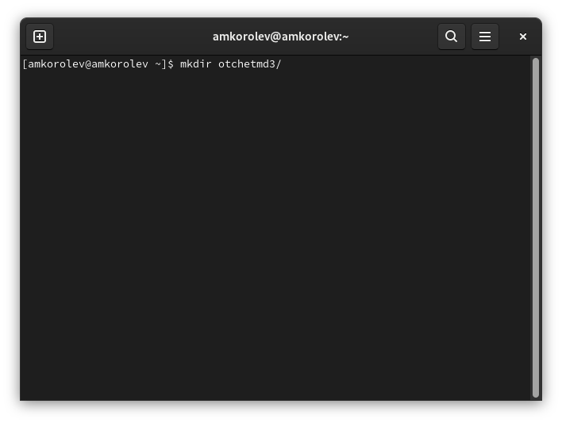

МИНИСТЕРСТВО ОБРАЗОВАНИЯ И НАУКИ\
РОССИЙСКОЙ ФЕДЕРАЦИИ\
\
ФЕДЕРАЛЬНОЕ ГОСУДАРСТВЕННОЕ АВТОНОМНОЕ\
ОБРАЗОВАТЕЛЬНОЕ УЧРЕЖДЕНИЕ ВЫСШЕГО ОБРАЗОВАНИЯ\
"РОССИЙСКИЙ УНИВЕРСИТЕТ ДРУЖБЫ НАРОДОВ"\

Факультет физико-математических и естественных наук\
\
\
\

ОТЧЕТ\
\
По лабораторной работе №3\
"Markdown"\
\
\

Выполнил:\
Студент группы: НПИбд-02-21\
Студенческий билет: №1032217060\
ФИО студента: Королев Адам Маратович\
Дата выполнения: 25.04.2022\

Москва 2022

# Цель работы:

\- Научиться оформлять отчеты с помощью легковесного языка разметки Markdown.

# Задание:

\- Сделайте отчет по предыдущей лабораторной работе в формате Markdown.

\- В качестве отчета просьба предоставить отчеты в 3 форматах: pdf, docx и md.

# Теоретическое введение:

Markdown -- это облегченный язык текстовой разметки документов. Его придумали в 2004 году блогер Джон Грубер и интернет-активист Аарон Шварц, чтобы быстро форматировать статьи. Требования к языку были следующими:
\- Чем проще - тем лучше.
\- Документы с этой разметкой можно перевести в красивой отформатированный вид, как на веб-странице.
\- Исходный текст материала должен оставаться читаемым даже без преобразования в веб-страницу.

# Выполнение лабораторной работы:

1. Необходимо запустить терминал Linux\
\
Запущенный терминал\
2. Создать папку, в которой в дальнейшем будет создан файл формата .md, а также изображения.\
\
Создаем папку\
3. Перейдем в созданную папку. В ней создадим файл формата .md, в котором мы будем работать.\
\
Переходим в папку. Создаем файл формата .md\
4. Используя редактор vim, отредактируем файл формата .md.\
\
Используем редактор vim\
5. Отредактируем файл формата .md.\
\
Редактируем файл\
6. Сохраним файл формата .md, используя команду :w.\
\
Используем команду :w\
7. Выйдем из редактора vim, используя команду :q.\
\
Выходим из редактора, команда :q\
8. Перенесем в папку, где располагается файл формата .md, наши изображения и makefile для создания файлов формата docx. и pdf.\
\
Переносим makefile и изображения\
9. Используя имеющийся Makefile, используя команду make создадим файлы форматов docx. и pdf.\
\
Создаем файлы форматов docx и pdf используя Makefile\
10. Проверим, появились ли у нас файлы формата docx. и pdf.\
\
Проверяем наличие файлов\
11. Проверим полученные файлы на ошибки.\
\
Проверяем работоспособность файлов\

# Выводы: 

В процессе выполнения задания были приобретены навыки по оформлению отчетов с помощью легковесного языка разметки Markdown.

