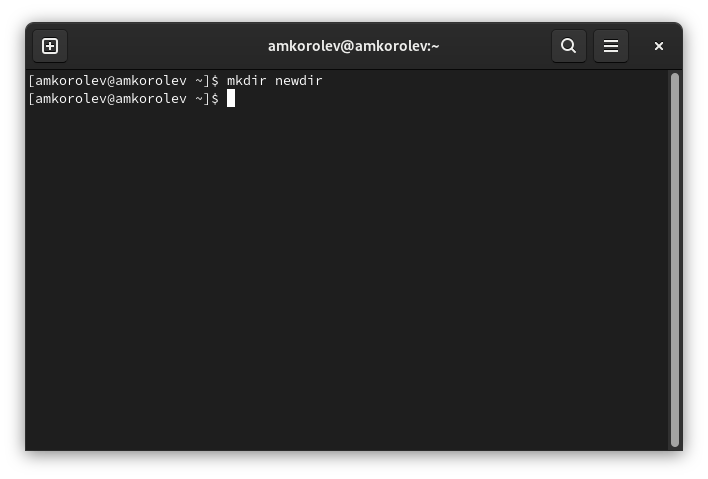
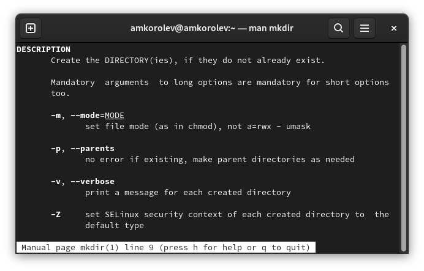

---
## Front matter
lang: ru-RU
title: Лабораторная работа №4. Основы интерфейса взаимодействия пользователя с системой Unix на уровне командной строки
author: |
	Подготовил:
	\
	Королев Адам Маратович
	\
	Группа: НПИбд-02-21
	\
	Студенческий билет: № 1032217060

## Formatting
toc: false
slide_level: 2
theme: metropolis
header-includes: 
 - \metroset{progressbar=frametitle,sectionpage=progressbar,numbering=fraction}
 - '\makeatletter'
 - '\beamer@ignorenonframefalse'
 - '\makeatother'
aspectratio: 43
section-titles: true
---
## Цель работы:

- Приобретение практических навыков взаимодействия пользователя с системой посредством командной строки.

## Задание:

1. Определите полное имя вашего домашнего каталога. Далее относительно этого каталога будут выполняться последующие упражнения.\
2. Выполните следующие действия:\
\- Перейдите в каталог /tmp\
\- Выведите на экран содержимое каталога /tmp. Для этого используйте команду ls с различными опциями.\
\- Определите, есть ли в каталоге /var/spool подкаталог с именем cron.\
\- Перейдите в Ваш домашний каталог и выведите на экран его содержимое. Определите, кто является владельцем файлов и подкаталогов.\
3. Выполните следующие действия:\
\- В домашнем каталоге создайте новый каталог с именем newdir.\
\- В каталоге ~/newdir создайте новый каталог с именем morefun.\

## Задание: 
\- В домашнем каталоге создайте одной командой три новых каталога с именами letters, memos, disk. Затем удалите эти каталоги одной командой.\
\- Попробуйте удалить ранее созданный каталог ~/newdir командой rm. Проверьте, был ли каталог удален.\
\- Удалите каталог ~/newdir/morefun из домашнего каталога. Проверьте, был ли каталог удален.\
4. С помощью команды man определите, какую опцию команды ls нужно использовать для просмотра содержимого не только указанного каталога, но и подкаталогов, входящих в него.\
5. С помощью команды man определите набор опций команды ls, позволяющий отсортировать по времени последнего изменения выводимый список содержимого каталога с развернутым описанием файлов.\

## Задание: 
6. Используйте команду man для просмотра описания следующих команд: cd, pwd, mkdir, rmdir, rm. Поясните основные опции этих команд\
7. Используя информацию, полученную при помощи команды history, выполните модификацию и исполнение нескольких команд из буфера команд.\

## Теоретическое введение:

UNIX -- семейство переносимых, многозадачных и многопользовательских операционных систем.\
Интерфейс пользователя -- интерфейс, обеспечивающий передачу информации между пользователем-человеком и программно-аппаратными компонентами компьютерной системы.\
Привелигированный пользователь -- обладает большими возможностями, чем обычные пользователи. Такой пользователь называется суперпользователем (superuser) или root. Он имеет неограниченные права на доступ к любому файлу и на выполнение любой программы. Кроме того, такой пользователь имеет возможность полного контроля над системой.\
Интерфейс командной строки -- разновидность текстового интерфейса между человеком и компьютером, в котором инструкции компьютеру даются в основном путем ввода с клавиатуры текстовых строк. 

## Теоретическое введение:
В UNIX-системах возможно применение мыши. Также известен под названиями "консоль" и "терминал".\

# Выполнение лабораторной работы:

## Определите полное имя вашего домашнего каталога.
{width=350px}

## Перейдем в каталог /tmp
{width=350px}

## Выведите на экран содержимое каталога /tmp. Для этого используйте команду ls с различными опциями.
{width=350px}

## Определите, есть ли в каталоге /var/spool подкаталог с именем cron.
{width=350px}

## Используем команду cd /var/spool
{width=350px}

## Перейдем в домашний каталог и выведем на экран его содержимое. Определим, кто является владельцем файлов и подкаталогов.
{width=200px}

## В домашнем каталоге создайте новый каталог с именем newdir.
{width=350px}

## В каталоге ~/newdir создаем новый каталог с именем morefun.
{width=350px}

## В домашнем каталоге создаем одной командой три новых каталога с именами letters, memos, misk. Затем удалим эти каталоги одной командой.
{width=350px}

## Попробуем удалить ранее созданный каталог ~/newdir командой rm. Проверим, был ли каталог удален.
{width=350px}

## Удалите каталог ~/newdir/morefun из домашнего каталога. Проверьте, был ли каталог удален.
{width=350px}

## С помощью команды man определите, какую опцию команды ls нужно использовать для просмотра содержимого не только указанного каталога, но и подкаталогов, входящих в него.
{width=350px}

## С помощью команды man определите, какую опцию команды ls нужно использовать для просмотра содержимого не только указанного каталога, но и подкаталогов, входящих в него.
{width=350px}

## С помощью команды man определите набор опций команды ls, позволяющий отсортировать по времени последнего изменения выводимый список содержимого каталога с развернутым описанием файлов.
{width=350px}

## С помощью команды man определите набор опций команды ls, позволяющий отсортировать по времени последнего изменения выводимый список содержимого каталога с развернутым описанием файлов.
{width=350px}

## Используйте команду man для просмотра описания следующих команд: cd, pwd, mkdir, rmdir, rm.
{width=350px}

## Используйте команду man для просмотра описания следующих команд: cd, pwd, mkdir, rmdir, rm.
{width=350px}

## Используйте команду man для просмотра описания следующих команд: cd, pwd, mkdir, rmdir, rm.
{width=350px}

## Используйте команду man для просмотра описания следующих команд: cd, pwd, mkdir, rmdir, rm.
{width=350px}

## Используйте команду man для просмотра описания следующих команд: cd, pwd, mkdir, rmdir, rm.
{width=350px}

## Используйте команду man для просмотра описания следующих команд: cd, pwd, mkdir, rmdir, rm.
{width=350px}

## Используйте команду man для просмотра описания следующих команд: cd, pwd, mkdir, rmdir, rm.
{width=350px}

## Используйте команду man для просмотра описания следующих команд: cd, pwd, mkdir, rmdir, rm.
{width=350px}

## Используйте команду man для просмотра описания следующих команд: cd, pwd, mkdir, rmdir, rm.
{width=350px}

## Используйте команду man для просмотра описания следующих команд: cd, pwd, mkdir, rmdir, rm.
{width=200px}

# Используя информацию, полученную при помощи команды history, выполните модификацию и исполнение нескольких команд из буфера команд.
## Введем команду history
{width=350px}

## Получим сведения о последних используемых командах
{width=350px}

## Выполним модификацию и исполнение команды cd
{width=350px}

## Выполним модификацию и исполнение команды touch
{width=350px}

## Выводы: 

В процессе выполнения работы были приобретены практические навыки взаимодействия пользователя с системой посредством командной строки.
