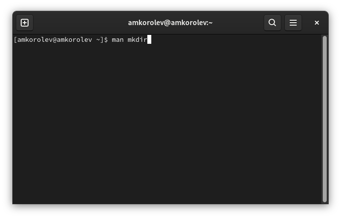

МИНИСТЕРСТВО ОБРАЗОВАНИЯ И НАУКИ\
РОССИЙСКОЙ ФЕДЕРАЦИИ\
\
ФЕДЕРАЛЬНОЕ ГОСУДАРСТВЕННОЕ АВТОНОМНОЕ\
ОБРАЗОВАТЕЛЬНОЕ УЧРЕЖДЕНИЕ ВЫСШЕГО ОБРАЗОВАНИЯ\
"РОССИЙСКИЙ УНИВЕРСИТЕТ ДРУЖБЫ НАРОДОВ"\

Факультет физико-математических и естественных наук\
\
\
\

ОТЧЕТ\
\
По лабораторной работе №4\
"Основы интерфейса взаимодействия пользователя с системой Unix на уровне командной строки"\
\
\

Выполнил:\
Студент группы: НПИбд-02-21\
Студенческий билет: №1032217060\
ФИО студента: Королев Адам Маратович\
Дата выполнения: 25.04.2022\

Москва 2022

# Цель работы:

\- Приобретение практических навыков взаимодействия пользователя с системой посредством командной строки.

# Задание:

1. Определите полное имя вашего домашнего каталога. Далее относительно этого каталога будут выполняться последующие упражнения.\
2. Выполните следующие действия:\
\- Перейдите в каталог /tmp
\- Выведите на экран содержимое каталога /tmp. Для этого используйте команду ls с различными опциями.
\- Определите, есть ли в каталоге /var/spool подкаталог с именем cron.
\- Перейдите в Ваш домашний каталог и выведите на экран его содержимое. Определите, кто является владельцем файлов и подкаталогов.
3. Выполните следующие действия:
\- В домашнем каталоге создайте новый каталог с именем newdir.
\- В каталоге ~/newdir создайте новый каталог с именем morefun.
\- В домашнем каталоге создайте одной командой три новых каталога с именами letters, memos, misk. Затем удалите эти каталоги одной командой.
\- Попробуйте удалить ранее созданный каталог ~/newdir командой rm. Проверьте, был ли каталог удален.
\- Удалите каталог ~/newdir/morefun из домашнего каталога. Проверьте, был ли каталог удален.
4. С помощью команды man определите, какую опцию команды ls нужно использовать для просмотра содержимого не только указанного каталога, но и подкатологов, входящих в него.
5. С помощью команды man определите набор опций команды ls, позволяющий отсортировать по времени последнего изменения выводимый список содержимого каталога с развернутым описанием файлов.
6. Используйте команду man для просмотра описания следующих команд: cd, pwd, mkdir, rmdir, rm. Поясните основные опции этих команд.
7. Используя информацию, полученную при помощи команды history, выполните модификацию и исполнение нескольких команд из буфера команд.

# Теоретическое введение:

UNIX -- семейство переносимых, многозадачных и многопользовательских операционных систем.
Интерфейс пользователя -- интерфейс, обеспечивающий передачу инфоррмации межлу пользователем-человеком и программно-аппаратными компонентами компьютерной системы.
Привелигированный пользователь -- обладает большими возможностями, чем обычные пользователи. Такой пользователь называется суперпользователем (superuser) или root. Он имеет неограниченные права на доступ к любому файлу и на выполнение любой программы. Кроме того, такой пользователь имеет возомжность полного контроля над системой.
Интерфейс командной строки -- разновидность текстового интерфейса между человеком и компьютером, в котором инструкции компьютеру даются в основном путем ввода с клавиатуры текстовых строк. В UNIX-системах возможно применение мыши. Также известен под названиями "консоль" и "терминал".

# Выполнение лабораторной работы:

1. Определите полное имя вашего домашнего каталога.\
\
Используем команду pwd\
2. Перейдите в каталог /tmp\
\
Используем команду cd /tmp\
3. Выведите на экран содержимое каталога /tmp. Для этого используйте команду ls с различными опциями.\
\
Используем команду ls -a\
4. Определите, есть ли в каталоге /var/spool подкаталог с именем cron.\
\
Используем команду cd /var/spool\
\
Используем команду ls -a\
5. Перейдите в Ваш домашний каталог и выведите на экран его содержимое. Определите, кто является владельцем файлов и подкаталогов.
\
Вводим команду cd и ls -l\
6. В домашнем каталоге создайте новый каталог с именем newdir.\
\
Вводим mkdir newdir\
7. В каталоге ~/newdir создайте новый каталог с именем morefun.\
\
Вводим cd newdir, после mkdir morefun\
8. В домашнем каталоге создайте одной командой три новых каталога с именами letters, memos, misk. Затем удалите эти каталоги одной командой.\
\
Вводим cd, после mkdir letters memos misk. Удаляем каталоги командой rm -rf letters memos misk.\
9. Попробуйте удалить ранее созданный каталог ~/newdir командой rm. Проверьте, был ли каталог удален.\
\
Вводим cd. После rm newdir. Каталог не удаляется\
10. Удалите каталог ~/newdir/morefun из домашнего каталога. Проверьте, был ли каталог удален.\
\
Используем команду cd newdir. Далее вводим rmdir morefun. Далее используем команду ls\
11. С помощью команды man определите, какую опцию команды ls нужно использовать для просмотра содержимого не только указанного каталога, но и подкатологов, входящих в него.\
\
Используем команду man ls\
\
Изображение необходимых опций\
12. С помощью команды man определите набор опций команды ls, позволяющий отсортировать по времени последнего изменения выводимый список содержимого каталога с развернутым описанием файлов.\
\
Используем команду man ls\
\
Изображения необходимых опций\
13. Используйте команду man для просмотра описания следующих команд: cd, pwd, mkdir, rmdir, rm.\
\
Используем команду man cd\
\
Результат\
\
Используем команду man pwd\
\
Результат\
\
Используем команду man mkdir\
\
Результат\
\
Используем команду man rmdir\
\
Результат\
\
Используем команду man rm\
\
Результат\
14. Используя информацию, полученную при помощи команды history, выполните модификацию и исполнение нескольких команд из буфера команд.\
Введем команду history\
\
Ввод команды history\
Получим сведения о последних используемых командах\
\
Сведения о последних используемых командах\
Выполним модификацию и исполнение команды cd\
\
Модифицируем и исполняем команду путем ввода в консоль !727:s/work/lab021\
Выполним модификацию и исполнение команды touch\
\
Модифицируем и исполняем команду путем ввода в консоль !729:s/abc.md/def.md\

# Выводы: 

В процессе выполнения работы были приобретены практические навыки взаимодействия пользователя с системой посредством командной строки.

# Ответы на контрольные вопросы:

1. Командная строка - это программа, которая служит промежуточным слоем между человеком и
компьютером и передает команды и ответы машине и человеку соответственно
2. Абсолютный путь текущего каталога определяется при помощи команды pwd - print working directory. Например, при вводе команды pwd находясь в моем домашнем каталоге, я получаю путь /home/amkorolev.
3. При помощи команды ls и команды ls с опцией --file-type. Пример: при вводе ls --file-type находясь в папке docs, где предварительно имеются файлы: doc1.md  doc2.pdf  doc3.txt и папка docs0, получим следующую строчку: doc1.md  doc2.pdf  doc3.txt  docs0/
4. Чтобы вывести имена скрытых файлов необходимо использовать команду ls с опцией -a. Пример: находясь в домашнем каталоге, введя ls -a, я смог увидеть скрытый файл .viminfo. Без ввода опции -a, данного файла я увидеть не смог.
5. Команда rm для удаления файла, для удаления папки rmdir. Можно сделать одной и той же командой (rm), но для удаления папки необходимо будет ввести опцию -r. Пример: создадим файл test1.txt с использованием команды touch. Создадим папку test2 с использованием команды mkdir. Удалить файл test1.txt можно с использованием команды rm. Удалить папку test2 можно с использованием rm -r или rmdir.
6. Используя команду history
7. Используя команду history, запомнить номер команды, потом написать ошибку и ее замену. Пример: введем команду cd work (перейдем в папку work). Выйдем из нее, введя cd. Далее введем команду history. Узнаем, что в истории номер команды - 639. Для того, чтобы модифицировать команду, введем !639:s/work/labs и таким образом произведем запуск команды cd labs.
8. Для таких случаев используется символ ; . Например: cd work; ls. Мы перейдем в папку work и выведем находящиеся в ней файлы и папки.
9. Символ экранирования нужен для того чтобы командная строка не приняла специальные
символы ., *, /, ... за команду
10. ls -l показывает дополнительную информацию о файле - дата изменения, права доступа,
список владельцев
11. Относительный путь — это путь к файлу относительно текущей папки. Абсолютный путь - это путь, который начинается от корня и описывает весь путь к файлу. Например, для входа в папку work из домашнего каталога, можно использовать как команду cd work, так и команду cd /home/amkorolev/work.
12. Для получения информации об интересующей нас команде используем команду --help, написав перед ней название интересующей команды.
13. Для автоматического дополнения вводимых команд нажимаем клавишу Tab.
