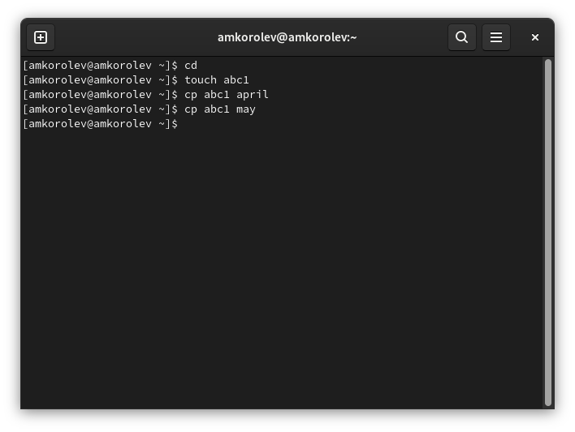
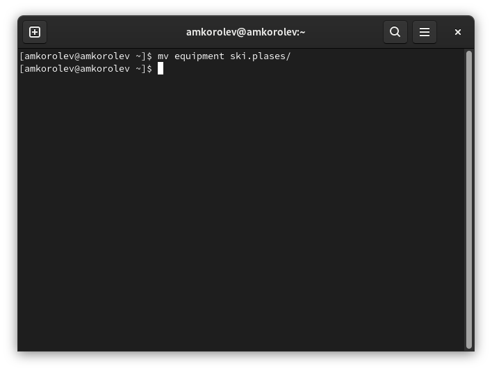
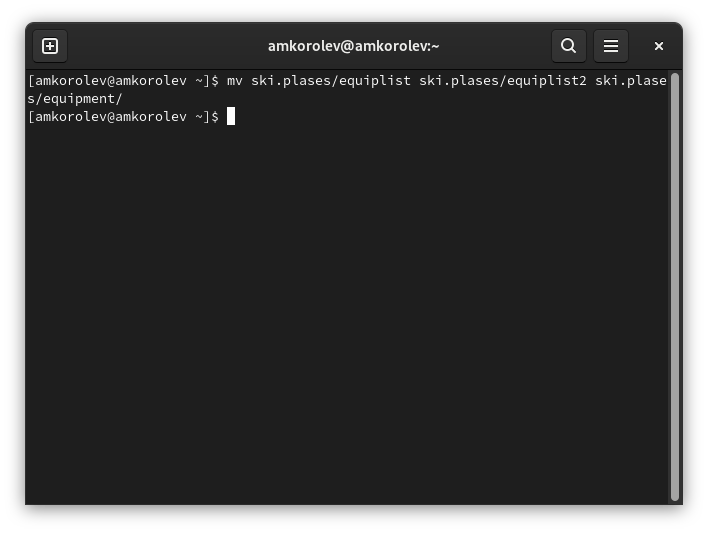
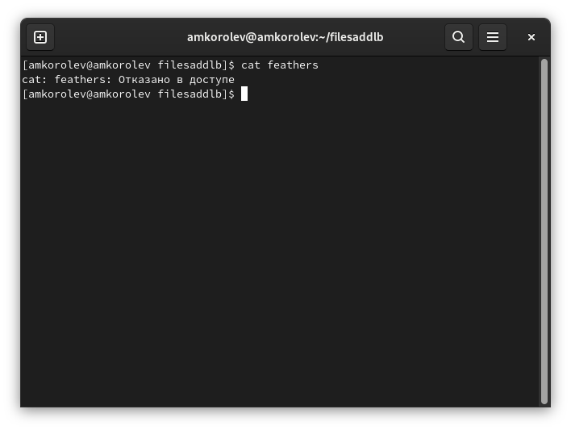
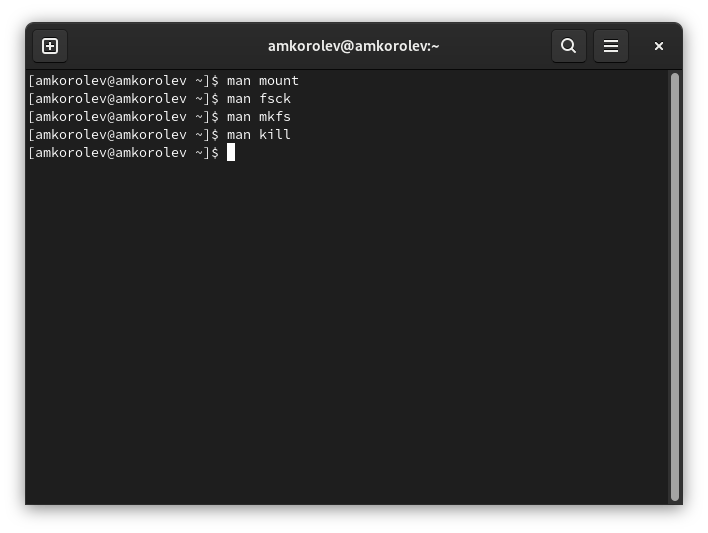

---
## Front matter
lang: ru-RU
title: Лабораторная работа №5. Анализ файловой системы Linux. Команды для работы с файлами и каталогами
author: |
	Подготовил:
	\
	Королев Адам Маратович
	\
	Группа: НПИбд-02-21
	\
	Студенческий билет: № 1032217060

## Formatting
toc: false
slide_level: 2
theme: metropolis
header-includes: 
 - \metroset{progressbar=frametitle,sectionpage=progressbar,numbering=fraction}
 - '\makeatletter'
 - '\beamer@ignorenonframefalse'
 - '\makeatother'
aspectratio: 43
section-titles: true
---
## Цель работы:

- Ознакомиться с файловой системой Linux, её структурой, именами и содержанием
каталогов.\
- Приобрести практические навыки по применению команд для работы
с файлами и каталогами, по управлению процессами (и работами), по проверке исполь-
зования диска и обслуживанию файловой системы.

## Теоретическое введение:

Файловая система -- это инструмент, позволяющий операционной системе и программам обращаться к нужным файлам и работать с ними.\
Каталог -- это объект в файловой системе, упрощающий организацию файлов. Типичная файловая система содержит большое количество файлов и каталоги помогают упорядочить ее путем их группировки.\
Права доступа -- совокупность правил, регламентирующих порядок и условия доступа субъекта к объектам информационной системы (информации, ее носителям, процессам и другим ресурсам).\

# Выполнение лабораторной работы:

# 1. Выполняем все примеры, приведённые в первой части описания лабораторной работы.

## 1.1. Копируем файл в текущем каталоге. Скопируем файл ~/abc1 в файл april и в файл may:

{width=350px}

## Копирование нескольких файлов в каталог. Скопировать файлы april и may в каталог monthly:

{width=350px}

## Копирование файлов в произвольном каталоге. Скопировать файл monthly/may в файл с именем june:

{width=350px}

## Копирование каталогов в текущем каталоге. Скопировать каталог monthly в каталог monthly.00:

{width=350px}

## Копирование каталогов в произвольном каталоге. Скопировать каталог monthly.00 в каталог /tmp

{width=350px}

## 1.2. Переименование файлов в текущем каталоге. Изменить название файла april на july в домашнем каталоге:

{width=350px}

## Перемещение файлов в другой каталог. Переместить файл july в каталог monthly.00:

{width=350px}

## Переименование каталогов в текущем каталоге. Переименовать каталог monthly.00 в monthly.01

{width=350px}

## Перемещение каталога в другой каталог. Переместить каталог monthly.01 в каталог reports:

{width=350px}

## Переименование каталога, не являющегося текущим. Переименовать каталог reports/monthly.01 в reports/monthly:

{width=350px}

## 1.3. Требуется создать файл ~/may с правом выполнения для владельца:

{width=350px}

## Требуется лишить владельца файла ~/may права на выполнение:

{width=350px}

## Требуется создать каталог monthly с запретом на чтение для членов группы и всех остальных пользователей:

{width=350px}

## Требуется создать файл ~/abc1 с правом записи для членов группы:

{width=350px}

# 2. Выполните следующие действия, зафиксировав в отчёте по лабораторной работе используемые при этом команды и результаты их выполнения:

## 2.1. Скопируйте файл /usr/include/sys/io.h в домашний каталог и назовите его equipment. Если файла io.h нет, то используйте любой другой файл в каталоге /usr/include/sys/ вместо него.
{width=350px}

## 2.2. В домашнем каталоге создайте директорию ~/ski.plases.
{width=350px}

## 2.3. Переместите файл equipment в каталог ~/ski.plases.
{width=350px}

## 2.4. Переименуйте файл ~/ski.plases/equipment в ~/ski.plases/equiplist.
{width=350px}

## 2.5. Создайте в домашнем каталоге файл abc1 и скопируйте его в каталог ~/ski.plases, назовите его equiplist2.
{width=350px}

## 2.6. Создайте каталог с именем equipment в каталоге ~/ski.plases.
{width=350px}

## 2.7. Переместите файлы ~/ski.plases/equiplist и equiplist2 в каталог ~/ski.plases/equipment.
{width=350px}

## 2.8. Создайте и переместите каталог ~/newdir в каталог ~/ski.plases и назовите его plans.
{width=350px}

## 3. Определим опции команды chmod, необходимые для того, чтобы присвоить перечисленным ниже файлам выделенные права доступа, считая, что в начале таких прав нет:
3.1. drwxr--r-- ... australia\
3.2. drwx--x--x ... play\
3.3. -r-xr--r-- ... my_os\
3.4. -rw-rw-r-- ... feathers\

## Присваиваем файлам права доступа:
{width=350px}

## Присваиваем файлам права доступа:
{width=350px}

# Проделайте приведённые ниже упражнения, записывая в отчёт по лабораторной работе используемые при этом команды:
## 4.1. Просмотрите содержимое файла /etc/password.
{width=350px}

## 4.2. Скопируйте файл ~/feathers в файл ~/file.old
{width=350px}

## 4.3. Переместите файл ~/file.old в каталог ~/play
{width=350px}

## 4.4. Скопируйте каталог ~/play в каталог ~/fun.
{width=350px}

## 4.5. Переместите каталог ~/fun в каталог ~/play и назовите его games.
{width=350px}

## 4.6. Лишите владельца файла ~/feathers права на чтение.
{width=350px}

## 4.7. Что произойдёт, если вы попытаетесь просмотреть файл ~/feathers командой cat?
{width=350px}

## 4.8. Что произойдёт, если вы попытаетесь скопировать файл ~/feathers?
{width=350px}

## 4.9. Дайте владельцу файла ~/feathers право на чтение.
{width=350px}

## 4.10. Лишите владельца каталога ~/play права на выполнение.
{width=350px}

## 4.11. Перейдите в каталог ~/play. Что произошло?
{width=350px}

## 4.12. Дайте владельцу каталога ~/play право на выполнение.
{width=350px}

# 5. Прочитайте man по командам mount, fsck, mkfs, kill и кратко их охарактеризуйте, приведя примеры.

## Команды man mount; man fsck; man mkfs; man kill
{width=350px}

## man mount
{width=350px}

## man fsck
{width=350px}

## man mkfs
{width=350px}

## man kill
{width=350px}

## Выводы: 

В процессе выполнения работы ознакомился с файловой системой Linux, ее структурой, именами и содержанием каталогов. Приобрел практические навыки по применению команд для работы с файлами и каталогами, по управлению процессами (и работами), по проверке использования диска и обслуживанию файловой системы.
