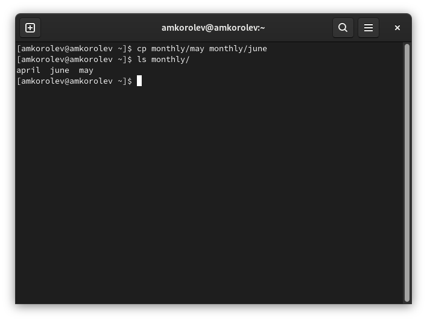
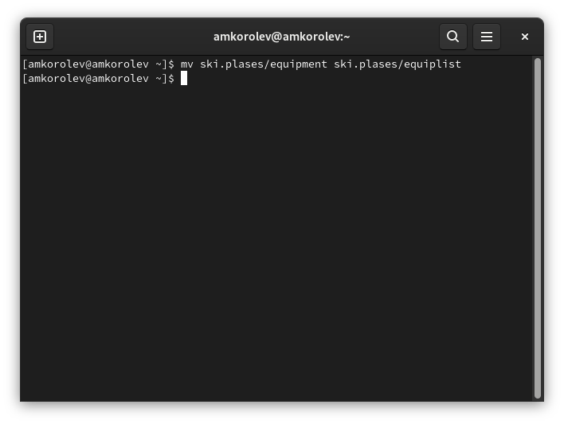

МИНИСТЕРСТВО ОБРАЗОВАНИЯ И НАУКИ\
РОССИЙСКОЙ ФЕДЕРАЦИИ\
\
ФЕДЕРАЛЬНОЕ ГОСУДАРСТВЕННОЕ АВТОНОМНОЕ\
ОБРАЗОВАТЕЛЬНОЕ УЧРЕЖДЕНИЕ ВЫСШЕГО ОБРАЗОВАНИЯ\
"РОССИЙСКИЙ УНИВЕРСИТЕТ ДРУЖБЫ НАРОДОВ"\

Факультет физико-математических и естественных наук\
\
\
\

ОТЧЕТ\
\
По лабораторной работе №5\
"Анализ файловой системы Linux.
Команды для работы с файлами и каталогами"\
\
\

Выполнил:\
Студент группы: НПИбд-02-21\
Студенческий билет: №1032217060\
ФИО студента: Королев Адам Маратович\
Дата выполнения: 04.05.2022\

Москва 2022

# Цель работы:

\- Ознакомиться с файловой системой Linux, её структурой, именами и содержанием
каталогов.\
\- Приобрести практические навыки по применению команд для работы
с файлами и каталогами, по управлению процессами (и работами), по проверке исполь-
зования диска и обслуживанию файловой системы.\

# Теоретическое введение:

Файловая система -- это инструмент, позволяющий операционной системе и программам обращаться к нужным файлам и работать с ними.\
Каталог -- это объект в файловой системе, упрощающий организацию файлов. Типичная файловая система содержит большое количество файлов и каталоги помогают упорядочить ее путем их группировки.\
Права доступа -- совокупность правил, регламентирующих порядок и условия доступа субъекта к объектам информационной системы (информации, ее носителям, процессам и другим ресурсам).\

# Выполнение лабораторной работы:

1. Выполняем все примеры, приведённые в первой части описания лабораторной работы.\
1.1. Копируем файл в текущем каталоге. Скопируем файл ~/abc1 в файл april
и в файл may:\
1 cd\
2 touch abc1\
3 cp abc1 april\
4 cp abc1 may\

\

Копирование нескольких файлов в каталог. Скопировать файлы april и may в каталог monthly:\
1 mkdir monthly\
2 cp april may monthly\

\

Копирование файлов в произвольном каталоге. Скопировать файл monthly/may в файл с именем june:\
1 cp monthly/may monthly/june\
2 ls monthly\

\

Копирование каталогов в текущем каталоге. Скопировать каталог monthly в каталог
monthly.00:\
1 mkdir monthly.00\
2 cp -r monthly monthly.00\

\

Копирование каталогов в произвольном каталоге. Скопировать каталог monthly.00
в каталог /tmp\
1 cp -r monthly.00 /tmp\

\

1.2. Переименование файлов в текущем каталоге. Изменить название файла april на
july в домашнем каталоге:\
1 cd\
2 mv april july\

\

Перемещение файлов в другой каталог. Переместить файл july в каталог monthly.00:\
1 mv july monthly.00\
2 ls monthly.00\

\

Переименование каталогов в текущем каталоге. Переименовать каталог monthly.00
в monthly.01\
1 mv monthly.00 monthly.01\

\

Перемещение каталога в другой каталог. Переместить каталог monthly.01в каталог
reports:\
1 mkdir reports\
2 mv monthly.01 reports\

\

Переименование каталога, не являющегося текущим. Переименовать каталог
reports/monthly.01 в reports/monthly:\
1 mv reports/monthly.01 reports/monthly\

\

1.3. Требуется создать файл ~/may с правом выполнения для владельца:\
1 cd\
2 touch may\
3 ls -l may\
4 chmod u+x may\
5 ls -l may\

\

Требуется лишить владельца файла ~/may права на выполнение:\
1 chmod u-x may\
2 ls -l may\

\

Требуется создать каталог monthly с запретом на чтение для членов группы и всех
остальных пользователей:\
1 cd\
2 mkdir monthly\
3 chmod g-r, o-r monthly\

\

Требуется создать файл ~/abc1 с правом записи для членов группы:\
1 cd\
2 touch abc1\
3 chmod g+w abc1\

\

2. Выполните следующие действия, зафиксировав в отчёте по лабораторной работе
используемые при этом команды и результаты их выполнения:\

2.1. Скопируйте файл /usr/include/sys/io.h в домашний каталог и назовите его
equipment. Если файла io.h нет, то используйте любой другой файл в каталоге
/usr/include/sys/ вместо него.\
\

2.2. В домашнем каталоге создайте директорию ~/ski.plases.\
\

2.3. Переместите файл equipment в каталог ~/ski.plases.\
\

2.4. Переименуйте файл ~/ski.plases/equipment в ~/ski.plases/equiplist.\
\

2.5. Создайте в домашнем каталоге файл abc1 и скопируйте его в каталог
~/ski.plases, назовите его equiplist2.\
\

2.6. Создайте каталог с именем equipment в каталоге ~/ski.plases.\
\

2.7. Переместите файлы ~/ski.plases/equiplist и equiplist2 в каталог
~/ski.plases/equipment.\
\

2.8. Создайте и переместите каталог ~/newdir в каталог ~/ski.plases и назовите
его plans.\
\

3. Определим опции команды chmod, необходимые для того, чтобы присвоить перечисленным ниже файлам выделенные права доступа, считая, что в начале таких прав
нет:\
3.1. drwxr--r-- ... australia\
3.2. drwx--x--x ... play\
3.3. -r-xr--r-- ... my_os\
3.4. -rw-rw-r-- ... feathers\

\

\

Проделайте приведённые ниже упражнения, записывая в отчёт по лабораторной
работе используемые при этом команды:\
4.1. Просмотрите содержимое файла /etc/password.\
\

4.2. Скопируйте файл ~/feathers в файл ~/file.old.\
\

4.3. Переместите файл ~/file.old в каталог ~/play.\
\

4.4. Скопируйте каталог ~/play в каталог ~/fun.\
\

4.5. Переместите каталог ~/fun в каталог ~/play и назовите его games.\
\

4.6. Лишите владельца файла ~/feathers права на чтение.\
\

4.7. Что произойдёт, если вы попытаетесь просмотреть файл ~/feathers командой
cat?\
\

4.8. Что произойдёт, если вы попытаетесь скопировать файл ~/feathers?\
\

4.9. Дайте владельцу файла ~/feathers право на чтение.\
\

4.10. Лишите владельца каталога ~/play права на выполнение.\
\

4.11. Перейдите в каталог ~/play. Что произошло?\
\

4.12. Дайте владельцу каталога ~/play право на выполнение.\
\

5. Прочитайте man по командам mount, fsck, mkfs, kill и кратко их охарактеризуйте,
приведя примеры.\

\

\
man mount\

\
man fsck\

\
man mkfs\
\
man kill\

# Выводы:
\- В процессе выполнения работы ознакомился с файловой системой Linux, ее структурой, именами и содержанием каталогов. Приобрел практические навыки по применению команд для работы с файлами и каталогами, по управлению процессами (и работами), по проверке использования диска и обслуживанию файловой системы.

# Ответы на контрольные вопросы:

1. EXT4 - Плюсы:\
\- Журналирование\
\- Поддержка шифрования\
\- Высокая стабильность, так как она проверена временем\
\- Поддержка по умолчанию во многих дистрибутивах\
\- Не подвержена фрагментации\
\- Лимитов вполне достаточно как обычному пользователю, так и для серверных систем\

EXT4 - Минусы:\
\- Не поддерживаются функции файловых систем следующего поколения, такие как управление томами, дедупликация данных\
\- Отсутствие проверки контрольных сумм для данных, что делает невозможным обнаружение повреждения данных из-за аппаратных сбоев оборудования.\
\- Плохая масштабируемость\

NTFS - Плюсы:\
\- Фрагментация файлов не имеет практически никаких последствий для самой файловой системы - работа фрагментированной системы ухудшается только с точки зрения доступа к самим данным файлов.\
\- Сложность структуры каталогов и число файлов в одном каталоге также не чинит особых препятствий быстродействию.\
\- Быстрый доступ к произвольному фрагменту файла\
\- Очень быстрый доступ к маленьким файлам (несколько сотен байт) - весь файл находится в том же месте, где и системные данные (запись MFT).\
NTFS - Минусы:\
\- Существенные требования к памяти системы (64 Мбайт - абсолютный минимум, лучше - больше).\
\- Медленные диски и контроллеры без Bus Mastering сильно снижают быстродействие NTFS\
\- Работа с каталогами средних размеров затруднена тем, что они почти всегда фрагментированы\
\- Диск, долго работающий в заполненном на 80% - 90% состоянии, будет показывать крайне низкое быстродействие\

2. \- '/bin' - Основные программы, необходимые для работы в системе\
\- '/boot' - Содержит ядро системы - главную программу, загружающую и исполняющую все остальные\
\- '/dev' - Каталог, в котором содержатся псевдофайлы устройств\
\- '/etc' - В этом каталоге содержатся системные конфигурационные файлы\
\- '/home' - В структуре файловой системы Linux каждый пользователь имеет отдельный личный каталог для своих данных\
\- '/mnt' - Каталоги для монтирования файловых систем сменных устройств и внешних файловых систем\
\- '/proc' - Файловая система на виртуальном устройстве, её файлы содержат информацию о текущем состоянии системы\
\- '/root' - Каталог администратора системы\
\- '/sbit' - Системные утилиты\
\- '/usr' - Программы и библиотеки, доступные пользователю\
\- '/var' - Рабочие файлы программ, различные временные данные\
\- '/tmp' - Временные файлы\
3. Чтобы содердимое некоторой файловой системы было доступно операционной системе, должно быть выполнено монтирование тома стандартными или внешними средствами операционной системы.\
4. Основные причины нарушения целостности файловой системы:\
\- Один блок адресуется несколькими 'mode'\
\- Блок помечен как свободный, но в то же время занят\
\- Блок помечен как занятый, но в то же время свободен\
\- Неправильное число ссылок в inode\
\- Несовпадение между размером файла и суммарным размером адресуемых inode блоков.\
\- Недопустимые адресуемые блоки\
\- Потерянные или недоступные файлы\
Чтобы устранить повреждения файловой системы используется команда 'fsck'\

5. Утилита 'mkfs' создает новую файловую систему\
6. \- Для просмотра небольших файлов - 'cat'\
\- Для просмотра больших файлов - 'less' - она позволяет осуществлять постраничный просмотр файлов\
\- Для просмотра начала файла - 'head[-n]' - по умолчанию она выводит первые 10 строк файла\
\- Команда 'tail[-n]' - выводит несколько последних строк файла\
7. Основные возможности команды 'cp':\
\- Копирование файла в текущем каталоге\
\- Копирование нескольких файлов в каталог\
\- Копирование файлов в произвольном каталоге\
\- '-i' в команде 'cp' выведет на экран запрос подтверждения о перезаписи файла, если на место целевого файла вы поставите имя уже существующего файла\
\- Команда 'cp' с опцией r (recursive) позволяет рекурсивно копировать каталоги вместе с входящими в них файлами и каталогами\
8. \- Команды mv и mvdir предназначены для перемещения и переименования файлов и каталогов\
\- Формат команды: mv [-option] %старый файл% %новый файл%\
9. Права доступа определяют, кто и что может делать с содержимым файла. Существуют три группы прав доступа: для владельца файла, для членов группы, для всех остальных.\
Для изменения прав доступа к файлу или каталогу используется команда chmod.\
Права доступа к файлу может поменять только владелец или суперпользователь.\
Команда 'sudo chmod' имеет следующую структуру и способ записи:\
\- 'u (user) владелец файла'\
\- 'g (group) группа, к которой принадлежит владелец файла'\
\- 'o (others) все остальные'\
\- '= установить право'\
\- '- лишить права'\
\- '+ дать право'\
\- 'r - чтение'\
\- 'w - запись'\
\- 'x - выполнение'\
