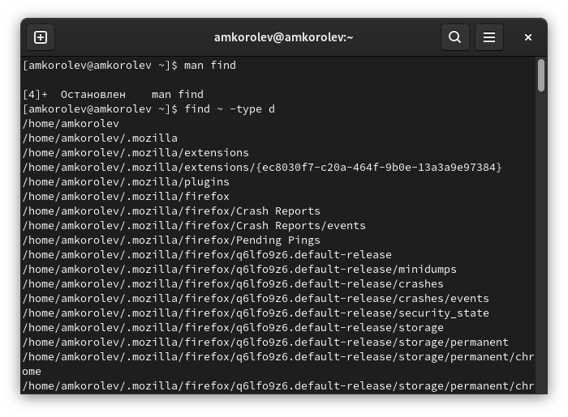

МИНИСТЕРСТВО ОБРАЗОВАНИЯ И НАУКИ\
РОССИЙСКОЙ ФЕДЕРАЦИИ\
\
ФЕДЕРАЛЬНОЕ ГОСУДАРСТВЕННОЕ АВТОНОМНОЕ\
ОБРАЗОВАТЕЛЬНОЕ УЧРЕЖДЕНИЕ ВЫСШЕГО ОБРАЗОВАНИЯ\
"РОССИЙСКИЙ УНИВЕРСИТЕТ ДРУЖБЫ НАРОДОВ"\

Факультет физико-математических и естественных наук\
\
\
\

ОТЧЕТ\
\
По лабораторной работе №6\
"Поиск файлов.\
Перенаправление ввода-вывода. Просмотр запущенных процессов"\
\

Выполнил:\
Студент группы: НПИбд-02-21\
Студенческий билет: №1032217060\
ФИО студента: Королев Адам Маратович\
Дата выполнения: 06.05.2022\

Москва 2022\

# Цель работы:
\- Ознакомиться с инструментами поиска файлов и фильтрации текстовых данных.\
\- Приобрести практические навыки: по управлению процессами (и заданиями), по проверке использования диска и обслуживанию файловых систем.\

# Теоретическое введение:

Файловая система -- это инструмент, позволяющий операционной системе и программам обращаться к нужным файлам и работать с ними.\
Процесс в Linux (как и в UNIX) -- это программа, которая выполняется в отдельном виртуальном адресном пространстве.\
Жесткий диск -- это запоминающее устройство (устройство хранения информации, накопитель) произвольного доступа, основанное на принципе магнитной записи. Является основным накопителем данных в большинстве компьютеров.\

# Выполнение лабораторной работы:

1. Запишем в файл file.txt названия файлов, содержащихся в каталоге /etc. Допишем в этот же файл названия файлов, содержащихся в домашнем каталоге.\

\
touch file.txt; ls /etc > file.txt; ls ~ >> file.txt\

2. Выведем имена всех файлов из file.txt, имеющих расширение .conf, после чего запишем их в новый текстовый файл conf.txt.\
\
grep .conf file.txt. Выведем имена всех файлов из file.txt, имеющих расширение .conf\

\
grep .conf file.txt >> conf.txt. Запишем их в новый текстовый файл conf.txt.\

3. Определим, какие файлы в домашнем каталоге имеют имена, начинавшиеся с символа c. Несколько способов.\
\
Первый способ. find ~-type f -name "c*" -print\

\
Второй способ. ls -l | grep c*\

4. Выведем на экран имена файлов из каталога /etc, начинающихся с символа h. Так как таких файлов не найдено, нам вывели каталоги, начинающиеся с символа h.\
\
ls -l | grep h*\

5. Запустим в фоновом режиме процесс, который будет записывать в файл ~/logfile файлы, имена которых начинаются с log.\
\
find ~ -name "log*" -print > ~/logfile&\

6. Удалим файл ~/logfile.\
\
rm -r logfile\

7. Запустим из консоли в фоновом режиме редактор gedit.\
\
gedit&\

8. Определим идентификатор процесса gedit, используя ps, конвейер и фильтр grep.\
\
ps aux | grep -i gedit&\

9. Прочтем справку (man) команды kill, после чего используем ее для завершения процесса gedit.\
\
man kill\

\
Справка по команде kill\

\
kill -9 8682\

10. Выполним команды df и du, предварительно получив более подробную информацию об этих командах, с помощью команды man.\
\
Справка по команде df\

\
Справка по команде du\

\
df\

\
du\

11. Воспользовавшись справкой команды find, выведем имена всех директорий, имеющихся в домашнем каталоге.\
\
Справка по команде find\

\
find ~ -type d\

# Выводы:
\- В процессе выполнения работы ознакомился с инструментами поиска файлов и фильтрации текстовых данных. Приобрел практические навыки:\
По управлению процессами (и заданиями);\
По проверке использования диска;\
По обслуживанию файловых систем.\

# Ответы на контрольные вопросы:

1. Существует всего три стандартных потока:\
\- 'stdin' - стандартный поток ввода (клавиатура - файловый дескриптор 0)\
\- 'stdout' - стандартный поток вывода (консоль - файловый дескриптор 1)\
\- 'stderr' - стандартный поток вывода сообщений об ошибках (консоль - файловый дескриптор 2)\

2. '>' - перенаправление stdout в файл. Если файл отсутствовал, то он создается, в противном случае - перезаписывается. \
\- '>>' - перенаправление stdout в файл. Если файл отсутствовал, то он создается, иначе - добавляется.\

3. Конвейер - инструмент для объединения простых команд или утилит в связные цепочки.\
4. Процесс - связь кода и данных, загруженные в ОЗУ/ПЗУ ЭВМ. К процессу также относятся элементы, которые взаимодействуют с программой - адресное пространство, глобальные переменные, регистры, стек и т.д.. Программа - единица выполняемого процесса.\
5. PID - Personal ID, идентификатор процесса.\
\- GID - Group ID, идентификатор группы.\

6. Программы запущенные в фоне называются задачами - jobs. Ими можно управлять с помощью команды jobs, которая выводит список запущенных в данный момент задач. Для завершения задачи необходимо выполнить команду 'kill %номер задачи'.\

7. 'htop' - монитор процессов, показывает динамический список системных процессов, список выравнивается по использованию ЦПУ.\
8. 'find' - используется для поиска и отображения имен файлов. Формат команды: 'find путь [-опции]' - 'find /home1/home2/ -%имя% "p*" -print'.\
9. 'grep' - используется для поиска файла по контексту - 'grep %string% %name%'.\
10. 'f' - позволяет определить объем свободной памяти на жестком диске.\
11. 'df /home/%user_name%' - позволяет определить объем домашнего каталога.\
12. Удалить зависший процесс можно командой 'kill %номер задачи%'.\
