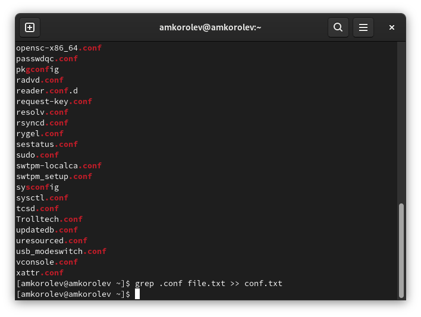
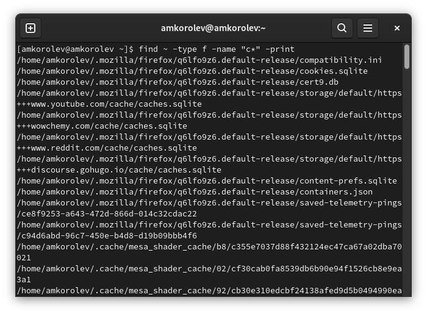
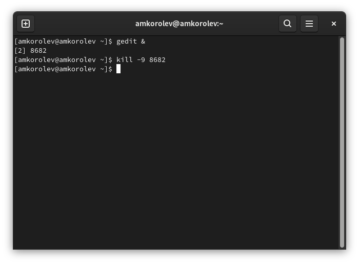

---
## Front matter
lang: ru-RU
title: Лабораторная работа №6. Поиск файлов. Перенаправление ввода-вывода. Просмотр запущенных процессов.
author: |
	Подготовил:
	\
	Королев Адам Маратович
	\
	Группа: НПИбд-02-21
	\
	Студенческий билет: № 1032217060

## Formatting
toc: false
slide_level: 2
theme: metropolis
header-includes: 
 - \metroset{progressbar=frametitle,sectionpage=progressbar,numbering=fraction}
 - '\makeatletter'
 - '\beamer@ignorenonframefalse'
 - '\makeatother'
aspectratio: 43
section-titles: true
---
## Цель работы:

- Ознакомиться с инструментами поиска файлов и фильтрации текстовых данных.\
- Приобрести практические навыки: по управлению процессами (и заданиями), по проверке использования диска и обслуживанию файловых систем.\

## Теоретическое введение:

Файловая система -- это инструмент, позволяющий операционной системе и программам обращаться к нужным файлам и работать с ними.\
Процесс в Linux (как и в UNIX) -- это программа, которая выполняется в отдельном виртуальном адресном пространстве.\
Жесткий диск -- это запоминающее устройство (устройство хранения информации, накопитель) произвольного доступа, основанное на принципе магнитной записи. Является основным накопителем данных в большинстве компьютеров.\

# Выполнение лабораторной работы:

## 1. Запишем в файл file.txt названия файлов, содержащихся в каталоге /etc. Допишем в этот же файл названия файлов, содержащихся в домашнем каталоге.

{width=250px}

# 2. Выведем имена всех файлов из file.txt, имеющих расширение .conf, после чего запишем их в новый текстовый файл conf.txt.

## Выведем имена всех файлов из file.txt, имеющих расширение .conf. grep .conf file.txt
{width=250px}

## Запишем их в новый текстовый файл conf.txt. grep .conf file.txt >> conf.txt
{width=250px}

# 3. Определим, какие файлы в домашнем каталоге имеют имена, начинавшиеся с символа c. Несколько способов.

## Первый способ. find ~-type f -name "c*" -print
{width=250px}

## Второй способ. ls -l | grep c*
{width=250px}

## 4. Выведем на экран имена файлов из каталога /etc, начинающихся с символа h. Так как таких файлов не найдено, нам вывели каталоги, начинающиеся с символа h.
{width=250px}

## 5. Запустим в фоновом режиме процесс, который будет записывать в файл ~/logfile файлы, имена которых начинаются с log.
{width=250px}

## 6. Удалим файл ~/logfile.
{width=250px}

## 7. Запустим из консоли в фоновом режиме редактор gedit.
{width=250px}

## 8. Определим идентификатор процесса gedit, используя ps, конвейер и фильтр grep.
{width=250px}

# 9. Прочтем справку (man) команды kill, после чего используем ее для завершения процесса gedit.

## Прочтем справку (man) команды kill
{width=250px}

## Прочтем справку (man) команды kill
{width=250px}

## Используем ее для завершения процесса gedit
{width=250px}

# 10. Выполним команды df и du, предварительно получив более подробную информацию об этих командах, с помощью команды man.

## Справка по команде df
{width=250px}

## Справка по команде du
{width=250px}

## df
{width=250px}

## du
{width=250px}

# 11. Воспользовавшись справкой команды find, выведем имена всех директорий, имеющихся в домашнем каталоге.

## Справка по команде find
{width=250px}

## Выведем имена всех директорий, имеющихся в домашнем каталоге
{width=250px}

## Выводы: 

\- В процессе выполнения работы ознакомился с инструментами поиска файлов и фильтрации текстовых данных. Приобрел практические навыки:\
По управлению процессами (и заданиями);\
По проверке использования диска;\
По обслуживанию файловых систем.\

