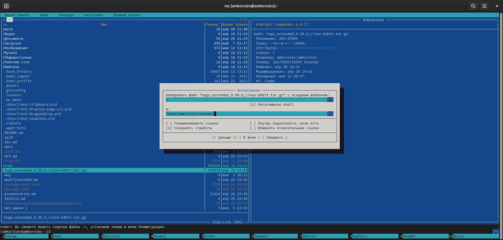
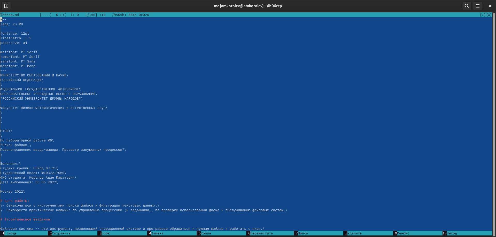
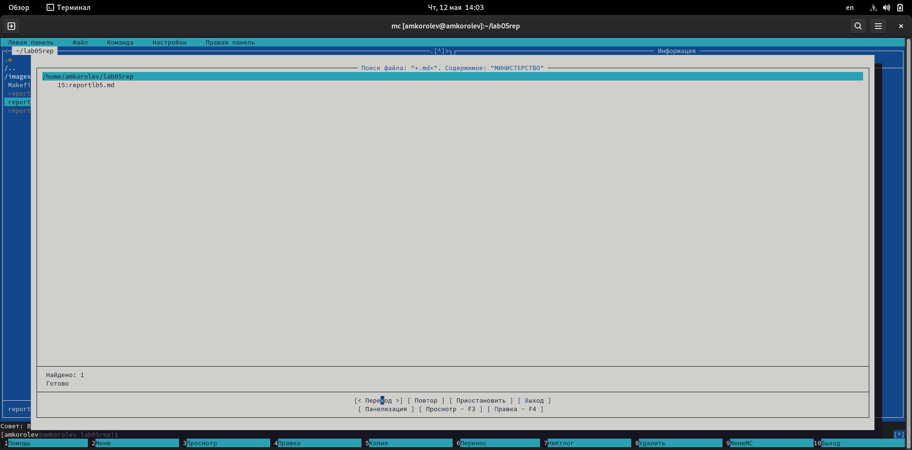
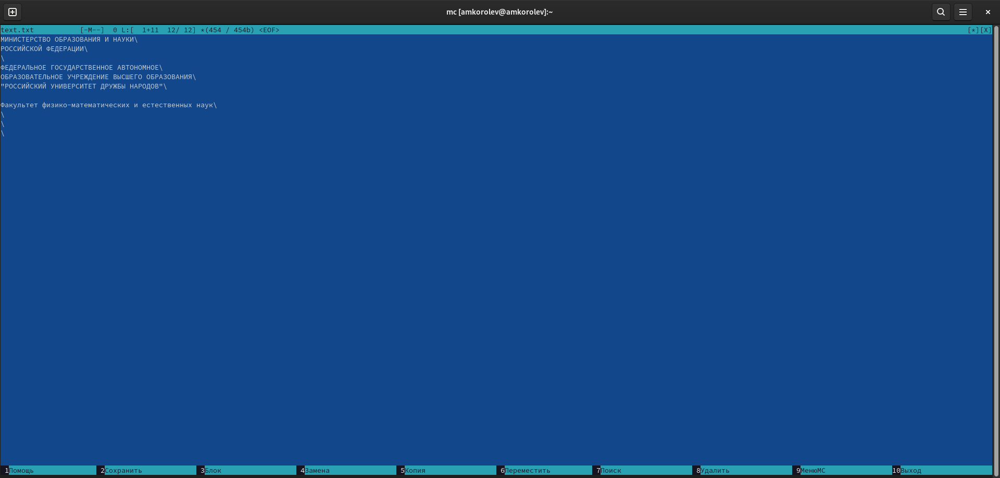
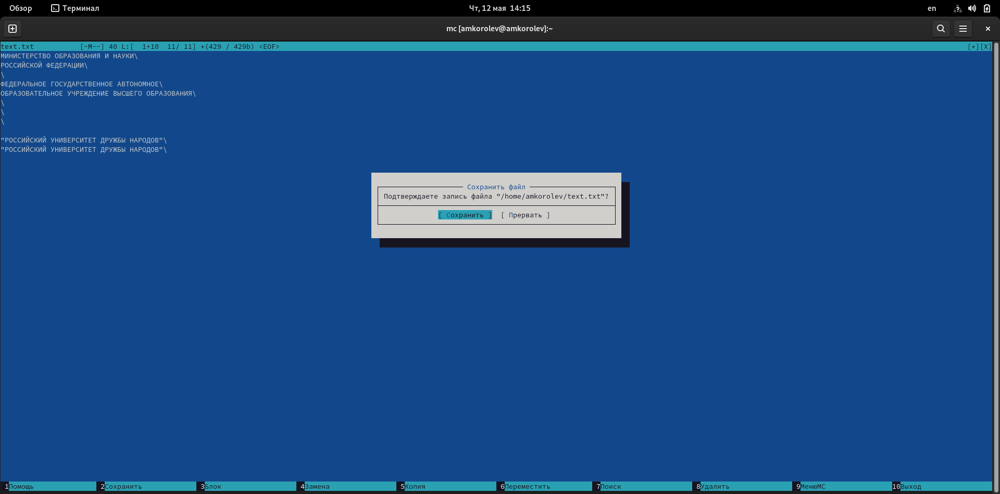

---
## Front matter
lang: ru-RU
title: Лабораторная работа №7. Командная оболочка. Midnight Commander.
author: |
	Подготовил:
	\
	Королев Адам Маратович
	\
	Группа: НПИбд-02-21
	\
	Студенческий билет: № 1032217060

## Formatting
toc: false
slide_level: 2
theme: metropolis
header-includes: 
 - \metroset{progressbar=frametitle,sectionpage=progressbar,numbering=fraction}
 - '\makeatletter'
 - '\beamer@ignorenonframefalse'
 - '\makeatother'
aspectratio: 43
section-titles: true
---
## Цель работы:

- Освоение основных возможностей командной оболочки Midnight Commander. Приоб-
ретение навыков практической работы по просмотру каталогов и файлов; манипуляций
с ними.

## Теоретическое введение:

Командная оболочка -- интерфейс взаимодействия пользователя с операционной системой и программным обеспечением посредством команд.\
Midnight Commander (или mc) -- текстовый двухпанельный файловый менеджер для Linux. Позволяет копировать, перемещать и удалять файлы и директории, производить поиск файлов и запускать на выполнение команды оболочки. Также включен встроенный редактор и программа для просмотра файлов.\

# Выполнение лабораторной работы:

## 1. Изучите информацию о mc, вызвав в командной строке man mc.

{width=250px}

## 2. Запустите из командной строки mc, изучите его структуру и меню.

{width=250px}

# 3. Выполните несколько операций в mc, используя управляющие клавиши (операции с панелями):

## Выделение/отмена выделения файлов
{width=250px}

## Копирование файлов
{width=250px}

## Перемещение файлов
{width=250px}

## Получение информации о размере и правах доступа на файлы и/или каталоги и т.п.
{width=250px}

# 4. Выполните основные команды меню левой (или правой) панели. Оцените степен подробности вывода информации о файлах.

## Меню правой панели
{width=250px}

## Оцените степень подробности вывода информации о файлах
{width=250px}

## Оцените степень подробности вывода информации о файлах
{width=250px}

## Оцените степень подробности вывода информации о файлах
{width=250px}

## Оцените степень подробности вывода информации о файлах
{width=250px}

# 5. Используя возможности подменю Файл , выполните:

## Просмотр содержимого текстового файла;
{width=250px}

## Редактирование содержимого текстового файла;
{width=250px}

## Создание каталога;
{width=250px}

## Создание каталога;
{width=250px}

## Копирование в файлов в созданный каталог
{width=250px}

## 6. С помощью соответствующих средств подменю Команда осуществите:
{width=250px}

## Поиск в файловой системе файла с заданными условиями;
{width=250px}

## Поиск в файловой системе файла с заданными условиями;
{width=250px}

## Выбор и повторение одной из предыдущих команд;
{width=250px}

## Выбор и повторение одной из предыдущих команд;
{width=250px}

## Переход в домашний каталог;
{width=250px}

# Анализ файла меню и файла расширений:

## Анализ файла меню
{width=250px}

## Анализ файла меню
{width=250px}

## Анализ файла расширений
{width=250px}

# 7. Вызовите подменю Настройки . Освойте операции, определяющие структуру экрана mc:
## Освойте операции, определяющие структуру экрана mc
{width=250px}

## Освойте операции, определяющие структуру экрана mc
{width=250px}

# Задание по встроенному редактору mc:

## 1. Cоздайте текстовой файл text.txt.
{width=250px}

## 2. Откройте этот файл с помощью встроенного в mc редактора.
{width=250px}

## 3. Вставьте в открытый файл небольшой фрагмент текста, скопированный из любого другого файла или Интернета.
{width=250px}

# 4. Проделайте с текстом следующие манипуляции, используя горячие клавиши:

## 4.1. Удалите строку текста.
{width=250px}

# 4.2. Выделите фрагмент текста и скопируйте его на новую строку.
## Выделите фрагмент текста
{width=250px}

## Скопируйте его на новую строку
{width=250px}

# 4.3. Выделите фрагмент текста и перенесите его на новую строку.
## Перенесите его на новую строку
{width=250px}

## 4.4. Сохраните файл.
{width=250px}

## 4.5. Отмените последнее действие.
{width=250px}

## 4.6. Перейдите в конец файла (нажав комбинацию клавиш) и напишите некоторый текст.
{width=250px}

## 4.7. Перейдите в начало файла (нажав комбинацию клавиш) и напишите некоторый текст.
{width=250px}

# 4.8. Сохраните и закройте файл.
## Сохраните файл
{width=250px}

## Закройте файл
{width=250px}

## 5. Откройте файл с исходным текстом на некотором языке программирования (например C или Java)

{width=250px}

# 6. Используя меню редактора, включите подсветку синтаксиса, если она не включена, или выключите, если она включена.
## Подсветка синтаксиса выключена
{width=250px}

## Включили подсветку синтаксиса
{width=250px}

## Выводы: 

\- В процессе выполнения работы были освоены основные возможности командной оболочки Midnight Commander. Приобретены навыки практической работы по просмотру каталогов и файлов; манипуляций с ними.\

