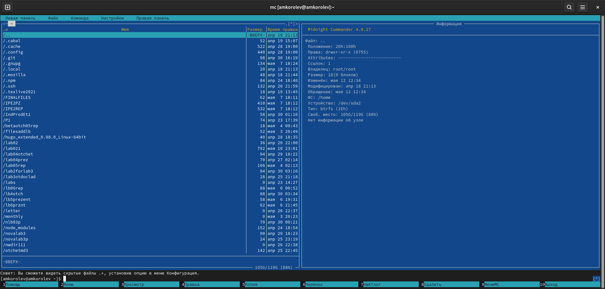

МИНИСТЕРСТВО ОБРАЗОВАНИЯ И НАУКИ\
РОССИЙСКОЙ ФЕДЕРАЦИИ\
\
ФЕДЕРАЛЬНОЕ ГОСУДАРСТВЕННОЕ АВТОНОМНОЕ\
ОБРАЗОВАТЕЛЬНОЕ УЧРЕЖДЕНИЕ ВЫСШЕГО ОБРАЗОВАНИЯ\
"РОССИЙСКИЙ УНИВЕРСИТЕТ ДРУЖБЫ НАРОДОВ"\

Факультет физико-математических и естественных наук\
\
\
\

ОТЧЕТ\
\
По лабораторной работе №7\
"Командная оболочка.\
 Midnight Commander"\
\

Выполнил:\
Студент группы: НПИбд-02-21\
Студенческий билет: №1032217060\
ФИО студента: Королев Адам Маратович\
Дата выполнения: 12.05.2022\

Москва 2022\

# Цель работы:
\- Освоение основных возможностей командной оболочки Midnight Commander. Приоб-
ретение навыков практической работы по просмотру каталогов и файлов; манипуляций
с ними.

# Теоретическое введение:

Командная оболочка -- интерфейс взаимодействия пользователя с операционной систе-
мой и программным обеспечением посредством команд.\
Midnight Commander (или mc) -- текстовый двухпанельный файловый менеджер для Linux. Позволяет копировать, перемещать и удалять файлы и директории, производить поиск файлов и запускать на выполнение команды оболочки. Также включен встроенный редактор и программа для просмотра файлов.\

# Выполнение лабораторной работы:

1. Изучите информацию о mc, вызвав в командной строке man mc.

\
man mc\

2. Запустите из командной строки mc, изучите его структуру и меню.

\
mc, изучаем структуру и меню mc\

3. Выполните несколько операций в mc, используя управляющие клавиши (операции
с панелями:\

Выделение/отмена выделения файлов\
\

Копирование файлов\
\

Перемещение файлов\
\

Получение информации о размере и правах доступа на файлы и/или каталоги
и т.п.\
\

4. Выполните основные команды меню левой (или правой) панели. Оцените степень
подробности вывода информации о файлах.\

Меню правой панели\
\

Оцените степень подробности вывода информации о файлах\
\

Оцените степень подробности вывода информации о файлах\
\

Оцените степень подробности вывода информации о файлах\
\

Оцените степень подробности вывода информации о файлах\
\

5. Используя возможности подменю Файл , выполните:\

Просмотр содержимого текстового файла;\
\

Редактирование содержимого текстового файла;\
\

Создание каталога;\
\

Создание каталога;\
\

Копирование в файлов в созданный каталог\
\

6. С помощью соответствующих средств подменю Команда осуществите:\
\

Поиск в файловой системе файла с заданными условиями;\
\

Поиск в файловой системе файла с заданными условиями;\
\

Выбор и повторение одной из предыдущих команд;\
\

Выбор и повторение одной из предыдущих команд;\
\

Переход в домашний каталог;\
\

Анализ файла меню и файла расширений:\

Анализ файла меню\
\

Анализ файла меню\
\

Анализ файла расширений\
\

7. Вызовите подменю Настройки . Освойте операции, определяющие структуру экрана mc:\
Освойте операции, определяющие структуру экрана mc\
\
Освойте операции, определяющие структуру экрана mc\
\

\- Задание по встроенному редактору mc:\

1. Cоздайте текстовой файл text.txt.\
\

2. Откройте этот файл с помощью встроенного в mc редактора.\
\

3. Вставьте в открытый файл небольшой фрагмент текста, скопированный из любого другого файла или Интернета.\
\

4. Проделайте с текстом следующие манипуляции, используя горячие клавиши:\

4.1. Удалите строку текста.\
\

4.2. Выделите фрагмент текста и скопируйте его на новую строку.\
Выделите фрагмент текста\
\

Скопируйте его на новую строку\
\

4.3. Выделите фрагмент текста и перенесите его на новую строку.\
Перенесите его на новую строку\
\

4.4. Сохраните файл.\
\

4.5. Отмените последнее действие.\
\

4.6. Перейдите в конец файла (нажав комбинацию клавиш) и напишите некоторый
текст.\
\

4.7. Перейдите в начало файла (нажав комбинацию клавиш) и напишите некоторый
текст.\
\

4.8. Сохраните и закройте файл.\
Сохраните файл\
\

Закройте файл\
\

5. Откройте файл с исходным текстом на некотором языке программирования (например C или Java)\

\

6. Используя меню редактора, включите подсветку синтаксиса, если она не включена, или выключите, если она включена.\
Подсветка синтаксиса выключена\
\

Включили подсветку синтаксиса\
\

# Выводы:
\- В процессе выполнения работы были освоены основные возможности командной оболочки Midnight Commander. Приобретены навыки практической работы по просмотру каталогов и файлов; манипуляций с ними.\

# Ответы на контрольные вопросы:

1. \
\- Режим "Информация" - на панель выводится информация о подсвеченном в другой панели файле и о текущей файловой системе\
\- Режим "Дерево" - в одной из панелей выводится графическое изображение структуры дерева каталогов\

2. \
\- F1 - Вызывает контекстно-зависимую подсказку.\
\- F2 - Вызывает меню, создаваемое пользователем. Оно позволяет создавать и добавлять дополнительные функции\
\- F3 - Просмотр файла, на который указывает подсветка в активной панели\
\- F4 - Вызов встроенного редактора для файла, на который указывает подсветка в активной панели.\
\- F5 - Копирование файла или группы отмеченных файлов из каталога, отображаемого в активной панели, в каталог, отображаемый на второй панели. При копировании одного файла можно поменять его имя\
\- F6 - Перенос файла или группы отмеченных файлов из каталога, отображаемого в активной панели, в каталог, отображаемый на второй панели. Как и при копировании, можно поменять имя файла или целого каталога.\
\- F7 - Создание подкаталога в каталоге, отображаемом в активной панели\
\- F8 - Удаление файла (подкаталога) или группы отмеченных файлов\
\- F9 - Вызов основного меню программы (отображаемого над панелями)\
\- F10 - Выход из программы\
\
3. Структура меню левой (или правой) панели MC:\
\- список файлов (этот режим используется для просмотра списка файлов).\
\- быстрый просмотр (в этом режиме панель переключается в режим вьюера, который показывает содержимое текущего файла; если выбрать эту панель (нажав клавишу Tab или при помощи мыши), то здесь можно пользоваться стандартными командами вьюера)\
\- информация (в этом режиме отображается информация, связанная с текущим файлом и, по возможности, информация о текущей файловой системе)\
\- дерево (этот режим идентичен функции отображения дерева каталогов)\
\- порядок сортировки (существует восемь типов сортировки файлов: по имени, по расширению, по времени последней модификации файла, по времени последнего доступа к файлу, по времени модификации индексного дескриптора, по размеру, по значению индексного деакриптора и без порядка. В диалоговом окне Sort order можно выбрать тип сортировки, а также указать, что сортировку следует производить в обратном порядке)\
\- фильтр (эта команда позволяет указать шаблон для файлов, которые должны отображаться; вне зависимости от шаблона, каталоги и ссылки к каталогам отображаются всегда)\
4. Подпункты меню «Файл»:\
\- F3 - позволяет посмотреть содержимое текущего файла без возможности редактирования\
\- F4 - открывает текущий файл для его редактирования
\- F5 - осуществляет копирование одного или нескольких файлов или каталогов в указанное место\
\- Ctrl-x c - позволяет изменить права доступа к одному или нескольким файлам или каталогам\
\- Ctrl-x l - позволяет создать жёсткую ссылку к текущему файлу\
\- Ctrl-x s - позволяет создать символическую ссылку к текущему файлу\
\- Ctrl-x o - позволяет задать владельца и имя группы для одного или нескольких файлов или каталогов\
\- F6 - позволяет переименовать один или несколько файлов или каталогов\
\- F7 - позволяет создать каталог\
\- F8 - позволяет удалить один или несколько файлов или каталогов\
\- F10 - завершает работу\
5. Подпункты меню "Команда":\
\- дерево каталогов - отображает структуру каталогов системы\
\- поиск файла - выполняет поиск файлов по заданным параметрам\
\- переставить панели - меняет местами левую и правую панели\
\- сравнить каталоги - сравнивает содержимое двух каталогов\
\- размеры каталогов - отображает размер и время изменения каталога\
\- история командной строки - выводит на экран список ранее выполненных в оболочке команд\
\- каталоги быстрого доступа - при вызове выполняется быстрая смена текущего каталога на один из заданного списка\
\- восстановление файлов - позволяет восстановить файлы на файловых системах ext2 и ext3\
\- редактировать файл расширений - позволяет задать с помощью определённого синтаксиса действия при запуске файлов с определённым расширением\
\- редактировать файл меню — позволяет отредактировать контекстное меню пользователя, вызываемое по клавише F2\
\- редактировать файл расцветки имён — позволяет подобрать оптимальную для пользователя расцветку имён файлов в зависимости от их типа.\
6. Подпункты меню «настройки»:\
\- Конфигурация позволяет скорректировать настройки работы с панелями\
\- Внешний вид и Настройки панелей определяет элементы, отображаемые при вызове MC, а также цветовое выделение\
\- Биты символов задаёт формат обработки информации локальным терминалом\
\- Подтверждение позволяет установить или убрать вывод окна с запросом подтверждения действий при определенных операциях\
\- Распознание клавиш диалоговое окно используется для тестирования клавиш\
\- Виртуальные ФС настройки виртуальной файловой системы\

7. Встроенные команды MC:\
\- F1 - Вызов контекстно-зависимой подсказки\
\- F2 - Вызов пользовательского меню с возможностью создания and/or\
\- F3 - Просмотр содержимого файла, на который указывает подсветка в активной панели\
\- F4 - Вызов встроенного в MC редактора для изменения содержания файла, на который указывает подсветка в активной панели\
\- F5 - Копирование одного или нескольких файлов, отмеченных в первой (активной) панели, в каталог, отображаемый на второй панели\
\- F6 - Перенос одного или нескольких файлов, отмеченных в первой панели, в каталог, отображаемый на второй панели\
\- F7 - Создание подкаталога в каталоге, отображаемом в активной панели\
\- F8 - Удаление одного или нескольких файлов, отмеченных в первой панели файлов\
\- F9 - Вызов меню MC\
\- F10 - Выход из MC\
8. Команды MC :\
\- Ctrl + Y - удалить строку\
\- Ctrl + U - отмена последней операции\
\- Ins - вставка/замена\
\- F7 - поиск\
\- Shift + F7 - повтор последней операции поиска\
\- F4 - замена файла\
\- F3 - первое нажатие начало выделения, второе это окончание выделения\
\- F5 - копировать выделенный фрагмент F6 переместить выделенный фрагмент\
\- F8 - удалить выделенный фрагмент\
\- F2 - записать изменения в файл\
\- F10 - выйти из редактора\
9.  Характеристика средств mc, которые позволяют создавать меню, определяемых пользователем. Перейти в строку меню панелей MC можно с помощью клавиши F9. В строке меню имеются пять меню: Левая панель, Файл, Команда, Настройки и Правая панель. В меню каждой левой и правой панели можно выбрать "Формат списка":\
\- стандартный - выводит список файлов и каталогов с указанием размера и времени правки\
\- ускоренный - позволяет задать число столбцов, на которые разбивается панель при выводе списка имён файлов или каталогов без дополнительной информации\
\- расширенный - помимо названия файла или каталога выводит сведения о правах доступа, владельце, группе, размере, времени правки\
\- определённые пользователем - позволяет вывести те сведения о файле или каталоге, которые задаст пользователь\
10. Средства MC, которые позволяют выполнять действия, над файлом - все команды, содержащиеся в меню в левой или правой панели, файле, команде, и в настройках\
