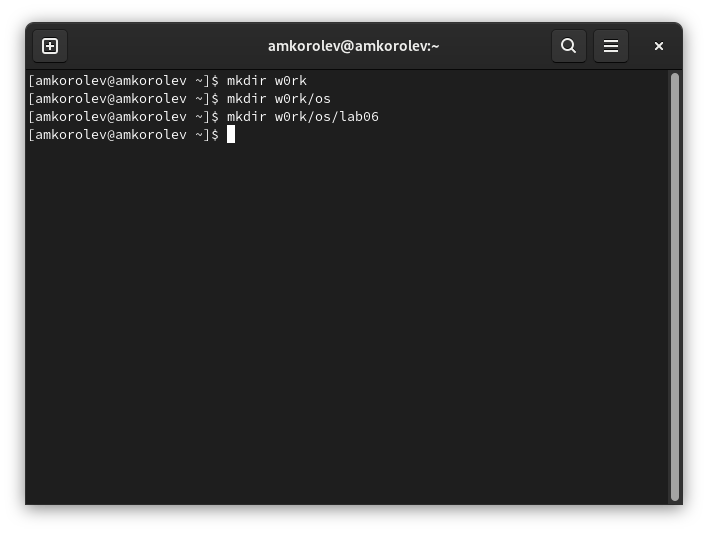

---
## Front matter
lang: ru-RU
title: Лабораторная работа №8. Текстовой редактор vi.
author: |
	Подготовил:
	\
	Королев Адам Маратович
	\
	Группа: НПИбд-02-21
	\
	Студенческий билет: № 1032217060

## Formatting
toc: false
slide_level: 2
theme: metropolis
header-includes: 
 - \metroset{progressbar=frametitle,sectionpage=progressbar,numbering=fraction}
 - '\makeatletter'
 - '\beamer@ignorenonframefalse'
 - '\makeatother'
aspectratio: 43
section-titles: true
---
## Цель работы:

- Ознакомиться с операционной системой Linux. Получить практические навыки работы с редактором vi, установленным по умолчанию практически во всех дистрибутивах.\

## Теоретическое введение:

Текстовый редактор vi -- это стандартный текстовый редактор UNIX, который есть в любой UNIX-подобной операционной системе. Первая версия редактора появилась в 1976 году. Редактор построен на базе редактора командной строки ex.\
Существует множество "клонов" vi: elvis, vim и др. Все они включают идентичный, основной набор команд. 

# Выполнение лабораторной работы:

# Задание 1. Создание нового файла с использованием vi.

## 1. Создайте каталог с именем ~/w0rk/os/lab06.

{width=250px}

## 2. Перейдите в созданный каталог.

{width=250px}

## 3. Вызовите vi и создайте файл hello.sh
{width=250px}

## 4. Нажмите клавишу i и вводите следующий текст.

{width=250px}

## 5. Нажмите клавишу Esc для перехода в командный режим после завершения ввода текста.

{width=250px}

## 6. Нажмите : для перехода в режим последней строки и внизу вашего экрана появится приглашение в виде двоеточия.

{width=250px}

## 7. Нажмите w (записать) и q (выйти), а затем нажмите клавишу Enter для сохранения вашего текста и завершения работы.

{width=250px}

## 8. Сделайте файл исполняемым

{width=250px}

# Задание 2. Редактирование существующего файла.

## 1. Вызовите vi на редактирование файла

{width=250px}

## 2. Установите курсор в конец слова HELL второй строки.

{width=250px}

## 3. Перейдите в режим вставки и замените на HELLO. Нажмите Esc для возврата в командный режим.

{width=250px}

## 4. Установите курсор на четвертую строку и сотрите слово LOCAL.

{width=250px}

## 5. Перейдите в режим вставки и наберите следующий текст: local, нажмите Esc для возврата в командный режим.

{width=250px}

## 6. Установите курсор на последней строке файла. Вставьте после неё строку, содержащую следующий текст: echo $HELLO.

{width=250px}

## 7. Нажмите Esc для перехода в командный режим.

{width=250px}

## 8. Удалите последнюю строку.

{width=250px}

## 9. Введите команду отмены изменений u для отмены последней команды.

{width=250px}

# 10. Введите символ : для перехода в режим последней строки. Запишите произведённые изменения и выйдите из vi.

## :wq
{width=250px}

## Вышли из vi
{width=250px}

## Выводы: 

\- В процессе выполнения работы получили практические навыки работы с редактором vi, установленным по умолчанию практически во всех дистрибутивах.\

