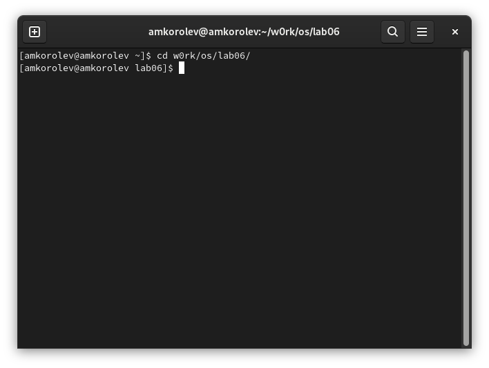
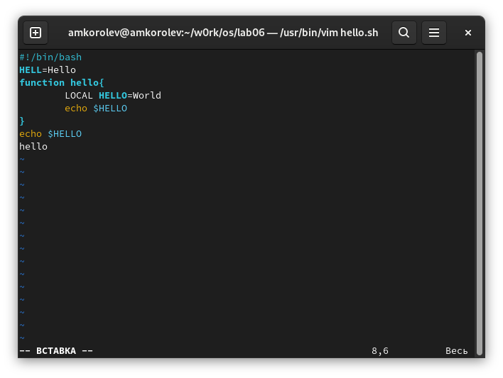
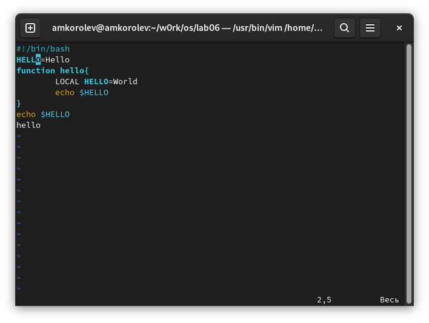
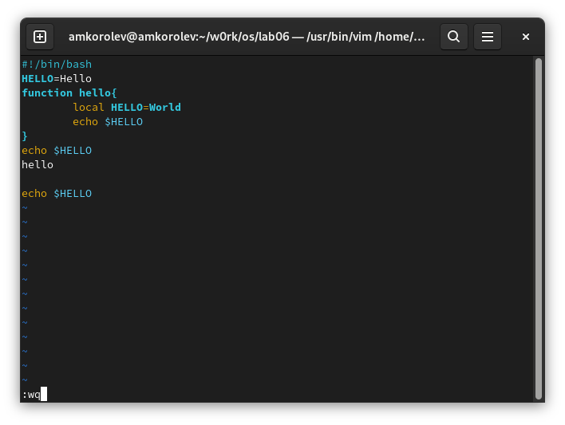

МИНИСТЕРСТВО ОБРАЗОВАНИЯ И НАУКИ\
РОССИЙСКОЙ ФЕДЕРАЦИИ\
\
ФЕДЕРАЛЬНОЕ ГОСУДАРСТВЕННОЕ АВТОНОМНОЕ\
ОБРАЗОВАТЕЛЬНОЕ УЧРЕЖДЕНИЕ ВЫСШЕГО ОБРАЗОВАНИЯ\
"РОССИЙСКИЙ УНИВЕРСИТЕТ ДРУЖБЫ НАРОДОВ"\

Факультет физико-математических и естественных наук\
\
\
\

ОТЧЕТ\
\
По лабораторной работе №8\
"Текстовой редактор vi."\
\

Выполнил:\
Студент группы: НПИбд-02-21\
Студенческий билет: №1032217060\
ФИО студента: Королев Адам Маратович\
Дата выполнения: 12.05.2022\
\
\
\

Москва 2022\

# Цель работы:
\- Познакомиться с операционной системой Linux. Получить практические навыки работы с редактором vi, установленным по умолчанию практически во всех дистрибутивах.

# Теоретическое введение:

Текстовый редактор vi -- это стандартный текстовый редактор UNIX, который есть в любой UNIX-подобной операционной системе. Первая версия редактора появилась в 1976 году. Редактор построен на базе редактора командной строки ex.\
Существует множество "клонов" vi: elvis, vim и др. Все они включают идентичный, основной набор команд. 

# Выполнение лабораторной работы:

## Задание 1. Создание нового файла с использованием vi.

1. Создайте каталог с именем ~/w0rk/os/lab06.

\
mkdir w0rk; mkdir work/os; mkdir work/os/lab06\

2. Перейдите в созданный каталог.

\
cd w0rk/os/lab06/\

3. Вызовите vi и создайте файл hello.sh\
\
vi hello.sh\

4. Нажмите клавишу i и вводите следующий текст.

!/bin/bash\
HELL=Hello\
function hello {\
LOCAL HELLO=World\
echo $HELLO\
}\
echo $HELLO\
hello\

\
Вводим текст\

5. Нажмите клавишу Esc для перехода в командный режим после завершения ввода текста.\

\
Перешли в командный режим\

6. Нажмите : для перехода в режим последней строки и внизу вашего экрана появится приглашение в виде двоеточия.\

\
Ввели :\

7. Нажмите w (записать) и q (выйти), а затем нажмите клавишу Enter для сохранения вашего текста и завершения работы.\

\
Ввели w и q\

8. Сделайте файл исполняемым\
chmod +x hello.sh\

\
chmod +x hello.sh\

## Задание 2. Редактирование существующего файла.

1. Вызовите vi на редактирование файла
vi ~/work/os/lab06/hello.sh

\
vi ~/work/os/lab06/hello.sh\

2. Установите курсор в конец слова HELL второй строки.

\
Установите курсор в конец слова HELL второй строки.\

3. Перейдите в режим вставки и замените на HELLO. Нажмите Esc для возврата в командный режим.

\
Заменили на HELLO.\

4. Установите курсор на четвертую строку и сотрите слово LOCAL.

\
терли слово LOCAL\

5. Перейдите в режим вставки и наберите следующий текст: local, нажмите Esc для
возврата в командный режим.

\
Набрали слово local\

6. Установите курсор на последней строке файла. Вставьте после неё строку, содержащую
следующий текст: echo $HELLO.

\
Вставили строку в текстом\

7. Нажмите Esc для перехода в командный режим.

\
Перешли в командный режим\

8. Удалите последнюю строку.

\
Удалили последнюю строку\

9. Введите команду отмены изменений u для отмены последней команды.

\
Отменили последнюю команду\

10. Введите символ : для перехода в режим последней строки. Запишите произведённые
изменения и выйдите из vi.

\
:wq\

\
Вышли из vi\

# Выводы:
\- В процессе выполнения работы получили практические навыки работы с редактором vi, установленным по умолчанию практически во всех дистрибутивах.\

# Ответы на контрольные вопросы:

1. Редактор vi имеет три режима работы:\
\- Командный режим — предназначен для ввода команд редактирования и навигации по редактируемому файлу;\
\- Режим вставки — предназначен для ввода содержания редактируемого файла;\
\- Режим последней (или командной) строки — используется для записи изменений в файл и выхода из редактора.\

2. Чтобы выйти из редактора не сохраняя произведенные изменения, нужно в режиме командной строки нажать клавиши :q!.\
3. Команды позиционирования:\
\- 0 (ноль) — переход в начало строки;\
\- $ — переход в конец строки;\
\- G — переход в конец файла;\
\- n G — переход на строку с номером n.\

4. Редактор vi предполагает, что слово - это строка символов, которая может включать в себя буквы, цифры и символы подчеркивания.\

5. Чтобы перейти в начало файла, необходимо в режиме командной строки нажать клавиши "1G", если в конец, то "G".\

6. Команды редактирования\
8.2.2.1. Вставка текста\
– а — вставить текст после курсора;\
– А — вставить текст в конец строки;\
– i — вставить текст перед курсором;\
– n i — вставить текст n раз;\
– I — вставить текст в начало строки.\

8.2.2.2. Вставка строки\
– о — вставить строку под курсором;\
– О — вставить строку над курсором.\

8.2.2.3. Удаление текста\
– x — удалить один символ в буфер;\
– d w — удалить одно слово в буфер;\
– d $ — удалить в буфер текст от курсора до конца строки;\
– d 0 — удалить в буфер текст от начала строки до позиции курсора;\
– d d — удалить в буфер одну строку;\
– n d d — удалить в буфер n строк.\

8.2.2.4. Отмена и повтор произведённых изменений\
– u — отменить последнее изменение;\
– . — повторить последнее изменение.\

8.2.2.5. Копирование текста в буфер\
– Y — скопировать строку в буфер;\
– n Y — скопировать n строк в буфер;\
– y w — скопировать слово в буфер.\

8.2.2.6. Вставка текста из буфера\
– p — вставить текст из буфера после курсора;\
– P — вставить текст из буфера перед курсором.\

8.2.2.7. Замена текста\
– c w — заменить слово;\
– n c w — заменить n слов;\
– c $ — заменить текст от курсора до конца строки;\
– r — заменить слово;\
– R — заменить текст.\

8.2.2.8. Поиск текста
– / текст — произвести поиск вперёд по тексту указанной строки символов текст;\
– ? текст — произвести поиск назад по тексту указанной строки символов текст\

7. Мною будет использована команда – c $ —, чтобы заменить текст от курсора до конца строки;\

8. Чтобы отменить некорректное действие, введите команду отмены изменений "u" для отмены последней команды.\

9. Команды редактирования в режиме командной строки\
8.2.3.1. Копирование и перемещение текста\
– : n,m d — удалить строки с n по m;\
– : i,j m k — переместить строки с i по j, начиная со строки k;\
– : i,j t k — копировать строки с i по j в строку k;\
– : i,j w имя-файла — записать строки с i по j в файл с именем имя-файла.\

8.2.3.2. Запись в файл и выход из редактора\
– :w — записать изменённый текст в файл, не выходя из vi;\
– :w имя-файла — записать изменённый текст в новый файл с именем имя-файла;\
– :w ! имя-файла — записать изменённый текст в файл с именем имя-файла;\
– :w q — записать изменения в файл и выйти из vi;\
– : q — выйти из редактора vi;\
– : q ! — выйти из редактора без записи;\
– : e ! — вернуться в командный режим, отменив все изменения, произведённые со времени последней записи.\

10. Чтобы определить позицию, в которой заканчивается строка, не перемещая курсора, нужно находясь в командном режиме находясь на нужной строке нажать "$" и посмотреть на число после запятой в правом нижнем углу экрана.\

11. Опции
Опции редактора vi позволяют настроить рабочую среду. Для задания опций используется команда set (в режиме последней строки):\
– :set all — вывести полный список опций;\
– :set nu — вывести номера строк;\
– :set list — вывести невидимые символы;\
– :set ic — не учитывать при поиске, является ли символ прописным или строчным.\
Если вы хотите отказаться от использования опции, то в команде set перед именем опции надо поставить no.\

12. В режиме командной строки внизу редактора присутствует ":" и снизу отсутствует текст. В режиме редактирования снизу отображается текст "ВСТАВКА".\

13. Граф взаимосвязи режимов работы редактора vi.\

\

