МИНИСТЕРСТВО ОБРАЗОВАНИЯ И НАУКИ\
РОССИЙСКОЙ ФЕДЕРАЦИИ\
\
ФЕДЕРАЛЬНОЕ ГОСУДАРСТВЕННОЕ АВТОНОМНОЕ\
ОБРАЗОВАТЕЛЬНОЕ УЧРЕЖДЕНИЕ ВЫСШЕГО ОБРАЗОВАНИЯ\
"РОССИЙСКИЙ УНИВЕРСИТЕТ ДРУЖБЫ НАРОДОВ"\

Факультет физико-математических и естественных наук\
\
\
\

ОТЧЕТ\
\
По лабораторной работе №9\
"Текстовой редактор emacs"\
\

Выполнил:\
Студент группы: НПИбд-02-21\
Студенческий билет: №1032217060\
ФИО студента: Королев Адам Маратович\
Дата выполнения: 20.05.2022\
\
\
\

Москва 2022\

# Цель работы:
\- Познакомиться с операционной системой Linux. Получить практические навыки работы с редактором Emacs.\

# Теоретическое введение:

Emacs представляет собой мощный экранный редактор текста, написанный на языке
высокого уровня Elisp.

# Выполнение лабораторной работы:

1. Открыть emacs.\
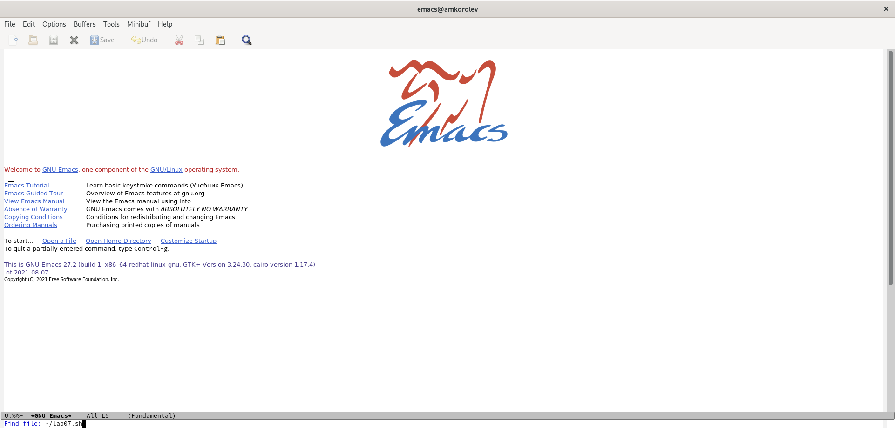\

2. Создать файл lab07.sh с помощью комбинации Ctrl-x Ctrl-f (C-x C-f).\
\

3. Наберите текст\
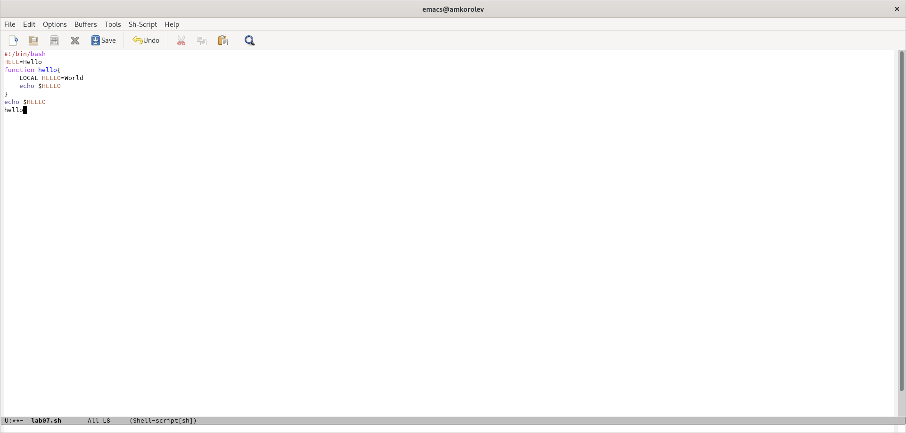\

4. Сохранить файл с помощью комбинации Ctrl-x Ctrl-s (C-x C-s).\
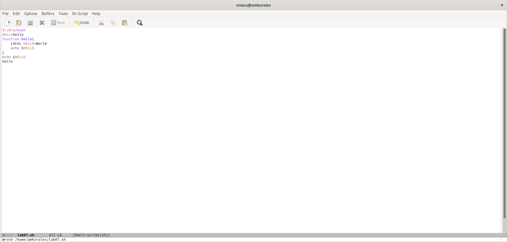\

5. Проделать с текстом стандартные процедуры редактирования, каждое действие долж-
но осуществляться комбинацией клавиш.\

5.1. Вырезать одной командой целую строку (С-k).\
\

5.2. Вставить эту строку в конец файла (C-y).\
\

5.3. Выделить область текста (C-space).\
\

5.4. Скопировать область в буфер обмена (M-w).\
\

5.5. Вставить область в конец файла.\
\

5.6. Вновь выделить эту область и на этот раз вырезать её (C-w).\
\

5.7. Отмените последнее действие (C-/).\
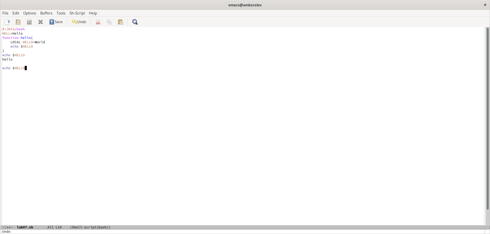\

6. Научитесь использовать команды по перемещению курсора.\

6.1. Переместите курсор в начало строки (C-a).\
\

6.2. Переместите курсор в конец строки (C-e).\
\

6.3. Переместите курсор в начало буфера (M-<).\
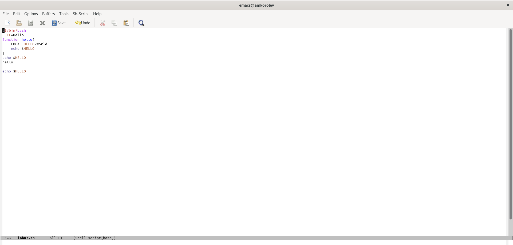\

6.4. Переместите курсор в конец буфера (M->).\
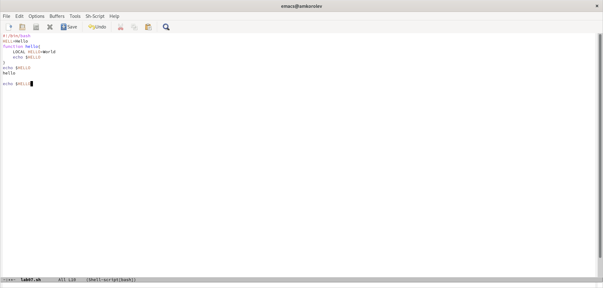\

7. Управление буферами.\

7.1. Вывести список активных буферов на экран (C-x C-b).\
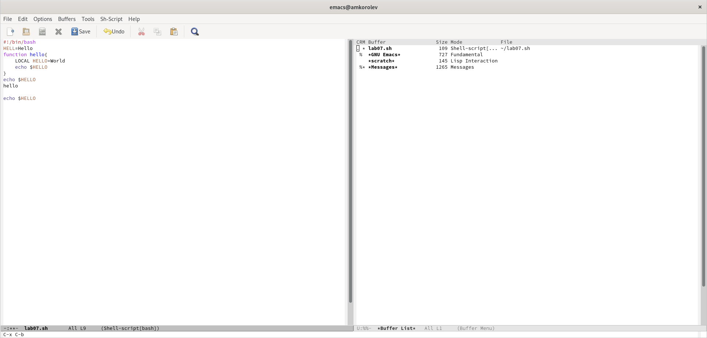\

7.2. Переместитесь во вновь открытое окно (C-x) o со списком открытых буферов
и переключитесь на другой буфер.\
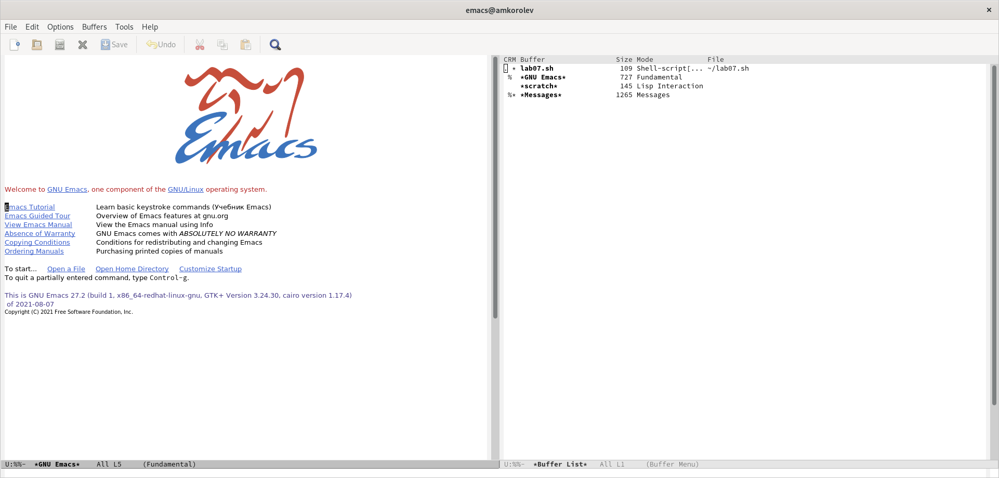\

7.3. Закройте это окно (C-x 0).\
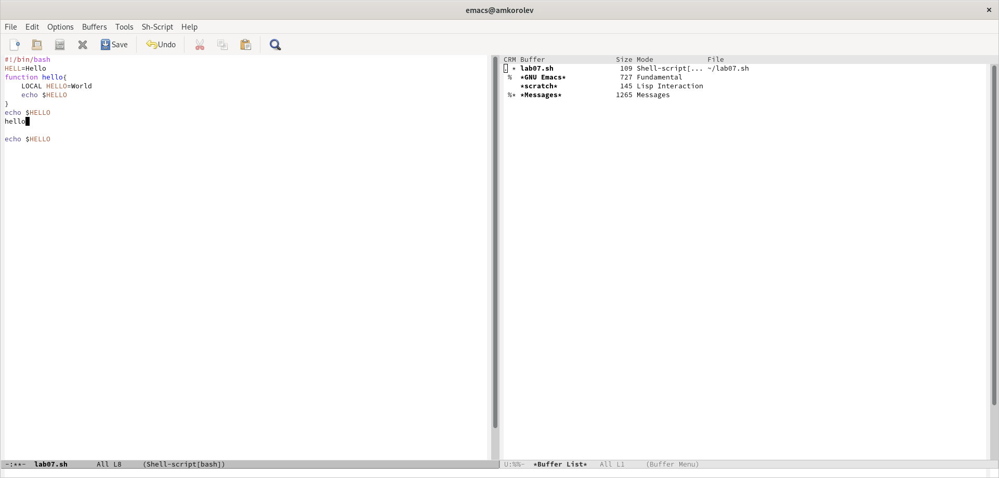\

7.4. Теперь вновь переключайтесь между буферами, но уже без вывода их списка на
экран (C-x b).\
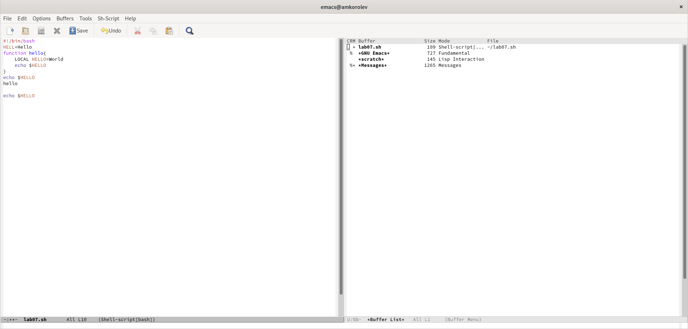\

8. Управление окнами.
8.1. Поделите фрейм на 4 части: разделите фрейм на два окна по вертикали (C-x 3),\
а затем каждое из этих окон на две части по горизонтали (C-x 2) (см. рис. 9.1).\
\

8.2. В каждом из четырёх созданных окон откройте новый буфер (файл) и введите
несколько строк текста.\
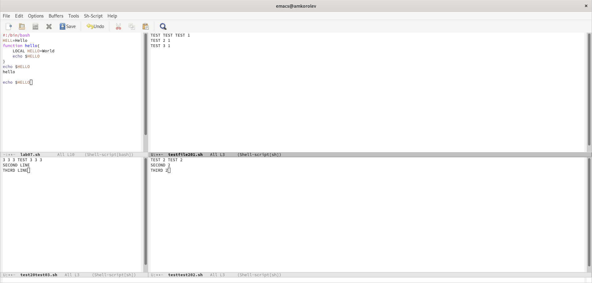\

9. Режим поиска

9.1. Переключитесь в режим поиска (C-s) и найдите несколько слов, присутствующих
в тексте.\
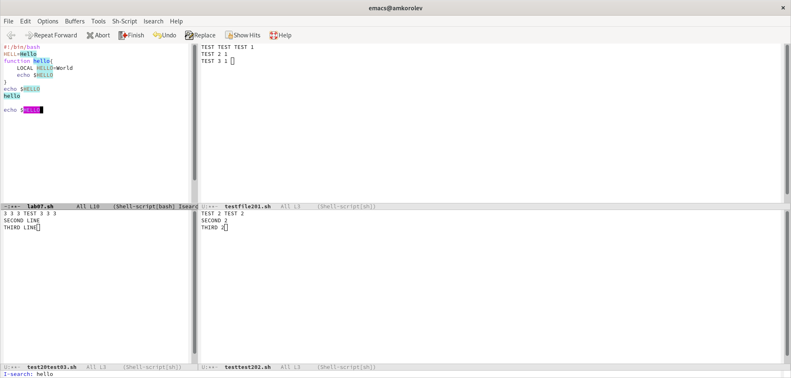\

9.2. Переключайтесь между результатами поиска, нажимая C-s.\
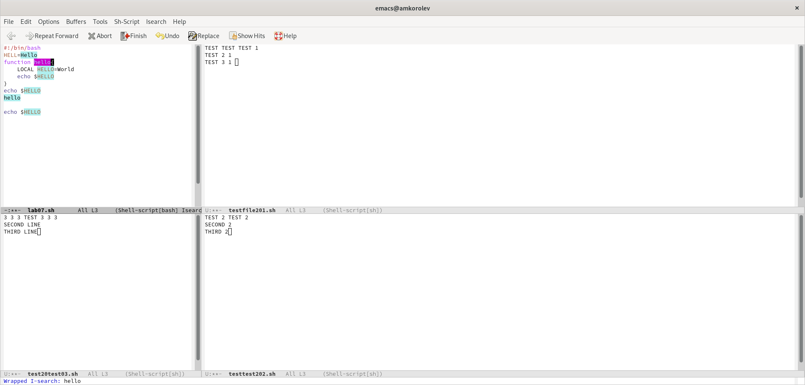\

9.3. Выйдите из режима поиска, нажав C-g.\
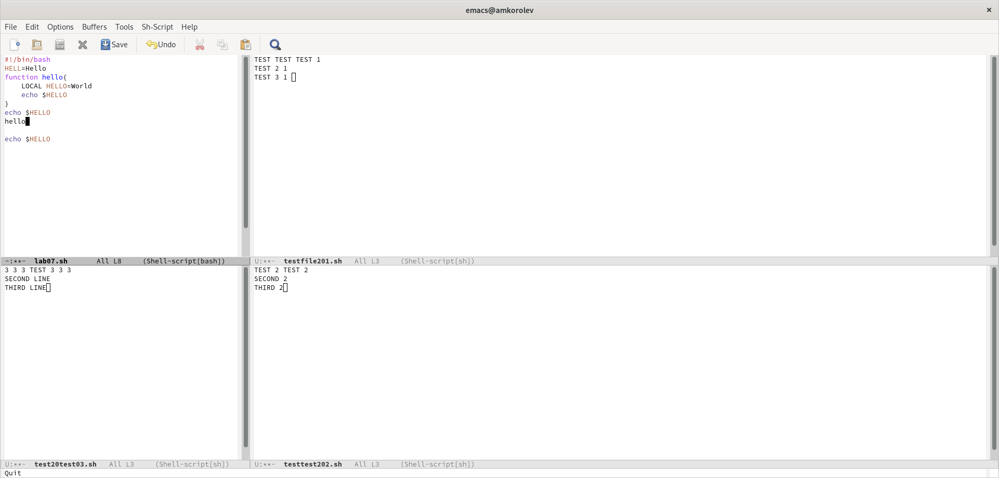\

9.4. Испробуйте другой режим поиска, нажав M-s o. \
\

# Выводы:
\- В процессе выполнения работы ознакомился с редактором Emacs и получил практические навыки работы с ним.\

# Ответы на контрольные вопросы:

    1. Кратко охарактеризуйте редактор emacs.\

Редактор Emacs -- это экранный текстовый редактор, интерфейс которого имеет большой фокус на отсутствие режимов работы, и вместо этого на широкий набор сочетаний клавиш, позволяющих за небольшое количество нажатий выполнить большинство операций.

    2. Какие особенности данного редактора могут сделать его сложным для освоения новичком?\

Из-за того, что все операции должны выполняться с помощью комбинаций клавиш, и документация по ним есть в отдельном окне, иногда бывает трудно вспомнить, как именно называется нужное действие. Это комбинируется с тем, что команды иногда имеют названия, которые не соответствуют общепринятым мнемоникам (чтобы открыть файл, нужно сделать операцию C-x C-f, от слова find, потому что файл нужно найти, чтобы открыть), что делает первый опыт работы с редактором непростым.

    3. Своими словами опишите, что такое буфер и окно в терминологии emacs’а.\

Буфер -- это область памяти, содержащая текст. Часто буфер содержит файл для редактирования, но там также может быть вывод команды, текст состояния, меню или другая информация. Окно -- это одно из разделений экрана ("фрейма"), которое может показывать содержимое буфера, и которое может содержать курсор пользователя.

    4. Можно ли открыть больше 10 буферов в одном окне?\

В одном окне может быть открыт только один буфер в одно время. Однако одно окно может переключаться между любым количеством буферов, используя комбинацию клавиш C-x b и названия буфера, или с помощью меню C-x C-b.

    5. Какие буферы создаются по умолчанию при запуске emacs?\

Это буфер, содержащий информацию о программе, scratch-буфер для временного текста, и буфер для сообщений от различных комманд.

    6. Какие клавиши вы нажмёте, чтобы ввести следующую комбинацию C-c | и C-c C-|?\

Для первой комбинации нужно нажать Ctrl, нажать С, отпустить C, отпустить Ctrl, затем нажать Shift и нажать \, чтобы ввести |. Для второй комбинации все сделать так же, только после того, как отпустили клавишу C, клавишу Ctrl отпускать не нужно.

    7. Как поделить текущее окно на две части?\

Для этого есть команды C-x 2 и C-x 3, которые делят текущее окно на два по горизонтали и по вертикали.

    8. В каком файле хранятся настройки редактора emacs?\

Они хранятся в файле ~/.emacs, который можно редактировать вручную или изменить при помощи команды M-x customize.

    9. Какую функцию выполняет клавиша и можно ли её переназначить?\

По умолчанию клавиша Backspace используется в редактируемых буферах для удаления символов, а в нередактируемых буферах -- для перехода в начало буфера.

    10. Какой редактор вам показался удобнее в работе vi или emacs? Поясните почему.\

Лично для меня более удобным показался vi, но это только потому, что я начал его использовать раньше, и не проходил встроенный tutorial в Emacs. Оба редактора довольно трудны в освоении, и для того, чтобы пользоваться ими эффективно, нужно приложить достаточно большие усилия для изучения их. Поскольку у меня было время для того, чтобы приложить эти усилия в одном, но не в другом случае, то сравнивать по моему мнению само удобство редакторов не возможно.

