---
## Front matter
lang: ru-RU
title: Лабораторная работа №9. Текстовой редактор emacs.
author: |
	Подготовил:
	\
	Королев Адам Маратович
	\
	Группа: НПИбд-02-21
	\
	Студенческий билет: № 1032217060

## Formatting
toc: false
slide_level: 2
theme: metropolis
header-includes: 
 - \metroset{progressbar=frametitle,sectionpage=progressbar,numbering=fraction}
 - '\makeatletter'
 - '\beamer@ignorenonframefalse'
 - '\makeatother'
aspectratio: 43
section-titles: true
---
## Цель работы:

- Познакомиться с операционной системой Linux. Получить практические навыки работы с редактором Emacs.\

## Теоретическое введение:

Emacs представляет собой мощный экранный редактор текста, написанный на языке
высокого уровня Elisp.\

# Выполнение лабораторной работы:

## 1. Открыть emacs.
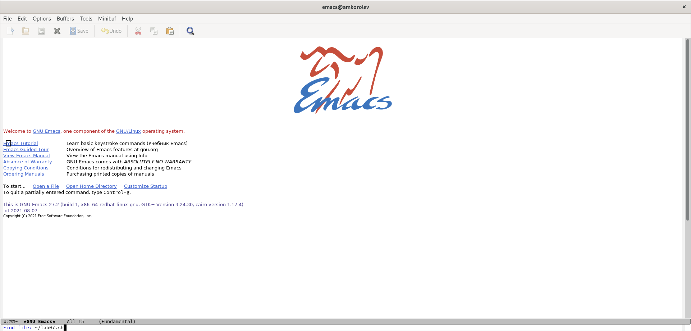{width=250px}

## 2. Создать файл lab07.sh с помощью комбинации Ctrl-x Ctrl-f (C-x C-f).
{width=250px}

## 3. Наберите текст
{width=250px}

## 4. Сохранить файл с помощью комбинации Ctrl-x Ctrl-s (C-x C-s).
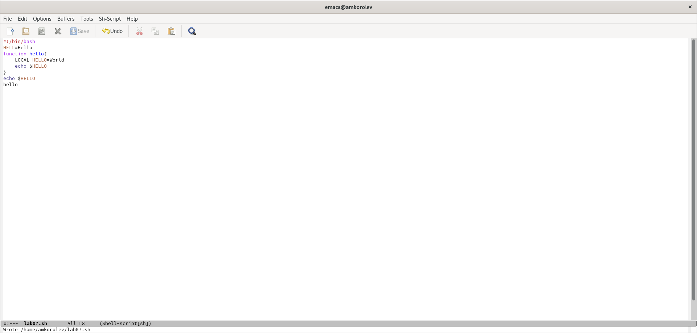{width=250px}

# 5. Проделать с текстом стандартные процедуры редактирования, каждое действие должно осуществляться комбинацией клавиш.

## 5.1. Вырезать одной командой целую строку (С-k).
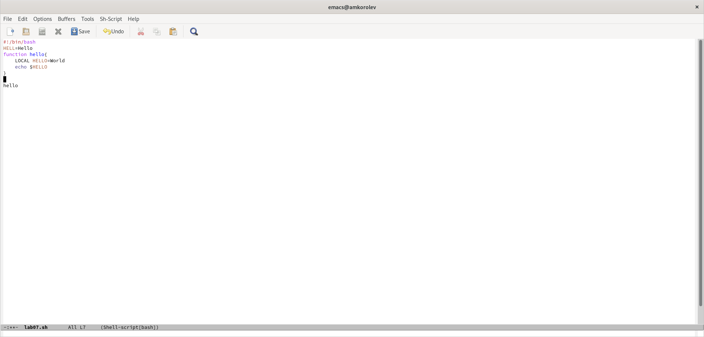{width=250px}

## 5.2. Вставить эту строку в конец файла (C-y).
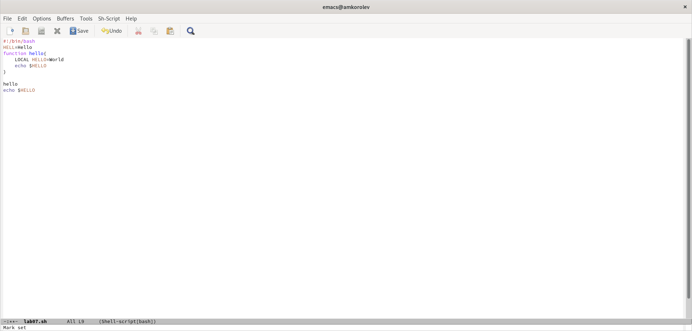{width=250px}

## 5.3. Выделить область текста (C-space).
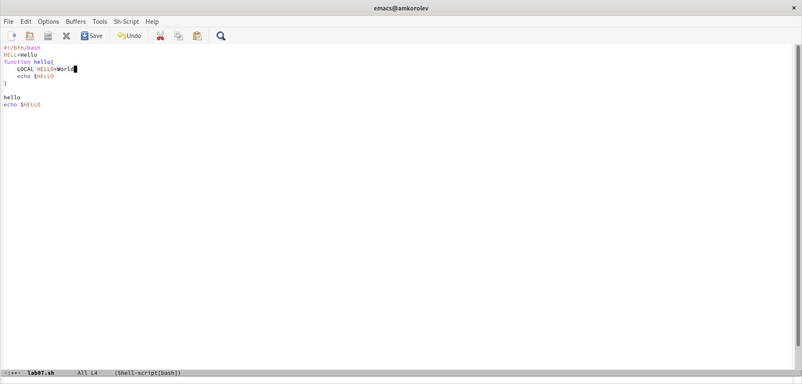{width=250px}

## 5.4. Скопировать область в буфер обмена (M-w).
{width=250px}

## 5.5. Вставить область в конец файла.
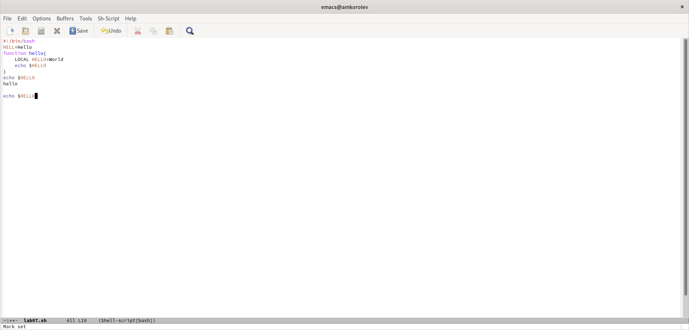{width=250px}

## 5.6. Вновь выделить эту область и на этот раз вырезать её (C-w).
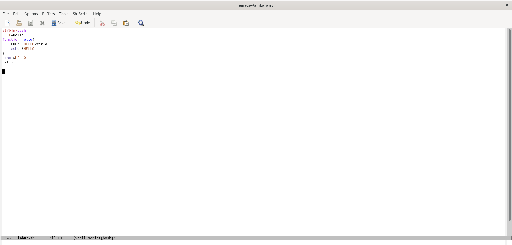{width=250px}

## 5.7. Отмените последнее действие (C-/).
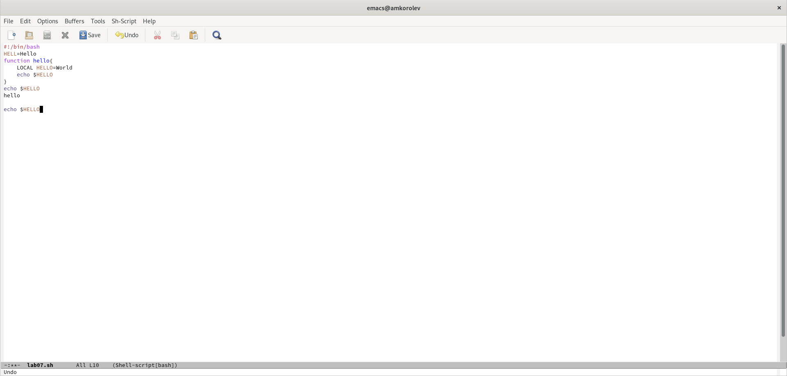{width=250px}

# 6. Научитесь использовать команды по перемещению курсора.

## 6.1. Переместите курсор в начало строки (C-a).
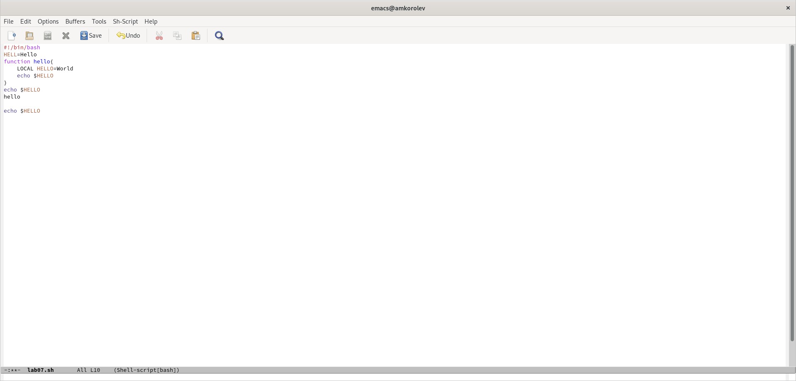{width=250px}

## 6.2. Переместите курсор в конец строки (C-e).
{width=250px}

## 6.3. Переместите курсор в начало буфера (M-<).
{width=250px}

## 6.4. Переместите курсор в конец буфера (M->).
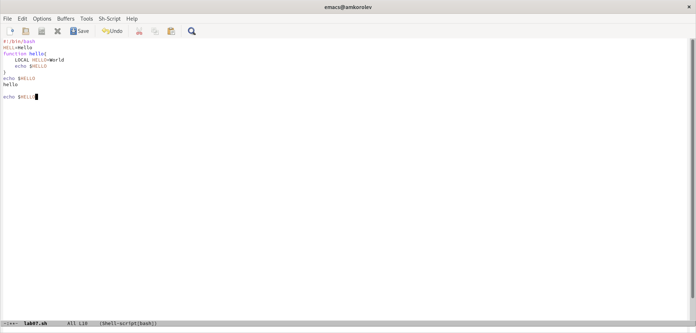{width=250px}

# 7. Управление буферами.

## 7.1. Вывести список активных буферов на экран (C-x C-b).
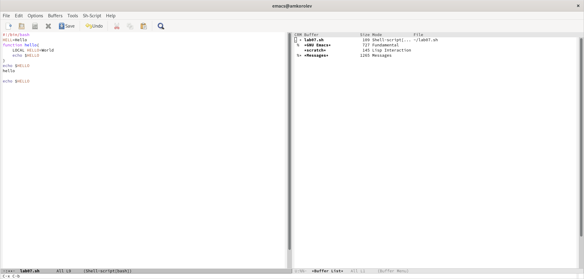{width=250px}

## 7.2. Переместитесь во вновь открытое окно (C-x) o со списком открытых буферов и переключитесь на другой буфер.
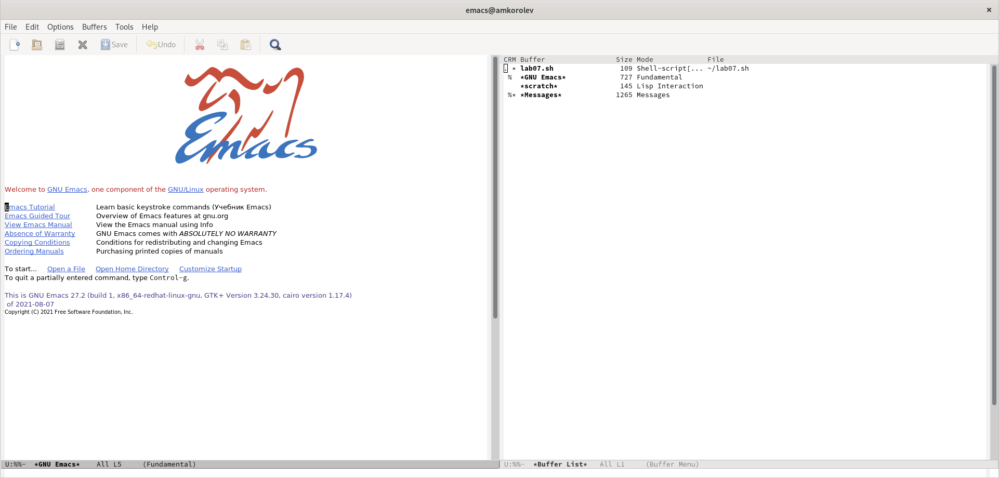{width=250px}

## 7.3. Закройте это окно (C-x 0).
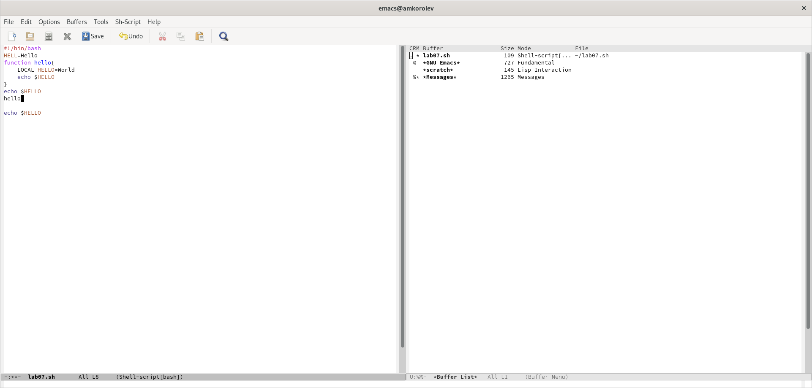{width=250px}

## 7.4. Теперь вновь переключайтесь между буферами, но уже без вывода их списка на экран (C-x b).
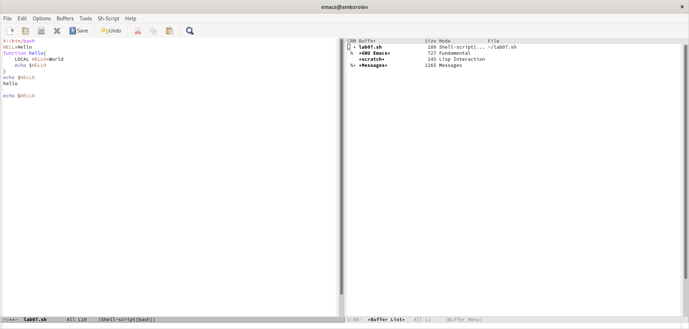{width=250px}

# 8. Управление окнами.
## 8.1. Поделите фрейм на 4 части: разделите фрейм на два окна по вертикали (C-x 3), а затем каждое из этих окон на две части по горизонтали (C-x 2) (см. рис. 9.1).
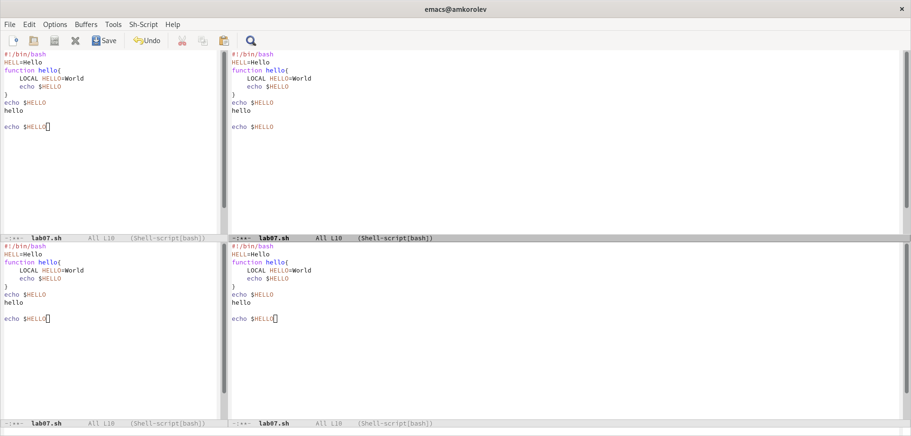{width=250px}

## 8.2. В каждом из четырёх созданных окон откройте новый буфер (файл) и введите несколько строк текста.
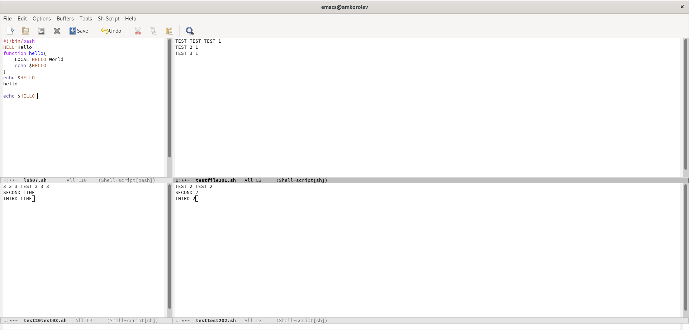{width=250px}

# 9. Режим поиска

## 9.1. Переключитесь в режим поиска (C-s) и найдите несколько слов, присутствующих в тексте.
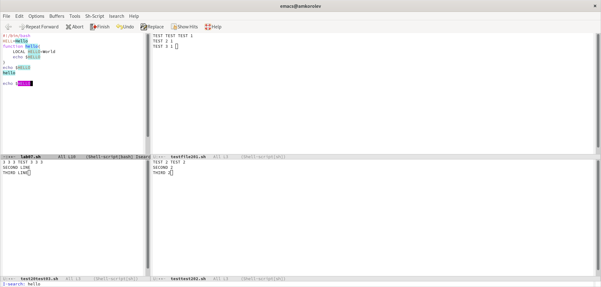{width=250px}

## 9.2. Переключайтесь между результатами поиска, нажимая C-s.
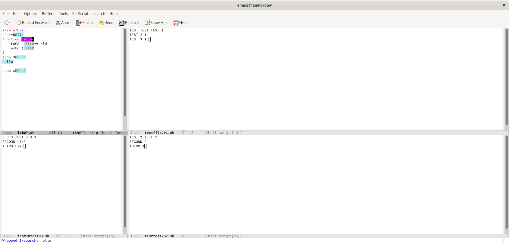{width=250px}

## 9.3. Выйдите из режима поиска, нажав C-g.
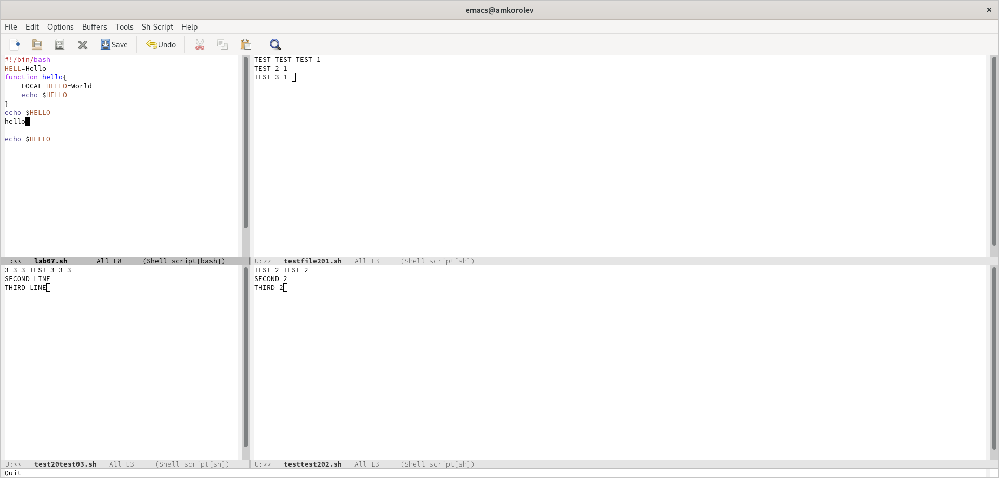{width=250px}

## 9.4. Испробуйте другой режим поиска, нажав M-s o. 
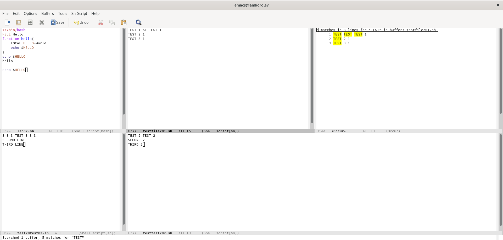{width=250px}

# Выводы:

\- В процессе выполнения работы ознакомился с редактором Emacs и получил практические навыки работы с ним.\
