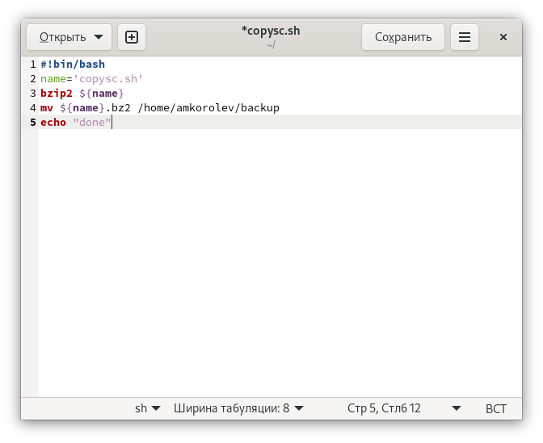
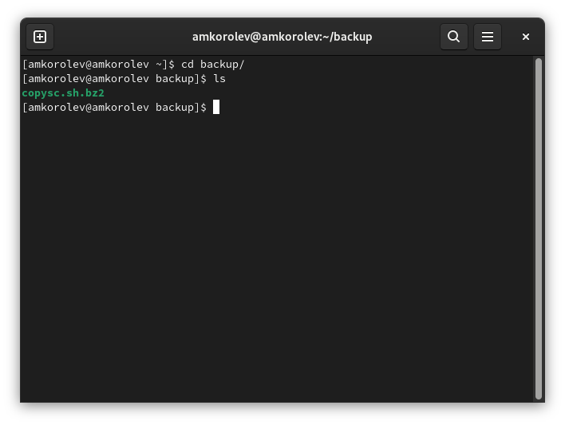
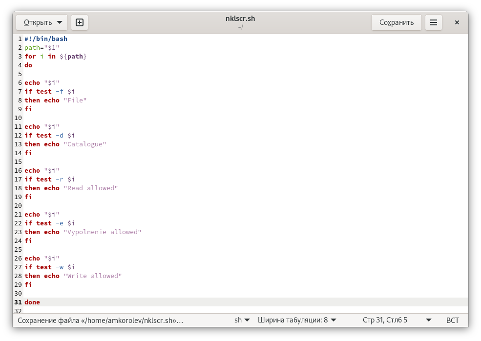
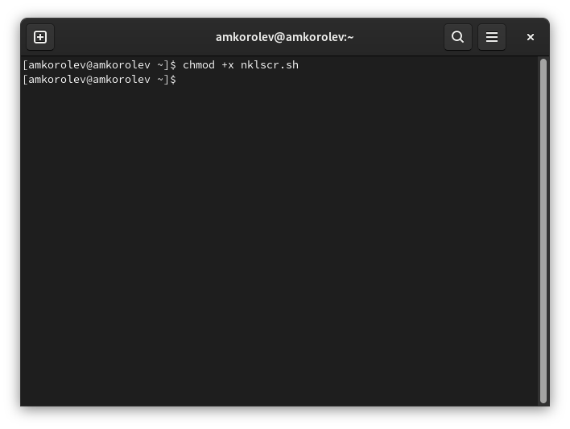
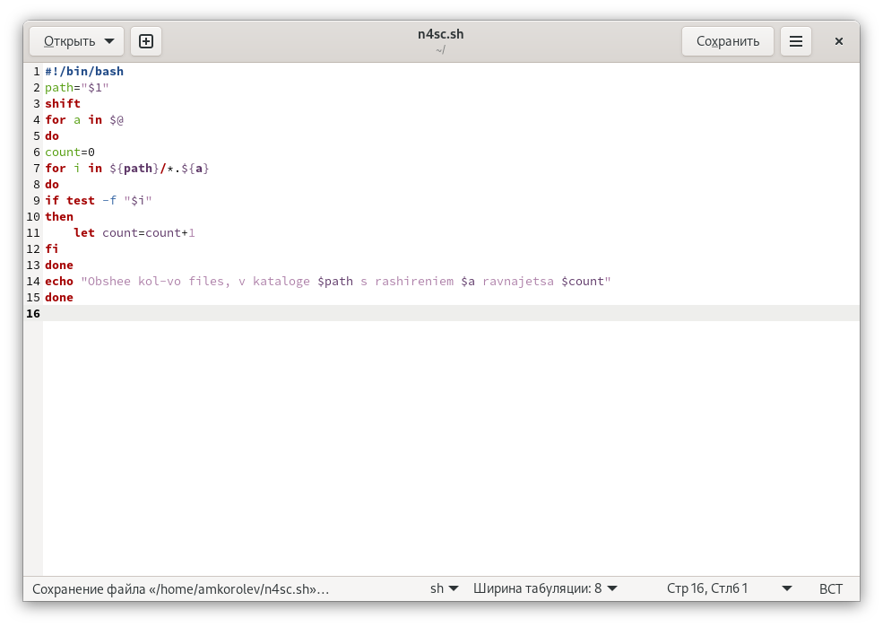

МИНИСТЕРСТВО ОБРАЗОВАНИЯ И НАУКИ\
РОССИЙСКОЙ ФЕДЕРАЦИИ\
\
ФЕДЕРАЛЬНОЕ ГОСУДАРСТВЕННОЕ АВТОНОМНОЕ\
ОБРАЗОВАТЕЛЬНОЕ УЧРЕЖДЕНИЕ ВЫСШЕГО ОБРАЗОВАНИЯ\
"РОССИЙСКИЙ УНИВЕРСИТЕТ ДРУЖБЫ НАРОДОВ"\

Факультет физико-математических и естественных наук\
\
\
\

ОТЧЕТ\
\
По лабораторной работе №10\
"Программирование в командном
процессоре ОС UNIX. Командные файлы"\
\

Выполнил:\
Студент группы: НПИбд-02-21\
Студенческий билет: №1032217060\
ФИО студента: Королев Адам Маратович\
Дата выполнения: 21.05.2022\
\
\
\

Москва 2022\

# Цель работы:
\- Изучить основы программирования в оболочке ОС UNIX/Linux. Научиться писать
небольшие командные файлы.\

# Теоретическое введение:

Командный процессор (командная оболочка, интерпретатор команд shell) — это программа, позволяющая пользователю взаимодействовать с операционной системой
компьютера.\
 В операционных системах типа UNIX/Linux наиболее часто используются
следующие реализации командных оболочек:\
– оболочка Борна (Bourne shell или sh) — стандартная командная оболочка UNIX/Linux,
содержащая базовый, но при этом полный набор функций;\
– С-оболочка (или csh) — надстройка на оболочкой Борна, использующая С-подобный
синтаксис команд с возможностью сохранения истории выполнения команд;\
– оболочка Корна (или ksh) — напоминает оболочку С, но операторы управления програм-
мой совместимы с операторами оболочки Борна;\
– BASH — сокращение от Bourne Again Shell (опять оболочка Борна), в основе своей сов-
мещает свойства оболочек С и Корна (разработка компании Free Software Foundation).\
POSIX (Portable Operating System Interface for Computer Environments) — набор стандартов
описания интерфейсов взаимодействия операционной системы и прикладных программ.\
Стандарты POSIX разработаны комитетом IEEE (Institute of Electrical and Electronics
Engineers) для обеспечения совместимости различных UNIX/Linux-подобных опера-
ционных систем и переносимости прикладных программ на уровне исходного кода.\
POSIX-совместимые оболочки разработаны на базе оболочки Корна.\
Рассмотрим основные элементы программирования в оболочке bash. В других оболоч-
ках большинство команд будет совпадать с описанными ниже.\

# Выполнение лабораторной работы:

1. Написать скрипт, который при запуске будет делать резервную копию самого себя (то
есть файла, в котором содержится его исходный код) в другую директорию backup
в вашем домашнем каталоге. При этом файл должен архивироваться одним из ар-
хиваторов на выбор zip, bzip2 или tar. Способ использования команд архивации
необходимо узнать, изучив справку.\

Пишем скрипт. \
\

Даем права на исполнение. \
\

Выполняем скрипт \
\

Проверяем результат\
\

2. Написать пример командного файла, обрабатывающего любое произвольное число
аргументов командной строки, в том числе превышающее десять. Например, скрипт
может последовательно распечатывать значения всех переданных аргументов.\

Пишем скрипт. \
\

Даем права на исполнение и выполняем скрипт. \
\

3. Написать командный файл — аналог команды ls (без использования самой этой ко-
манды и команды dir). Требуется, чтобы он выдавал информацию о нужном каталоге
и выводил информацию о возможностях доступа к файлам этого каталога.\

Пишем скрипт. \
\

Даем права на исполнение. \
\

Выполняем скрипт \
\

4. Написать командный файл, который получает в качестве аргумента командной строки
формат файла (.txt, .doc, .jpg, .pdf и т.д.) и вычисляет количество таких файлов
в указанной директории. Путь к директории также передаётся в виде аргумента ко-
мандной строки.\

Пишем скрипт. \
\

Даем права на исполнение и выполняем скрипт. \
\


# Выводы:
\- В процессе выполнения работы изучил основы программирования в оболочке ОС UNIX/Linux. Научился писать
небольшие командные файлы.\

# Ответы на контрольные вопросы:

1. Объясните понятие командной оболочки. Приведите примеры командных оболочек. Чем они отличаются?

Командная оболочка -- это программа, которая принимает ввод от пользователя и выполняет команды.
Самая известная оболочка -- это `bash`, но существуют и другие, например `zsh`, `csh`, `ksh`, `fish`, `busybox` и т.д.
Разные командные оболочки могут различаться по своему синтаксису --
так, `csh` имеет все возможности Bourne shell, но они доступны в другом, более C-подобном синтаксисе.
Командные оболочки также могут отличаться по своему пользовательскому интерфейсу --
`fish` имеет функционал вроде автодополнения из `man`-страниц, который делает ее более удобной для использования.

2. Что такое POSIX?

POSIX --  стандарт для различных Unix-подобных систем, описывающий разные API и способы взаимодействия с системой.
Следование этим стандартам при написании кода гарантирует, что этот код будет работать на любой системе, которая поддерживает этот стандарт.

3. Как определяются переменные и массивы в языке программирования bash?

```bash
VAR="hello world"
echo $var  # > hello world
ARRAY=("this" "is" "an" "array")
echo ${ARRAY[3]}  # > array
echo ${ARRAY[*]}  # > this is an array
```


4. Каково назначение операторов let и read?

Команда `let` позволяет выполнять арифметические операции с переменными.

```bash
A=123
B=456
let "C = A + B"
echo $C  # > 579
```

Команда `read` считывает ввод с стандартного ввода и присваивает его значение переменной.

```bash
echo "What is your name?"
read NAME
echo "Hello, $NAME"
```

5. Какие арифметические операции можно применять в языке программирования bash?

Самые полезные операции показаны ниже.

```bash
A=500
B=100
let "q = A + B"; echo $q  # > 600
let "q = A - B"; echo $q  # > 400
let "q = A * B"; echo $q  # > 50000
let "q = A / B"; echo $q  # > 5
let "q = A % B"; echo $q  # > 0
A=5
B=2
let "q = A ** B"; echo $q  # > 25
let "q = -A"; echo $q  # > -5
let "q = A<<B"; echo $q  # > 20
let "q = A>>B"; echo $q  # > 1
```

6. Что означает операция (( ))?

Эта операция позволяет выполнять арифметические действия, не используя команду `let`.

```bash
A=500
B=100
(( A++ ))
echo $(( A+B ))  # > 601
```

7. Какие стандартные имена переменных Вам известны?

- `$PATH` -- список путей, в которых следует искать программы команд
- `$HOME` -- домашний каталог
- `$SHELL` -- путь к используемой оболочке
- `$USER` -- имя пользователя
- `$HOSTNAME` -- имя хоста
- `$PWD` -- текущий каталог
- `$OLDPWD` -- предыдущий каталог
- `$PS1` -- приглашение к вводу команды
- `$PS2` -- приглашение к вводу продолжающей строки


8. Что такое метасимволы?

Метасимволы -- это символы, которые имеют особый смысл в контексте `glob`-последовательностей, например:

- `*` - любое количество (включая 0) любых символов
- `?` - любой один символ
- `[...]` - любой символ из перечисленных в скобках
- `[a-z]` - любой символ из диапазона букв


9. Как экранировать метасимволы?

Для этого нужно написать перед этим символом обратный слеш:
`*.*` соответствует всем файлам, имеющим расширение, а `*.\*` соответствует только файлам, расширение которых равно одной звездочке.

10. Как создавать и запускать командные файлы?

Для этого нужно создать текстовый файл, на первой строке написать специальную последовательность `#!`,
а затем путь к интерпретатору (например, `#!/bin/bash`).
После этого в файле можно написать команды.
Для того, чтобы выполнить этот файл, нужно добавить разрешение на выполнение, используя команду `chmod +x`.


11. Как определяются функции в языке программирования bash?

```bash

greet () {
    echo "Hello, $1!"
}
greet "Jim"
```

12. Каким образом можно выяснить, является файл каталогом или обычным файлом?

```bash
$file="/tmp/what"
[ -d $file ] && echo "file is a directory" || echo "file is a normal file"
```

13. Каково назначение команд set, typeset и unset?

Эти команды используются, чтобы управлять переменными -- `set` задает новое значение переменной, `unset` удаляет переменную, а `typeset` задает значение переменной и ее тип.

14. Как передаются параметры в командные файлы?

Они оказываются в переменных `$1`...`$9`, а также в массиве `$@`. Оттуда их можно использовать внутри командного файла.

15. Назовите специальные переменные языка bash и их назначение.

- `$0` - имя исполняемого файла
- `$1` - первый аргумент командной строки
- `$2` - второй аргумент командной строки
- `$9` - девятый аргумент командной строки
- `$#` - количество аргументов командной строки
- `$@` - все аргументы командной строки
- `$$` - номер процесса
- `$?` - код, возвращенный последней выполненной командой
