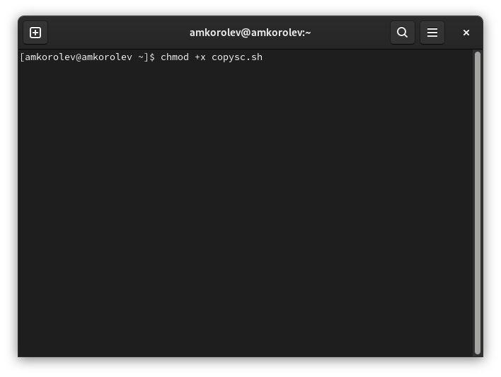
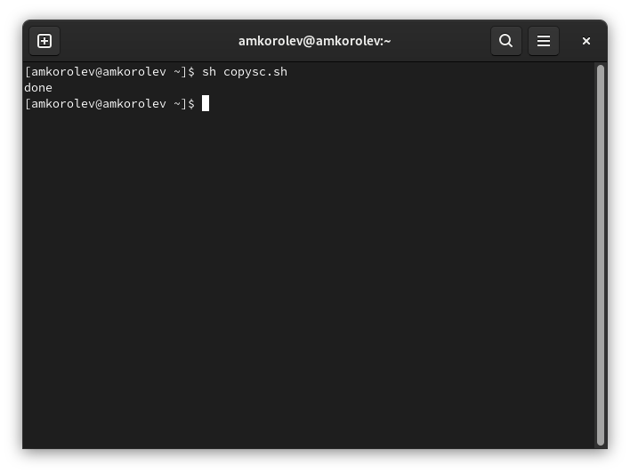
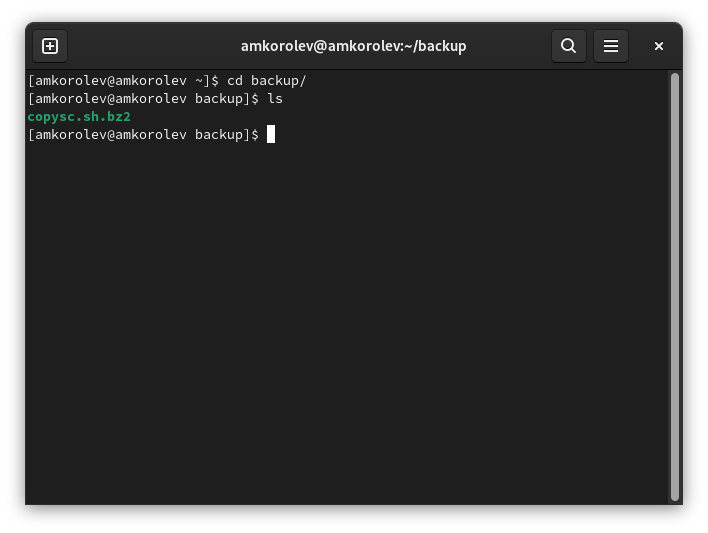
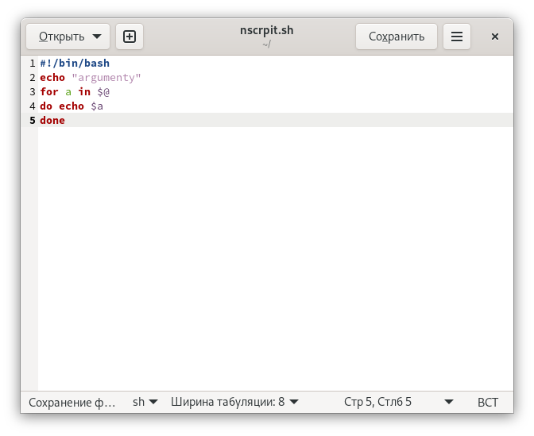
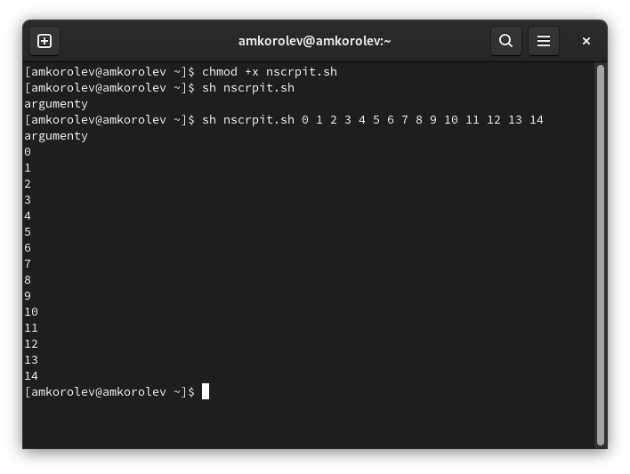
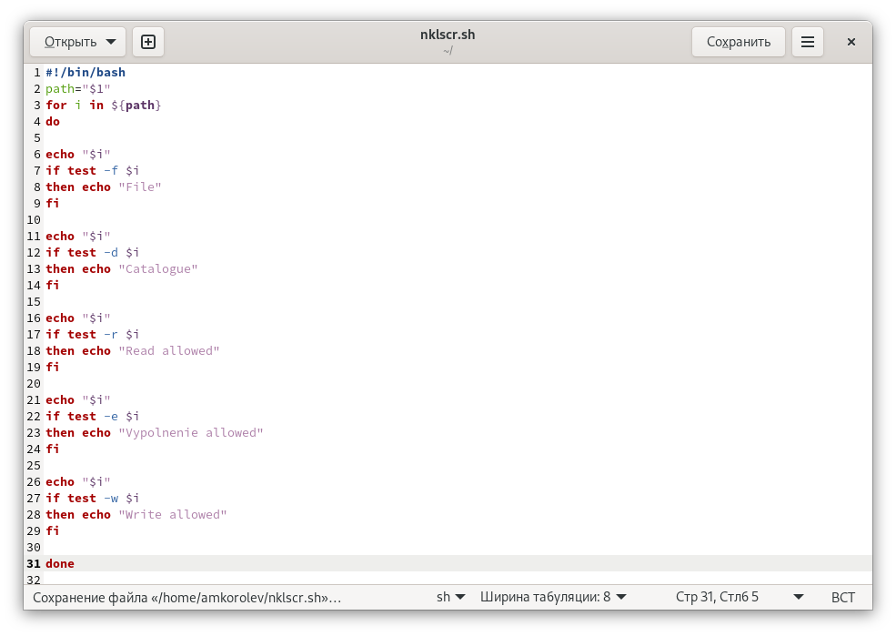
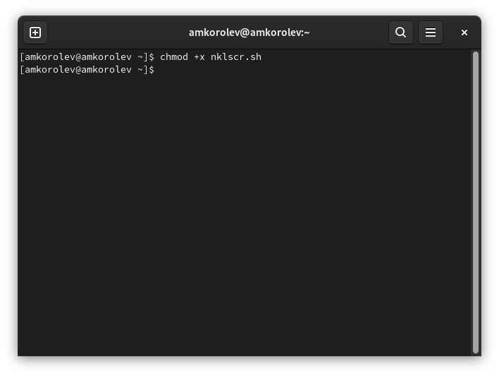
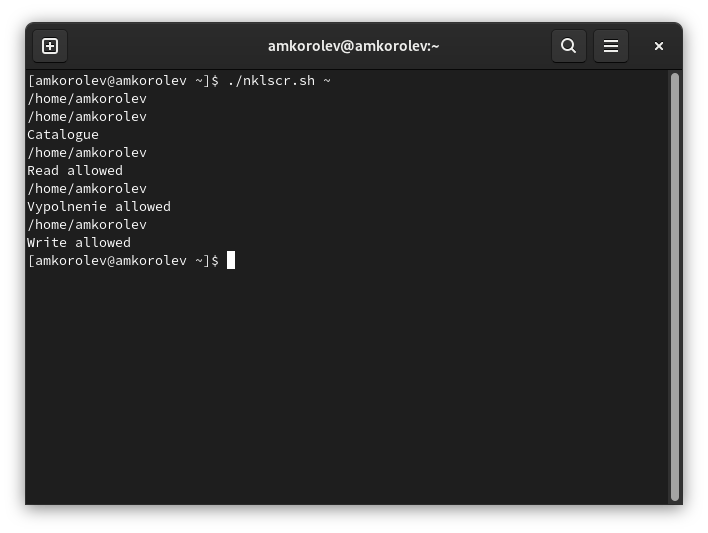
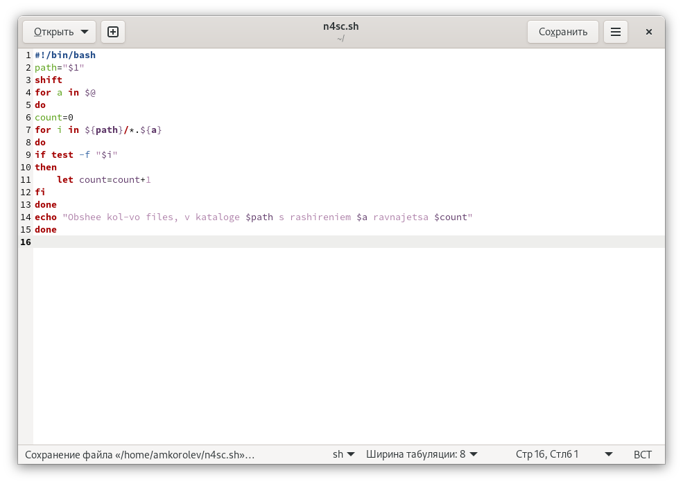
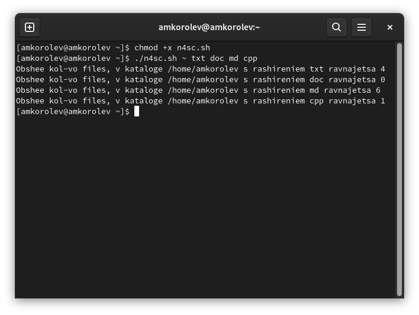

---
## Front matter
lang: ru-RU
title: Лабораторная работа №10. Программирование в командном процессоре ОС UNIX. Командные файлы
author: |
	Подготовил:
	\
	Королев Адам Маратович
	\
	Группа: НПИбд-02-21
	\
	Студенческий билет: № 1032217060

## Formatting
toc: false
slide_level: 2
theme: metropolis
header-includes: 
 - \metroset{progressbar=frametitle,sectionpage=progressbar,numbering=fraction}
 - '\makeatletter'
 - '\beamer@ignorenonframefalse'
 - '\makeatother'
aspectratio: 43
section-titles: true
---
## Цель работы:

- Изучить основы программирования в оболочке ОС UNIX/Linux. Научиться писать
небольшие командные файлы.\

## Теоретическое введение:

Командный процессор (командная оболочка, интерпретатор команд shell) - это программа, позволяющая пользователю взаимодействовать с операционной системой
компьютера.\
 В операционных системах типа UNIX/Linux наиболее часто используются
следующие реализации командных оболочек:\
– оболочка Борна (Bourne shell или sh) - стандартная командная оболочка UNIX/Linux,
содержащая базовый, но при этом полный набор функций\

## Теоретическое введение: 

– С-оболочка (или csh) - надстройка на оболочкой Борна, использующая С-подобный
синтаксис команд с возможностью сохранения истории выполнения команд\
– оболочка Корна (или ksh) - напоминает оболочку С, но операторы управления програм-
мой совместимы с операторами оболочки Борна\

## Теоретическое введение:

– BASH - сокращение от Bourne Again Shell (опять оболочка Борна), в основе своей сов-
мещает свойства оболочек С и Корна (разработка компании Free Software Foundation).\
POSIX (Portable Operating System Interface for Computer Environments) - набор стандартов
описания интерфейсов взаимодействия операционной системы и прикладных программ.\
Стандарты POSIX разработаны комитетом IEEE (Institute of Electrical and Electronics
Engineers) для обеспечения совместимости различных UNIX/Linux-подобных опера-
ционных систем и переносимости прикладных программ на уровне исходного кода.\

## Теоретическое введение: 

POSIX-совместимые оболочки разработаны на базе оболочки Корна.\
Рассмотрим основные элементы программирования в оболочке bash. В других оболоч-
ках большинство команд будет совпадать с описанными ниже.\

# Выполнение лабораторной работы:

# 1. Написать скрипт, который при запуске будет делать резервную копию самого себя в другую директорию backup в вашем домашнем каталоге. 

# При этом файл должен архивироваться одним из архиваторов на выбор zip, bzip2 или tar. Способ использования команд архивации необходимо узнать, изучив справку.

## Пишем скрипт. 
{width=250px}

## Даем права на исполнение. 
{width=250px}

## Выполняем скрипт 
{width=250px}

## Проверяем результат
{width=250px}

# 2. Написать пример командного файла, обрабатывающего любое произвольное число аргументов командной строки, в том числе превышающее десять. 

# Например, скрипт может последовательно распечатывать значения всех переданных аргументов.

## Пишем скрипт. 
{width=250px}

## Даем права на исполнение и выполняем скрипт. 
{width=250px}

# 3. Написать командный файл - аналог команды ls. 

#Требуется, чтобы он выдавал информацию о нужном каталоге и выводил информацию о возможностях доступа к файлам этого каталога.

## Пишем скрипт. 
{width=250px}

## Даем права на исполнение. 
{width=250px}

## Выполняем скрипт 
{width=250px}

# 4. Написать командный файл, который получает в качестве аргумента командной строки формат файла и вычисляет количество таких файлов в указанной директории. 

# Путь к директории также передаётся в виде аргумента командной строки.

## Пишем скрипт. 
{width=250px}

## Даем права на исполнение и выполняем скрипт. 
{width=250px}

# Выводы:

\- В процессе выполнения работы изучил основы программирования в оболочке ОС UNIX/Linux. Научился писать
небольшие командные файлы.\
