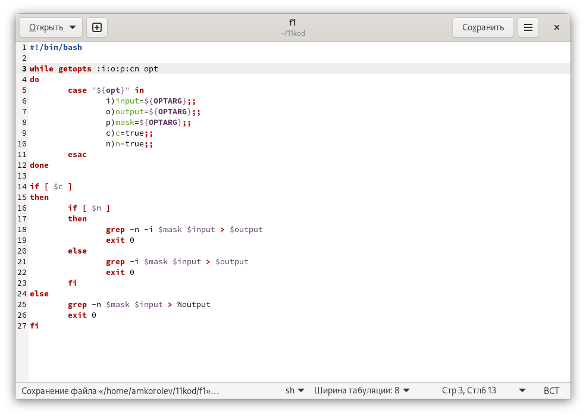
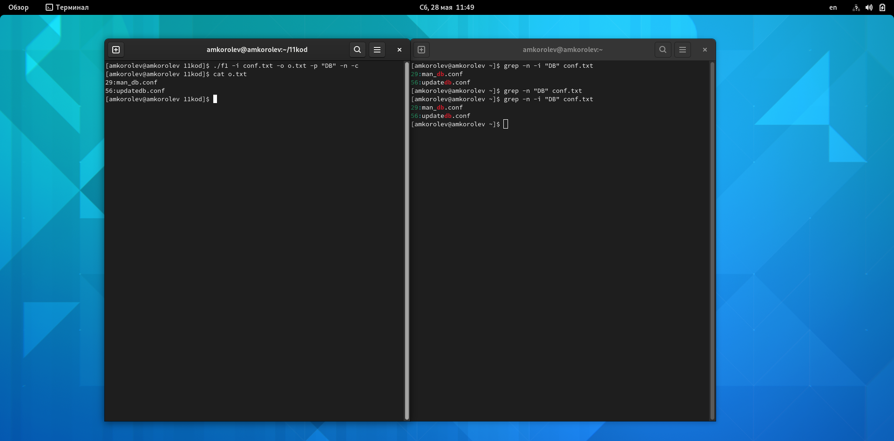
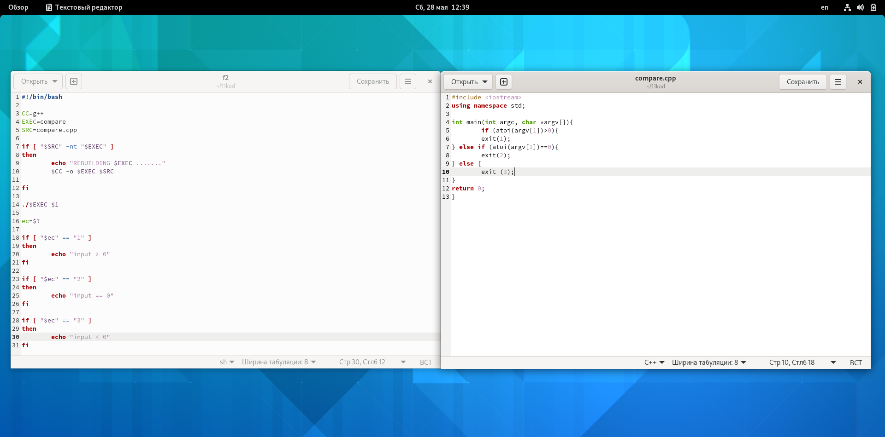
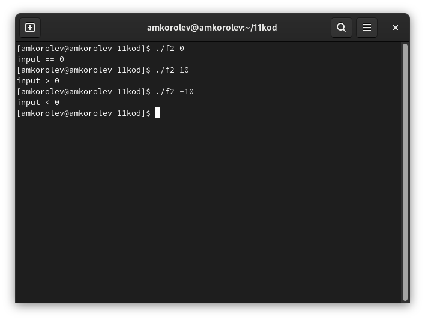
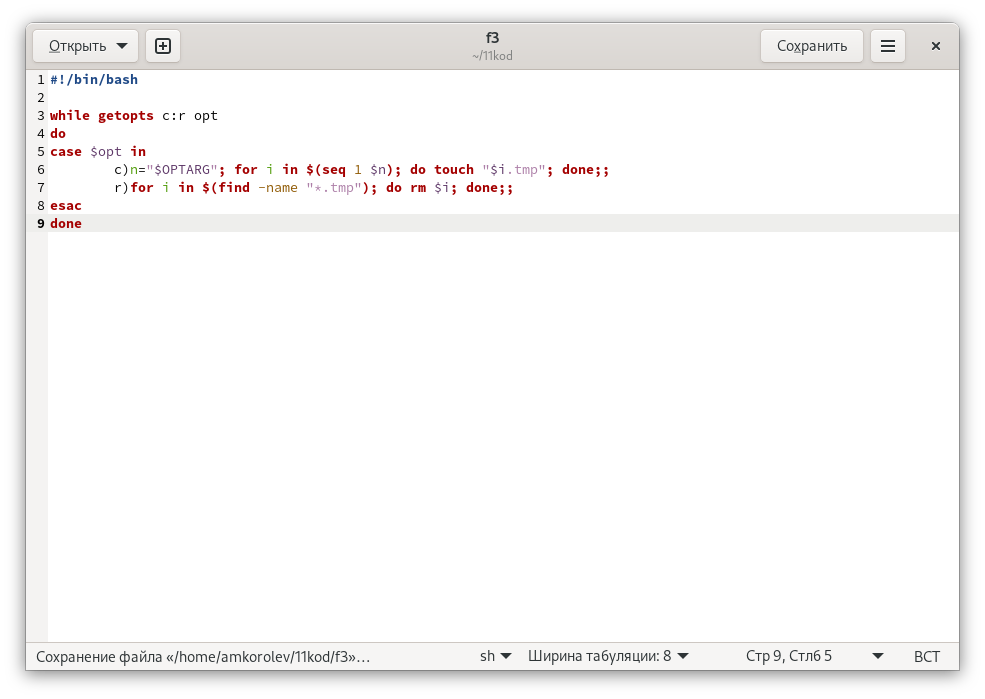
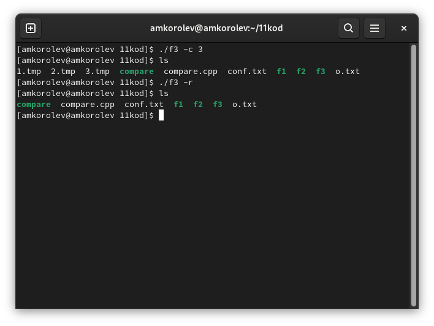
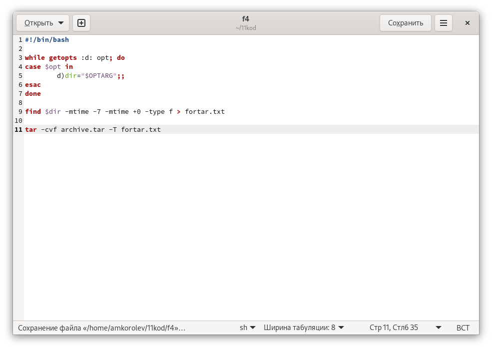
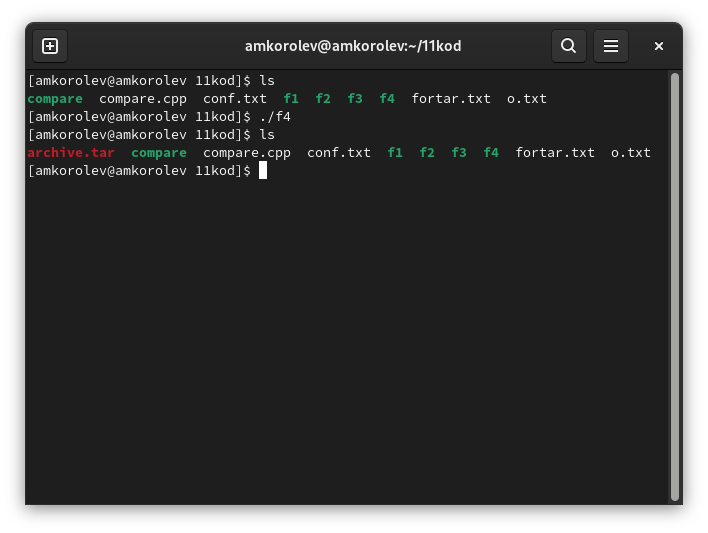

---
## Front matter
lang: ru-RU
title: Лабораторная работа №11. Программирование в командном процессоре ОС UNIX. Ветвления и циклы
author: |
	Подготовил:
	\
	Королев Адам Маратович
	\
	Группа: НПИбд-02-21
	\
	Студенческий билет: № 1032217060

## Formatting
toc: false
slide_level: 2
theme: metropolis
header-includes: 
 - \metroset{progressbar=frametitle,sectionpage=progressbar,numbering=fraction}
 - '\makeatletter'
 - '\beamer@ignorenonframefalse'
 - '\makeatother'
aspectratio: 43
section-titles: true
---
## Цель работы:

- Изучить основы программирования в оболочке ОС UNIX. Научится писать более
сложные командные файлы с использованием логических управляющих конструкций
и циклов.\

## Теоретическое введение:

Командный процессор (командная оболочка, интерпретатор команд shell) - это программа, позволяющая пользователю взаимодействовать с операционной системой
компьютера.\
 В операционных системах типа UNIX/Linux наиболее часто используются
следующие реализации командных оболочек:\
– оболочка Борна (Bourne shell или sh) - стандартная командная оболочка UNIX/Linux,
содержащая базовый, но при этом полный набор функций\

## Теоретическое введение: 

– С-оболочка (или csh) - надстройка на оболочкой Борна, использующая С-подобный
синтаксис команд с возможностью сохранения истории выполнения команд\
– оболочка Корна (или ksh) - напоминает оболочку С, но операторы управления програм-
мой совместимы с операторами оболочки Борна\

## Теоретическое введение:

– BASH - сокращение от Bourne Again Shell (опять оболочка Борна), в основе своей сов-
мещает свойства оболочек С и Корна (разработка компании Free Software Foundation).\
POSIX (Portable Operating System Interface for Computer Environments) - набор стандартов
описания интерфейсов взаимодействия операционной системы и прикладных программ.\
Стандарты POSIX разработаны комитетом IEEE (Institute of Electrical and Electronics
Engineers) для обеспечения совместимости различных UNIX/Linux-подобных опера-
ционных систем и переносимости прикладных программ на уровне исходного кода.\

## Теоретическое введение: 

POSIX-совместимые оболочки разработаны на базе оболочки Корна.\
Рассмотрим основные элементы программирования в оболочке bash. В других оболоч-
ках большинство команд будет совпадать с описанными ниже.\

# Выполнение лабораторной работы:

# 1. Используя команды getopts grep, написать командный файл, который анализирует командную строку с ключами:
# – -iinputfile — прочитать данные из указанного файла; – -ooutputfile — вывести данные в указанный файл; – -pшаблон — указать шаблон для поиска; – -C — различать большие и малые буквы; – -n — выдавать номера строк. а затем ищет в указанном файле нужные строки, определяемые ключом -p.

## Пишем скрипт. 
{width=250px}

## Выполняем скрипт 
{width=250px}

# 2. Написать на языке Си программу, которая вводит число и определяет, является ли оно больше нуля, меньше нуля или равно нулю. Затем программа завершается с помощью функции exit(n), передавая информацию в о коде завершения в оболочку. 
# Командный файл должен вызывать эту программу и, проанализировав с помощью команды $?, выдать сообщение о том, какое число было введено.

## Пишем скрипт. 
{width=250px}

## Выполняем скрипт 
{width=250px}

# 3. Написать командный файл, создающий указанное число файлов, пронумерованных последовательно от 1 до N (например 1.tmp, 2.tmp, 3.tmp,4.tmp и т.д.). 
# Число файлов, которые необходимо создать, передаётся в аргументы командной строки. Этот же командный файл должен уметь удалять все созданные им файлы (если они существуют).

## Пишем скрипт. 
{width=250px}

## Выполняем скрипт 
{width=250px}

# 4. Написать командный файл, который с помощью команды tar запаковывает в архив
все файлы в указанной директории. 
# Модифицировать его так, чтобы запаковывались только те файлы, которые были изменены менее недели тому назад (использовать команду find).

## Пишем скрипт. 
{width=250px}

## Выполняем скрипт 
{width=250px}

# Выводы:

\- В процессе выполнения работы научился писать более сложные командные файлы с использованием логических управляющих конструкций
и циклов.
