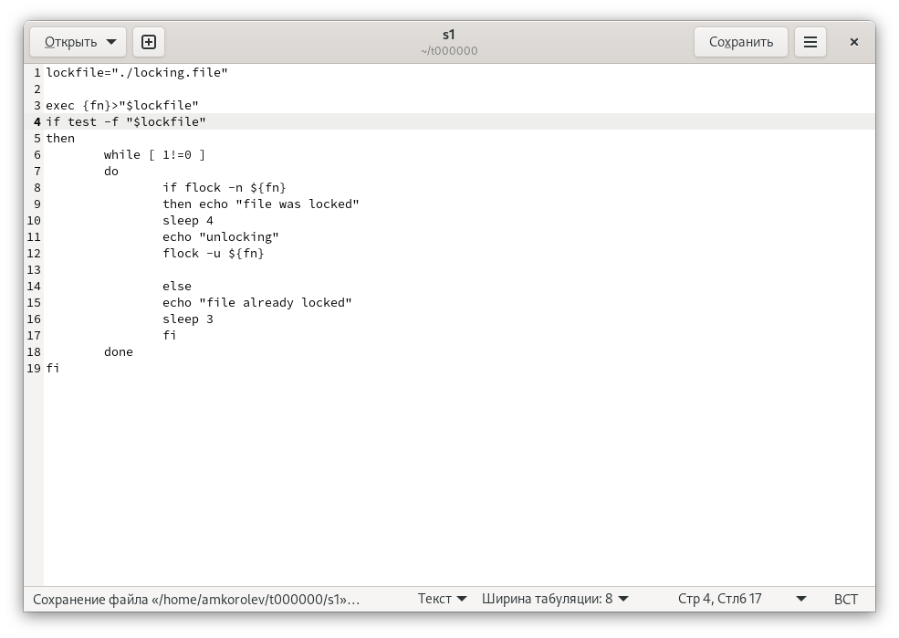
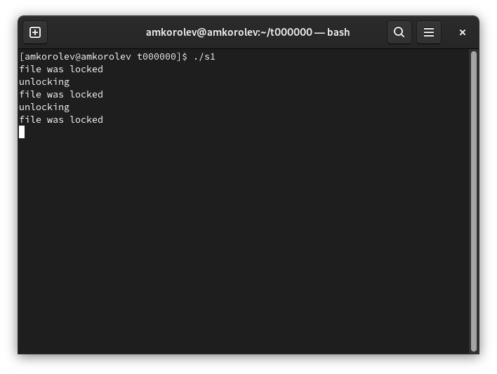
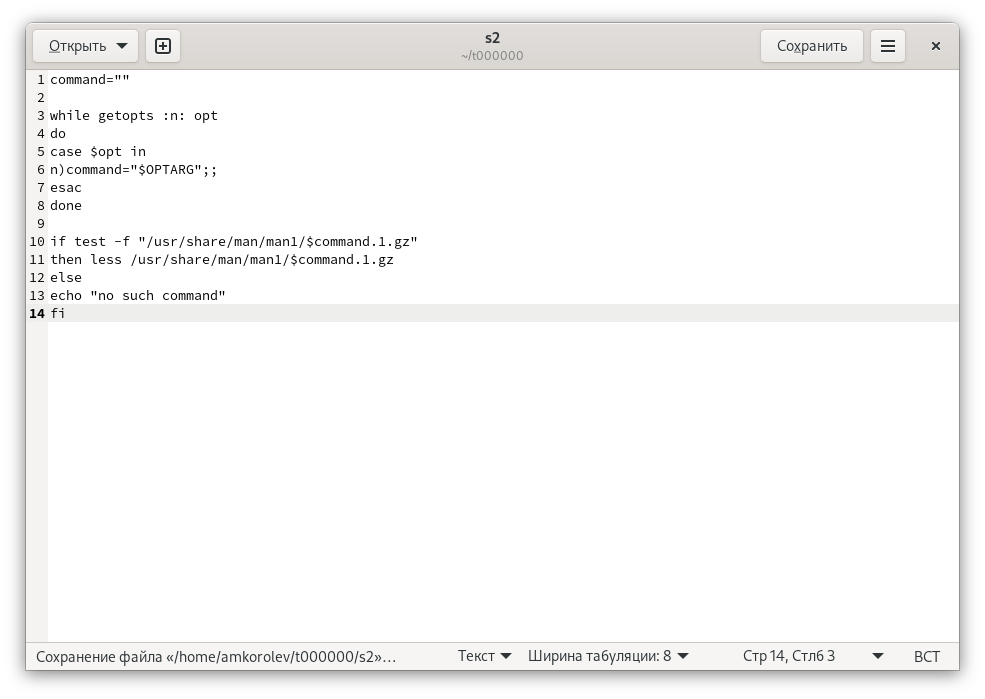
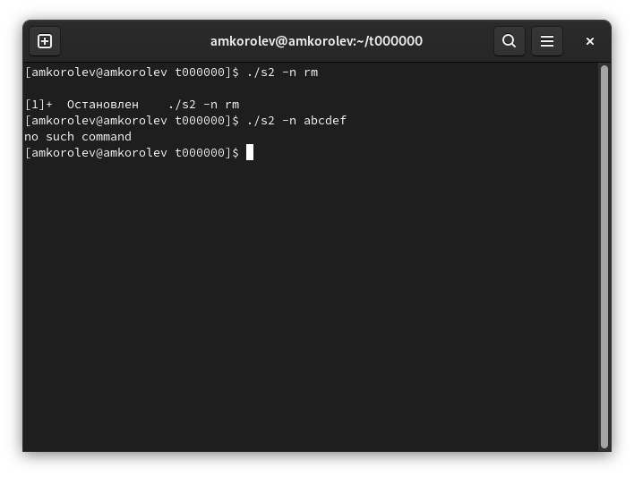
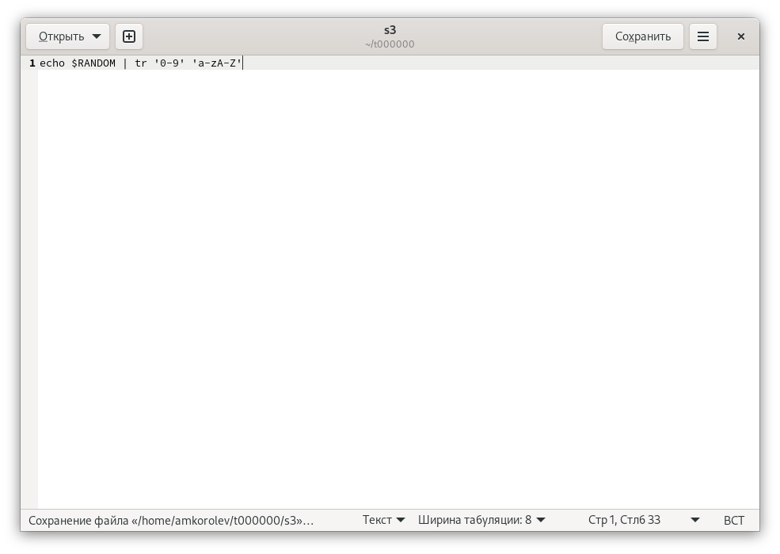
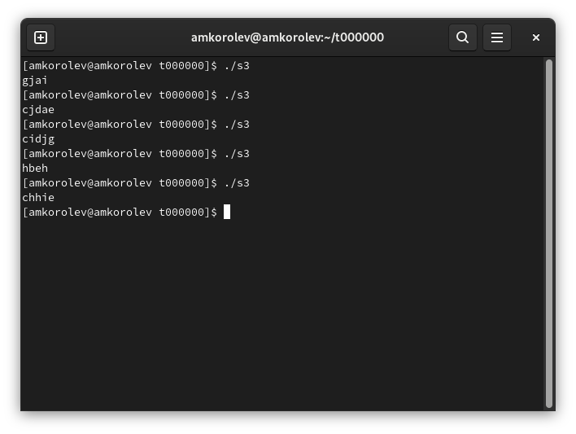

МИНИСТЕРСТВО ОБРАЗОВАНИЯ И НАУКИ\
РОССИЙСКОЙ ФЕДЕРАЦИИ\
\
ФЕДЕРАЛЬНОЕ ГОСУДАРСТВЕННОЕ АВТОНОМНОЕ\
ОБРАЗОВАТЕЛЬНОЕ УЧРЕЖДЕНИЕ ВЫСШЕГО ОБРАЗОВАНИЯ\
"РОССИЙСКИЙ УНИВЕРСИТЕТ ДРУЖБЫ НАРОДОВ"\

Факультет физико-математических и естественных наук\
\
\
\

ОТЧЕТ\
\
По лабораторной работе №12\
"Программирование в командном
процессоре ОС UNIX. Расширенное программирование"\
\

Выполнил:\
Студент группы: НПИбд-02-21\
Студенческий билет: №1032217060\
ФИО студента: Королев Адам Маратович\
Дата выполнения: 28.05.2022\
\
\
\

Москва 2022\

# Цель работы:
\- Изучить основы программирования в оболочке ОС UNIX. Научиться писать более
сложные командные файлы с использованием логических управляющих конструкций
и циклов.\

# Теоретическое введение:

Командный процессор (командная оболочка, интерпретатор команд shell) — это программа, позволяющая пользователю взаимодействовать с операционной системой
компьютера.\
 В операционных системах типа UNIX/Linux наиболее часто используются
следующие реализации командных оболочек:\
– оболочка Борна (Bourne shell или sh) — стандартная командная оболочка UNIX/Linux,
содержащая базовый, но при этом полный набор функций;\
– С-оболочка (или csh) — надстройка на оболочкой Борна, использующая С-подобный
синтаксис команд с возможностью сохранения истории выполнения команд;\
– оболочка Корна (или ksh) — напоминает оболочку С, но операторы управления програм-
мой совместимы с операторами оболочки Борна;\
– BASH — сокращение от Bourne Again Shell (опять оболочка Борна), в основе своей сов-
мещает свойства оболочек С и Корна (разработка компании Free Software Foundation).\
POSIX (Portable Operating System Interface for Computer Environments) — набор стандартов
описания интерфейсов взаимодействия операционной системы и прикладных программ.\
Стандарты POSIX разработаны комитетом IEEE (Institute of Electrical and Electronics
Engineers) для обеспечения совместимости различных UNIX/Linux-подобных опера-
ционных систем и переносимости прикладных программ на уровне исходного кода.\
POSIX-совместимые оболочки разработаны на базе оболочки Корна.\
Рассмотрим основные элементы программирования в оболочке bash. В других оболоч-
ках большинство команд будет совпадать с описанными ниже.\

# Выполнение лабораторной работы:

1. Написать командный файл, реализующий упрощённый механизм семафоров. Ко-
мандный файл должен в течение некоторого времени t1 дожидаться освобождения
ресурса, выдавая об этом сообщение, а дождавшись его освобождения, использовать
его в течение некоторого времени t2<>t1, также выдавая информацию о том, что
ресурс используется соответствующим командным файлом (процессом). Запустить
командный файл в одном виртуальном терминале в фоновом режиме, перенаправив
его вывод в другой (> /dev/tty#, где # — номер терминала куда перенаправляется
вывод), в котором также запущен этот файл, но не фоновом, а в привилегированном
режиме. Доработать программу так, чтобы имелась возможность взаимодействия трёх
и более процессов.\

Пишем скрипт. \
\

Выполняем скрипт \
\

2. Реализовать команду man с помощью командного файла. Изучите содержимое ката-
лога /usr/share/man/man1. В нем находятся архивы текстовых файлов, содержащих
справку по большинству установленных в системе программ и команд. Каждый архив
можно открыть командой less сразу же просмотрев содержимое справки. Командный
файл должен получать в виде аргумента командной строки название команды и в виде
результата выдавать справку об этой команде или сообщение об отсутствии справки,
если соответствующего файла нет в каталоге man1.\

Пишем скрипт. \
\

Выполняем скрипт \
\

3. Используя встроенную переменную $RANDOM, напишите командный файл, генерирую-
щий случайную последовательность букв латинского алфавита. Учтите, что $RANDOM
выдаёт псевдослучайные числа в диапазоне от 0 до 32767.\

Пишем скрипт. \
\

Выполняем скрипт \
\

# Выводы:
\- В процессе выполнения работы научился писать более сложные командные файлы с использованием логических управляющих конструкций и циклов.\

# Ответы на контрольные вопросы:

1: **Найдите синтаксическую ошибку в следующей строке: while [\$1 != "exit"]**

\$1.
Так же между скобками должны быть пробелы. В противном случае скобки и рядом стоящие символы будут восприниматься как одно целое

2:	**Как объединить (конкатенация) несколько строк в одну?**

cat file.txt | xargs | sed -e 's/\\. /.\\n/g'

3:	**Найдите информацию об утилите seq. Какими иными способами можно реализовать её функционал при программировании на bash?**

seq - выдает последовательность чисел. Реализовать ее функционал можно командой for n in \{1..5\}
do <КОМАНДА>
done

4:	**Какой результат даст вычисление выражения \$((10/3))?**

3

5:	**Укажите кратко основные отличия командной оболочки zsh от bash.**

Zsh очень сильно упрощает работу. Но существуют различия. Например, в zsh после for обязательно вставлять пробел, нумерация массивов в zsh начинается с 1 (что не особо удобно на самом деле).
Если вы собираетесь писать скрипт, который легко будет запускать множество разработчиков, то я рекомендуется Bash. Если скрипты вам не нужны - Zsh (более простая работа с файлами, например)

6:	**Проверьте, верен ли синтаксис данной конструкции for ((a=1; a <= LIMIT; a++))**

Верен

7:	**Сравните язык bash с какими-либо языками программирования. Какие преимущества у bash по сравнению с ними? Какие недостатки?**

Bash позволяет очень легко работать с файловой системой без лишних конструкций (в отличи от обычного языка программирования). Но относительно обычных языков программирования bash очень сжат. Тот же Си имеет гораздо более широкие возможности для разработчика.
