МИНИСТЕРСТВО ОБРАЗОВАНИЯ И НАУКИ\
РОССИЙСКОЙ ФЕДЕРАЦИИ\
\
ФЕДЕРАЛЬНОЕ ГОСУДАРСТВЕННОЕ АВТОНОМНОЕ\
ОБРАЗОВАТЕЛЬНОЕ УЧРЕЖДЕНИЕ ВЫСШЕГО ОБРАЗОВАНИЯ\
"РОССИЙСКИЙ УНИВЕРСИТЕТ ДРУЖБЫ НАРОДОВ"\

Факультет физико-математических и естественных наук\
\
\
\

ОТЧЕТ:\
\
О выполнении индивидуального проекта.\
"Этап 1. Размещение на Github pages заготовки для персонального сайта".\
\
\

Выполнил:\
Студент группы: НПИбд-02-21\
Студенческий билет: №1032217060\
ФИО студента: Королев Адам Маратович\
Дата выполнения: 29.04.2022\

Москва 2022

# Цель работы:

\- Приобретение навыков работы с программным обеспечением Hugo.\
\- Приобретение навыков по размещению своего сайта на Github pages.\
\- Приобретение навыков по работе с шаблонами индивидуальных сайтов.\

# Задание:

Размещение на Github pages заготовки для персонального сайта\
\- Установить необходимое программное обеспечение.\
\- Скачать шаблон темы сайта.\
\- Разместить его на хостинге git.\
\- Установить параметр для URLs сайта.\
\- Разместить заготовку сайта на Github pages.\

# Теоретическое введение: 

GitHub Pages -- это бесплатный хостинг для статических файлов. Данный сервис позволяет размещать свои статические веб-сайты.\
Hugo -- это один из генераторов статических сайтов с открытым исходным кодом, который является как самым популярным, так и совершенно бесплатным.\

# Выполнение лабораторной работы:

1. Установим программное обеспечение Hugo.\
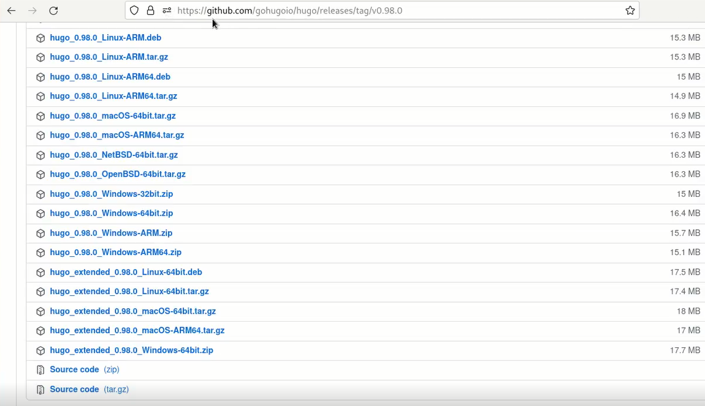\
Перейдите на страницу с github.com/gohugoio/hugo/releases и скачайте архив hugo_extended_0.98.0_Linux-64bit.tar.gz\

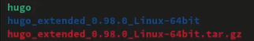\
Разархивируем архив\

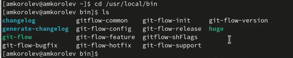\
Копируем файл hugo в /usr/local/bin\

2. Клонируем репозиторий с темой сайта.\
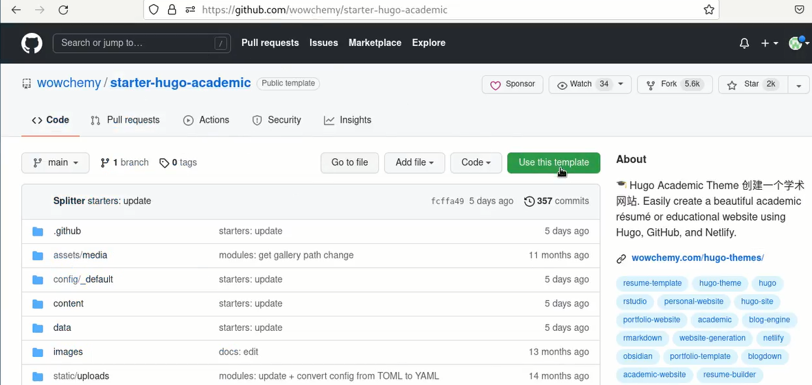\
Перейдите на страницу github.com/wowchemy/starter-hugo-academic и нажмите use this template\

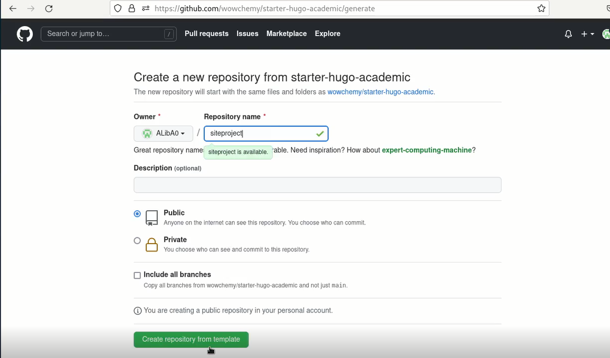\
В появившемся окне выбираем имя нашего нового репозитория и нажимаем create repository from template\

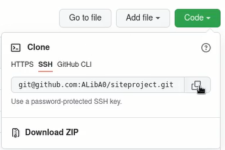\
Копируем ссылку, с помощью которой мы будем осуществлять копирование репозитория на наш компьютер\

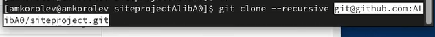\
Выполняем команду git clone --recursive %ссылка на наш репозиторий%\

3. Перейдем в скопированный репозиторий на нашем компьютере.\
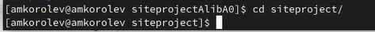\
Выполняем команду cd siteproject\

4. Выполним команду hugo.\
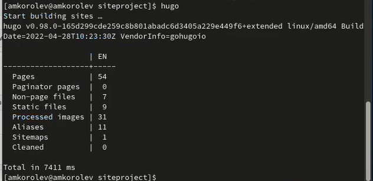\
Выполняем команду hugo\

5. Удаляем папку public.\
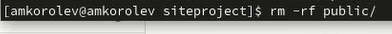\
rm -rf public\

6. Проверим работоспособность сайта, выполнив команду hugo server и перейдя по полученной ссылке.\
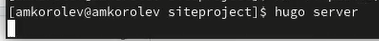\
hugo server\

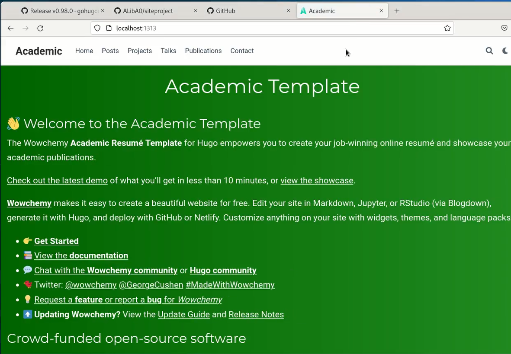\
Внешний вид сайта при переходе на него по ссылке\

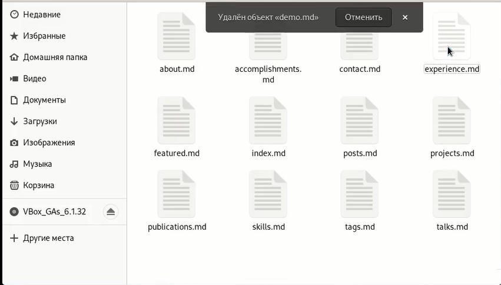\
Удалим лишний блок на нашем сайте, удалив файл demo.md по пути content/home\

7. Создаем еще один репозиторий. Выбираем ему имя ALibA0.github.io\
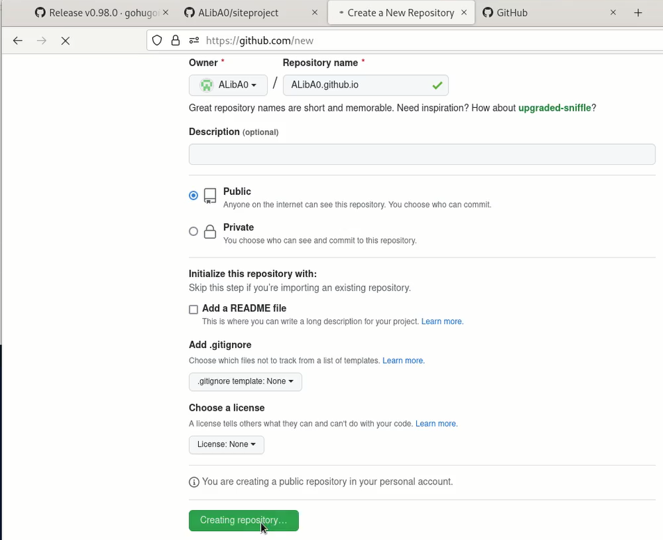\
Скриншот процесса создания репозитория\

8. Клонируем созданный репозиторий на наш компьютер.\

Копируем ссылку, которую мы будем использовать для клонирования.\
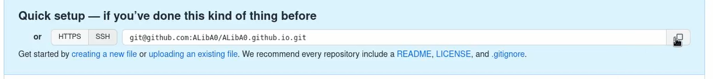\

Выполняем команду git clone --recursive %полученная ссылка%\
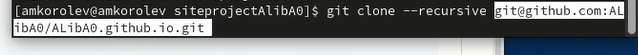\

9. Выполняем команду git checkout -b main.\
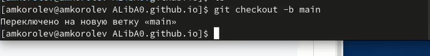\
Выполняем команду git checkout -b main. Переключаем на ветку "main"\

10. Создаем файл README.md (touch README.md), выгружаем его на Github, выполняя команды git add . ; git commit -am 'feat(main): Добавлен файл README.md' ; git push origin main.\
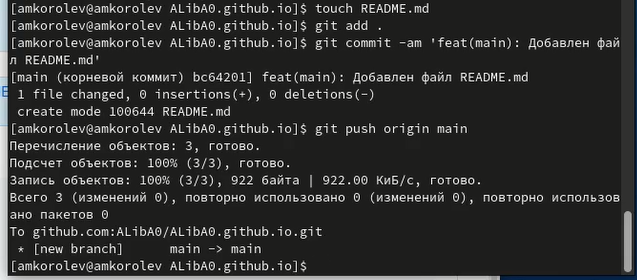\
Создаем файл README.md, выгружаем его на Github\

11. Редактируем файл .gitignore\
\
Выполняем команду vim .gitignore\

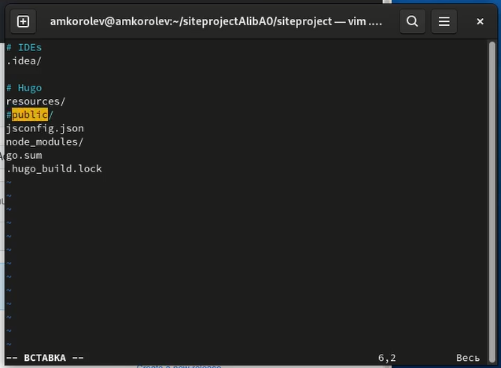\
Ставим символ # перед public\

12. Подключим git submodule, находясь в папке siteproject\
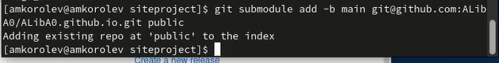\
Git submodule add -b main %скопированная раннее ссылка% public\

13. Выполняем команду git remote -v для проверки правильности подключения\
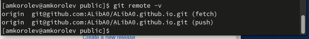\
Выполняем команду git remote -v\

14. Выполняем команды: git add . ; git commit -am 'feat(main): Добавлен сайт'\
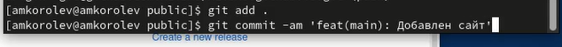\
git add . ; git commit -am 'feat(main): Добавлен сайт'\

15. Выполняем команду git push origin main\
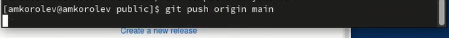\
git push origin main\

16. Проверяем работоспособность сайта, перейдя по ссылке ALibA0.github.io\
\
Переходим по ссылке ALibA0.github.io\

# Выводы:

\- В процессе выполнения работы были приобретены навыки работы с программным обеспечением Hugo, приобретены навыки по размещению своего сайта на Github pages и приобретены навыки по работе с шаблонами индивидуальных сайтов.
