---
## Front matter
lang: ru-RU
title: Индивидуальный проект. Этап 1. Размещение на Github pages заготовки для персонального сайта.
author: |
	Подготовил:
	\
	Королев Адам Маратович
	\
	Группа: НПИбд-02-21
	\
	Студенческий билет: № 1032217060

## Formatting
toc: false
slide_level: 2
theme: metropolis
header-includes: 
 - \metroset{progressbar=frametitle,sectionpage=progressbar,numbering=fraction}
 - '\makeatletter'
 - '\beamer@ignorenonframefalse'
 - '\makeatother'
aspectratio: 43
section-titles: true
---
## Цель работы:

- Приобретение навыков работы с программным обеспечением Hugo.
- Приобретение навыков по размещению своего сайта на Github pages.
- Приобретение навыков по работе с шаблонами индивидуальных сайтов.

## Задание:

Размещение на Github pages заготовки для персонального сайта \
- Установить необходимое программное обеспечение. \
- Скачать шаблон темы сайта. \
- Разместить его на хостинге git. \
- Установить параметр для URLs сайта. \
- Разместить заготовку сайта на Github pages. \

## Теоретическое введение:

GitHub Pages -- это бесплатный хостинг для статических файлов. Данный сервис позволяет размещать свои статические веб-сайты. \
Hugo -- это один из генераторов статических сайтов с открытым исходным кодом, который является как самым популярным, так и совершенно бесплатным. \

# Выполнение лабораторной работы:

## 1. Установим программное обеспечение Hugo.
{width=350px}

## Разархивируем архив
{width=350px}

## Копируем файл hugo в /usr/local/bin
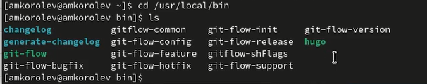{width=350px}

## 2. Клонируем репозиторий с темой сайта.
{width=350px}

## В появившемся окне выбираем имя нашего нового репозитория и нажимаем create repository from template
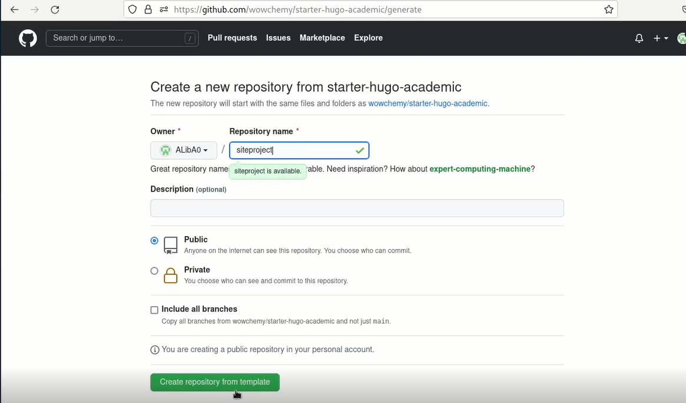{width=350px}

## Копируем ссылку, с помощью которой мы будем осуществлять копирование репозитория на наш компьютер
{width=350px}

## Выполняем команду git clone --recursive %ссылка на наш репозиторий%
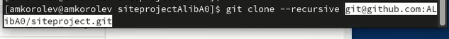{width=350px}

## 3. Перейдем в скопированный репозиторий на нашем компьютере.
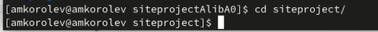{width=350px}

## 4. Выполним команду hugo.
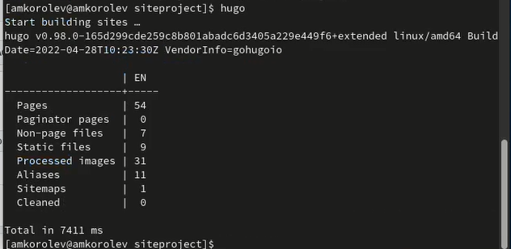{width=350px}

## 5. Удаляем папку public.
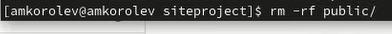{width=350px}

## 6. Проверим работоспособность сайта, выполнив команду hugo server и перейдя по полученной ссылке.
{width=350px}

## Внешний вид сайта при переходе на него по ссылке
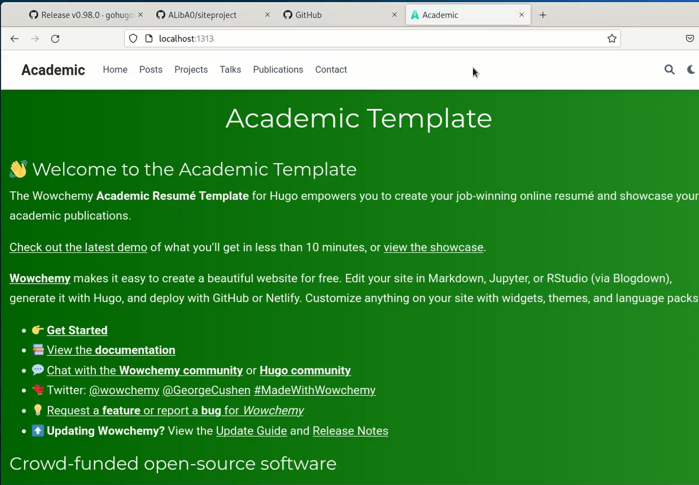{width=350px}

## Удалим лишний блок на нашем сайте, удалив файл demo.md по пути content/home
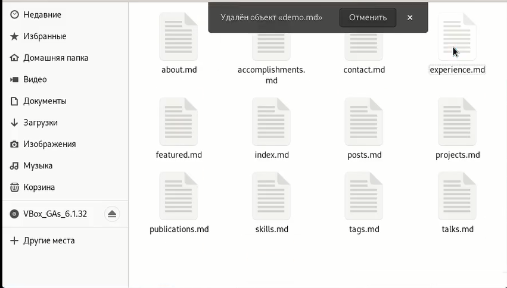{width=350px}

## 7. Создаем еще один репозиторий. Выбираем ему имя ALibA0.github.io
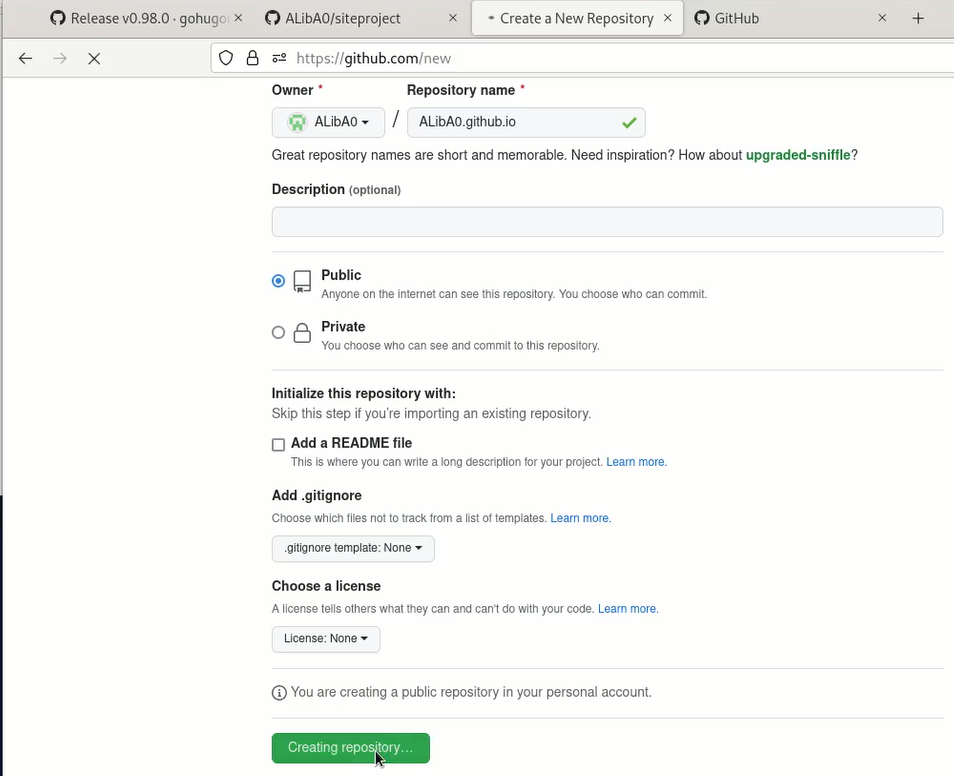{width=350px}

# 8. Клонируем созданный репозиторий на наш компьютер.

## Копируем ссылку, которую мы будем использовать для клонирования.
{width=350px}

## Выполняем команду git clone --recursive %полученная ссылка%
{width=350px}

## 9. Выполняем команду git checkout -b main.
{width=350px}

## 10. Создаем файл README.md (touch README.md), выгружаем его на Github, выполняя команды git add . ; git commit -am 'feat(main): Добавлен файл README.md' ; git push origin main.
{width=350px}

## 11. Редактируем файл .gitignore
{width=350px}

## Ставим символ # перед public
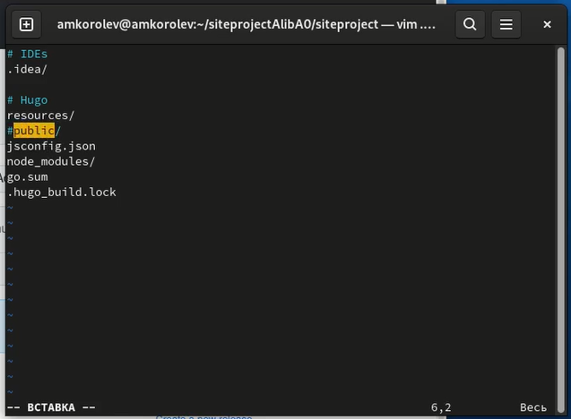{width=350px}

## 12. Подключим git submodule, находясь в папке siteproject
{width=350px}

## 13. Выполняем команду git remote -v для проверки правильности подключения
{width=350px}

## 14. Выполняем команды: git add . ; git commit -am 'feat(main): Добавлен сайт'
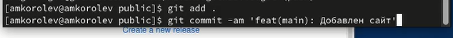{width=350px}

## 15. Выполняем команду git push origin main
{width=350px}

## 16. Проверяем работоспособность сайта, перейдя по ссылке ALibA0.github.io
{width=350px}

# Выводы:

- В процессе выполнения работы были приобретены навыки работы с программным обеспечением Hugo, приобретены навыки по размещению своего сайта на Github pages и приобретены навыки по работе с шаблонами индивидуальных сайтов.

