МИНИСТЕРСТВО ОБРАЗОВАНИЯ И НАУКИ\
РОССИЙСКОЙ ФЕДЕРАЦИИ\
\
ФЕДЕРАЛЬНОЕ ГОСУДАРСТВЕННОЕ АВТОНОМНОЕ\
ОБРАЗОВАТЕЛЬНОЕ УЧРЕЖДЕНИЕ ВЫСШЕГО ОБРАЗОВАНИЯ\
"РОССИЙСКИЙ УНИВЕРСИТЕТ ДРУЖБЫ НАРОДОВ"\

Факультет физико-математических и естественных наук\
\
\
\

ОТЧЕТ:\
\
О выполнении индивидуального проекта.\
"Этап 2. Добавление к сайту данных о себе".\
\
\

Выполнил:\
Студент группы: НПИбд-02-21\
Студенческий билет: №1032217060\
ФИО студента: Королев Адам Маратович\
Дата выполнения: 07.05.2022\

Москва 2022

# Цель работы:

\- Добавление к сайту информации о себе.\
\- Приобретение навыков по созданию постов при помощи программного обеспечения Hugo.\
\- Приобретение навыков по изменению своего сайта.\

# Задание:

Добавить к сайту данные о себе\
Список добавляемых данных:\
\- Разместить фотографию владельца сайта.\
\- Разместить краткое описание владельца сайта.\
\- Добавить информацию об интересах.\
\- Добавить информацию об образовании.\

# Теоретическое введение: 

GitHub Pages -- это бесплатный хостинг для статических файлов. Данный сервис позволяет размещать свои статические веб-сайты.\
Hugo -- это один из генераторов статических сайтов с открытым исходным кодом, который является как самым популярным, так и совершенно бесплатным.\

# Выполнение лабораторной работы:

1. Изменим фотографию на сайте, путем добавления своей фотографии в папку content/authors/admin с названием avatar.jpg.\
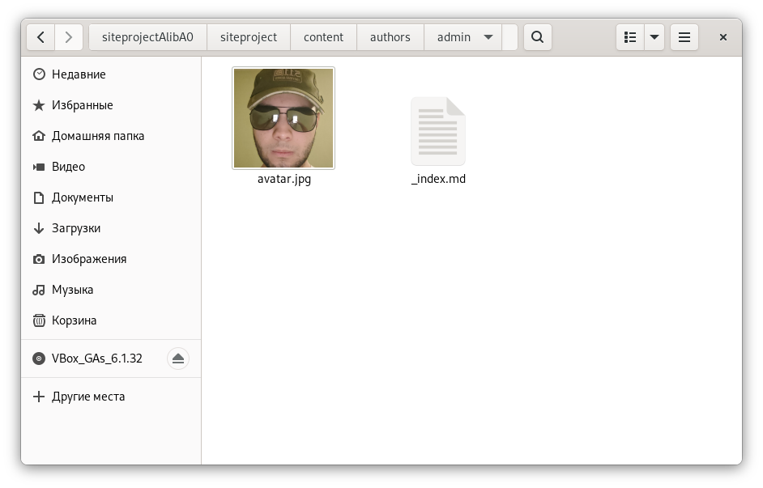\

2. Добавим к сайту данные о себе, отредактировав файл _index.md в папке content/authors/admin.\

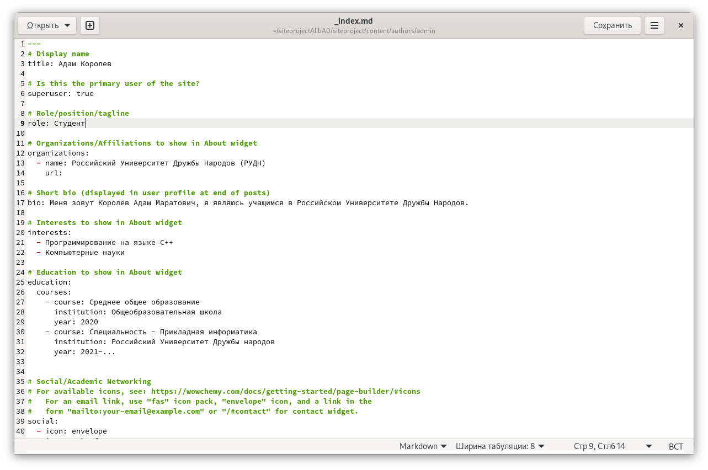\

3. Создаем пустой пост, который мы будем редактировать для того, чтобы создать пост по прошедшей неделе.\

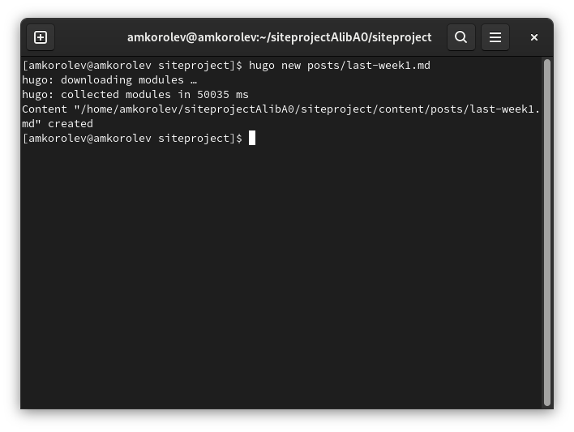\
hugo new posts/last-week1.md\

4. Заходим в папку content/posts и редактируем файл last-week.md\

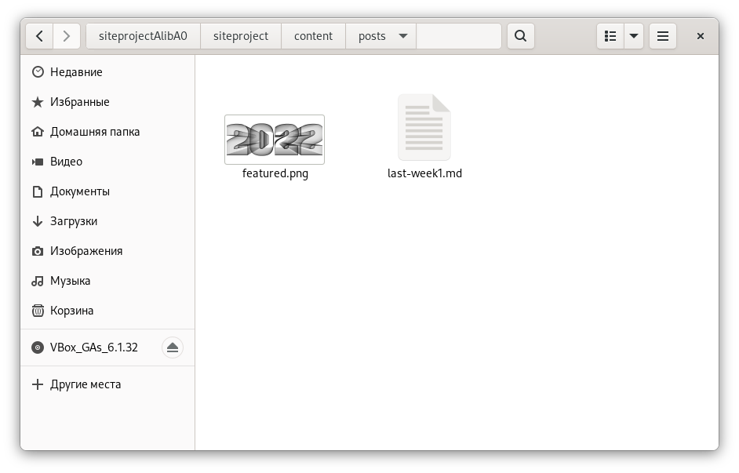\
Заходим в папку\

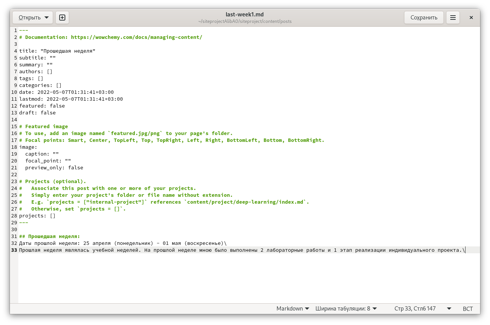\
Редактируем файл\

5. Добавляем пост на тему управления версиями. Git.\

\
Выполняем команду hugo new posts/git-version-control1.md\

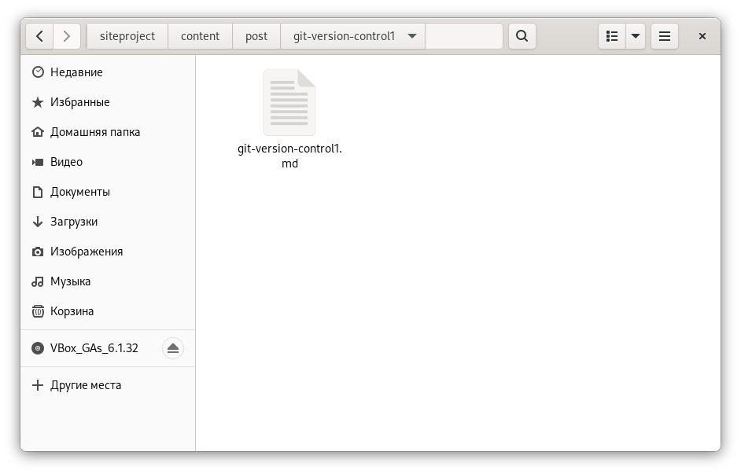\
Заходим в папку content/post и открываем файл\

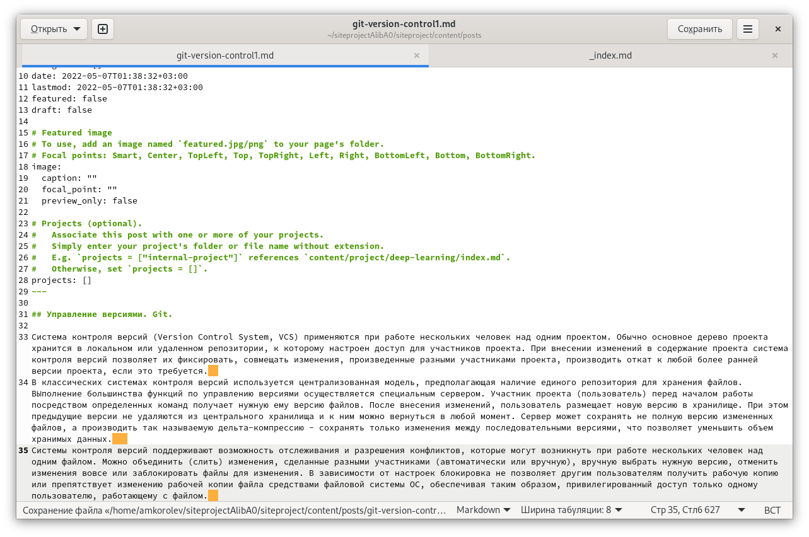\
Редактируем файл\

\- Перемещаем наши посты в content/post в отдельные папки\

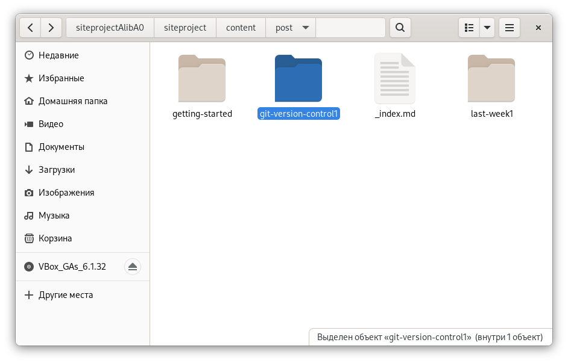\

\- Выполняем команду hugo.\

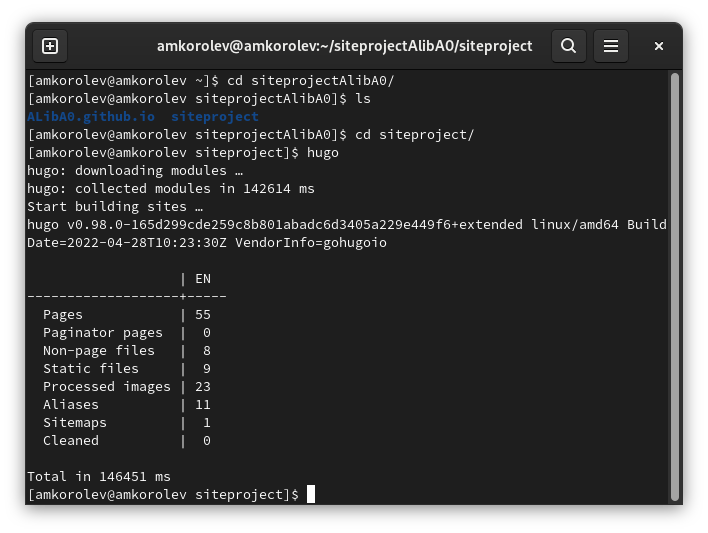\

6. Выгружаем наш сайт на github.\

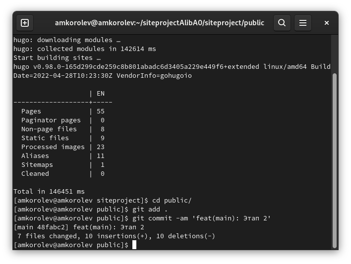\
cd public ; git add . ; git commit -am\

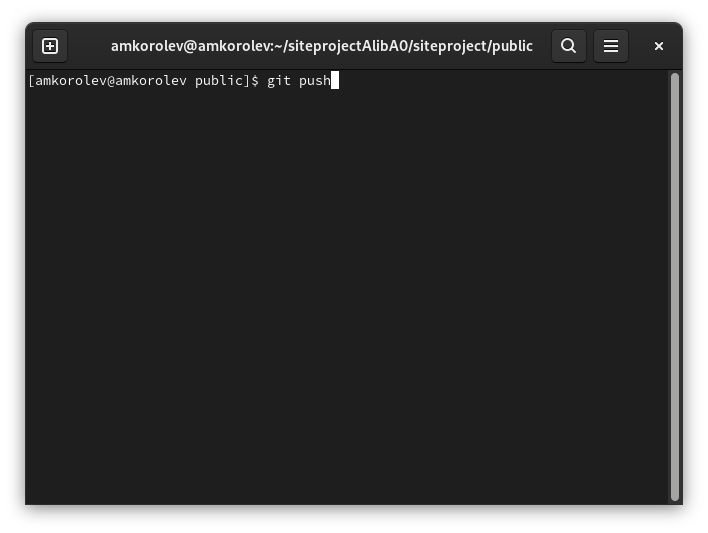\
git push\

7. Проверим изменения\

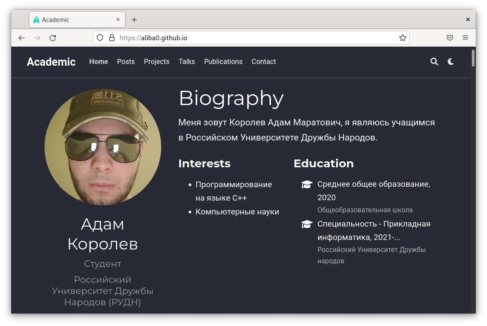\
Переходим на сайт aliba0.github.io и проверяем сайт\

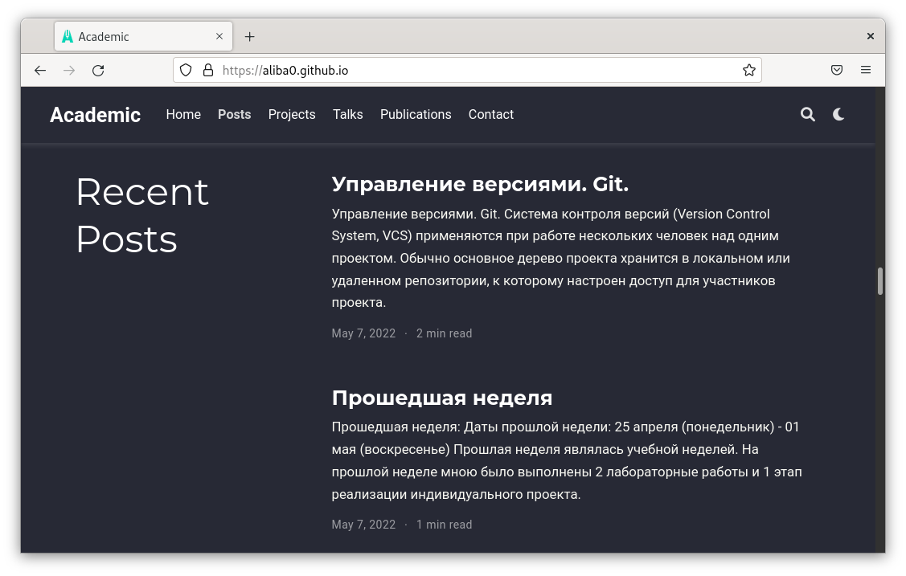\
Проверяем сайт\

# Выводы:

\- В процессе выполнения работы была добавлена информация о себе, были приобретены навыки по созданию постов с помощью программного обеспечения Hugo, были приобретены навыки по изменению своего сайта.
