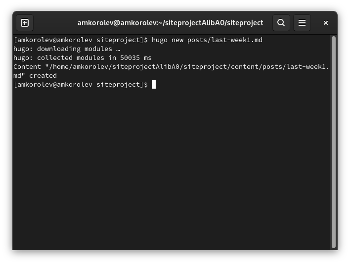
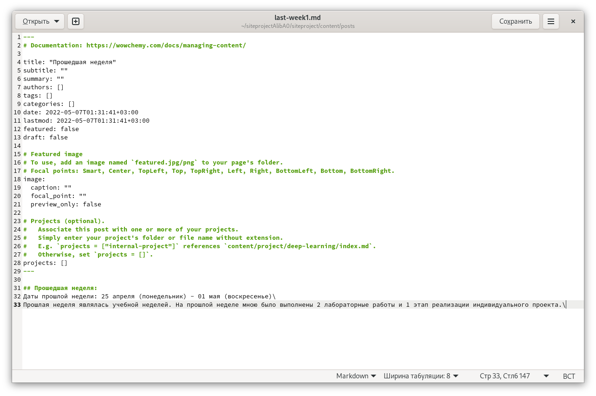
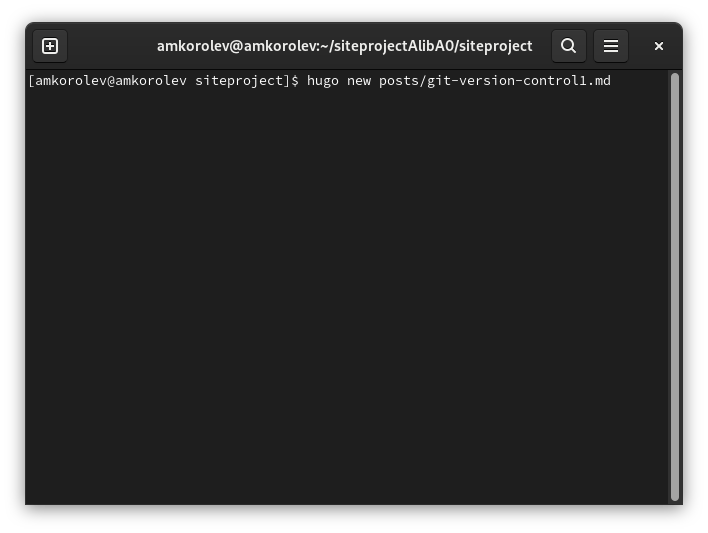
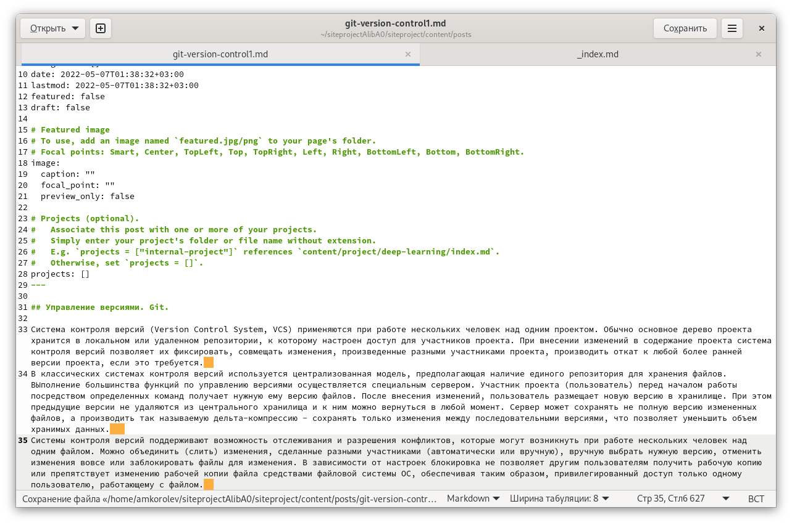
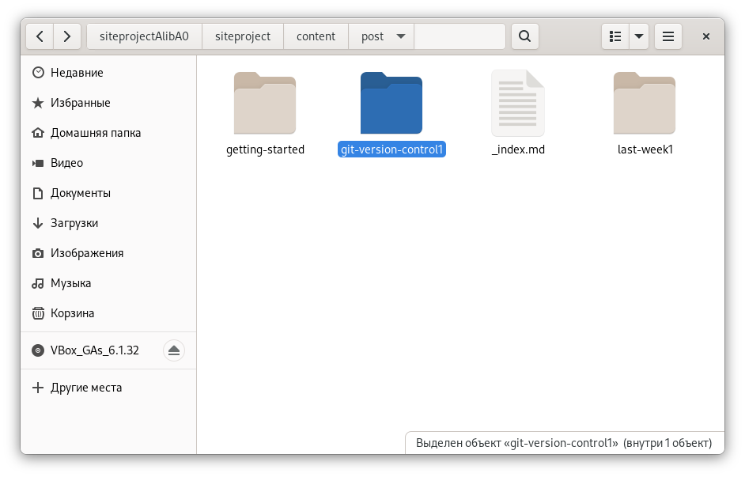

---
## Front matter
lang: ru-RU
title: Реализация индивидуального проекта. Этап 2. Добавление к сайту данных о себе
author: |
	Подготовил:
	\
	Королев Адам Маратович
	\
	Группа: НПИбд-02-21
	\
	Студенческий билет: № 1032217060

## Formatting
toc: false
slide_level: 2
theme: metropolis
header-includes: 
 - \metroset{progressbar=frametitle,sectionpage=progressbar,numbering=fraction}
 - '\makeatletter'
 - '\beamer@ignorenonframefalse'
 - '\makeatother'
aspectratio: 43
section-titles: true
---
## Цель работы:

- Добавление к сайту информации о себе.\
- Приобретение навыков по созданию постов при помощи программного обеспечения Hugo.\
- Приобретение навыков по изменению своего сайта.\

## Теоретическое введение:

GitHub Pages -- это бесплатный хостинг для статических файлов. Данный сервис позволяет размещать свои статические веб-сайты.\
Hugo -- это один из генераторов статических сайтов с открытым исходным кодом, который является как самым популярным, так и совершенно бесплатным.\

# Выполнение лабораторной работы:

## 1. Изменим фотографию на сайте, путем добавления своей фотографии в папку content/authors/admin с названием avatar.jpg.
{width=250px}

## 2. Добавим к сайту данные о себе, отредактировав файл _index.md в папке content/authors/admin.

{width=250px}

## 3. Создаем пустой пост, который мы будем редактировать для того, чтобы создать пост по прошедшей неделе.

{width=250px}

## 4. Заходим в папку content/posts и редактируем файл last-week.md

{width=250px}

## Редактируем файл
{width=250px}

## 5. Добавляем пост на тему управления версиями. Git.

{width=250px}

## Заходим в папку content/post
{width=250px}

## Редактируем файл
{width=250px}

## Перемещаем наши посты в content/post в отдельные папки

{width=250px}

## Выполняем команду hugo.

{width=250px}

# 6. Выгружаем наш сайт на github.

## cd public ; git add . ; git commit -am
{width=250px}

## git push
{width=250px}

# 7. Проверим изменения

## Переходим на сайт aliba0.github.io и проверяем сайт
{width=250px}

## Проверяем сайт
{width=250px}

# Выводы:

\- В процессе выполнения работы была добавлена информация о себе, были приобретены навыки по созданию постов с помощью программного обеспечения Hugo, были приобретены навыки по изменению своего сайта.
