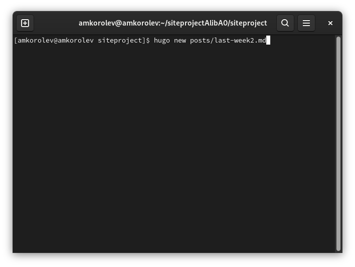

---
## Front matter
lang: ru-RU
title: Реализация индивидуального проекта. Этап 3. Добавление к сайту достижений
author: |
	Подготовил:
	\
	Королев Адам Маратович
	\
	Группа: НПИбд-02-21
	\
	Студенческий билет: № 1032217060

## Formatting
toc: false
slide_level: 2
theme: metropolis
header-includes: 
 - \metroset{progressbar=frametitle,sectionpage=progressbar,numbering=fraction}
 - '\makeatletter'
 - '\beamer@ignorenonframefalse'
 - '\makeatother'
aspectratio: 43
section-titles: true
---
## Цель работы:

- Добавление к сайту достижений.\
- Улучшение навыков по созданию постов при помощи программного обеспечения Hugo.\
- Улучшение навыков по изменению своего сайта.\

## Теоретическое введение:

GitHub Pages -- это бесплатный хостинг для статических файлов. Данный сервис позволяет размещать свои статические веб-сайты.\
Hugo -- это один из генераторов статических сайтов с открытым исходным кодом, который является как самым популярным, так и совершенно бесплатным.\

# Выполнение лабораторной работы:

## 1. Добавим к сайту информацию о навыках (skills)

{width=250px}

## 2. Добавим к сайту информацию об опыте (experience)

{width=250px}

## 3. Добавляем к сайту информацию о достижениях (accomplishments).

{width=250px}

## 4. Создаем пост по прошедшей неделе.
{width=250px}

## Процесс создания поста
{width=250px}

## 5. Добавляем пост на тему: "Язык разметки Markdown"

{width=250px}

## Процесс создания поста
{width=250px}

## 6. Выполняем команду для создания необходимых файлов
{width=250px}

## 7. Выгружаем наш сайт на github.

{width=250px}

## 8. Проверяем изменения на сайте

{width=250px}

## Проверяем сайт
{width=250px}

# Выводы:

\- В процессе выполнения работы была добавлена информация о навыках, об опыте, о достижениях, был создан пост по прошедшей неделе, был добавлен пост на тему: "Язык разметки Markdown". Были улучшены навыки по созданию постов и изменению своего сайта.
