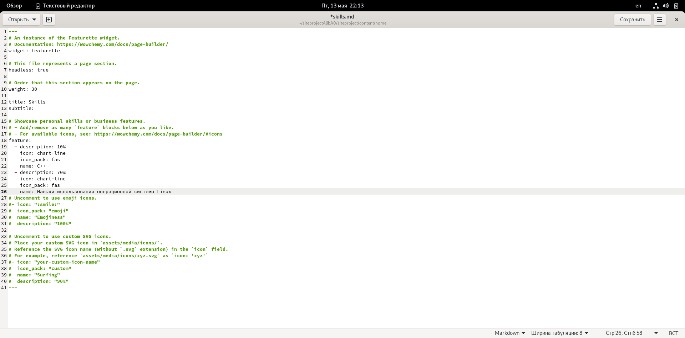
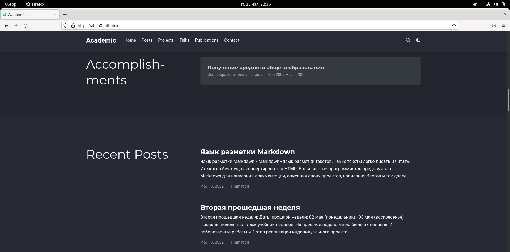

МИНИСТЕРСТВО ОБРАЗОВАНИЯ И НАУКИ\
РОССИЙСКОЙ ФЕДЕРАЦИИ\
\
ФЕДЕРАЛЬНОЕ ГОСУДАРСТВЕННОЕ АВТОНОМНОЕ\
ОБРАЗОВАТЕЛЬНОЕ УЧРЕЖДЕНИЕ ВЫСШЕГО ОБРАЗОВАНИЯ\
"РОССИЙСКИЙ УНИВЕРСИТЕТ ДРУЖБЫ НАРОДОВ"\

Факультет физико-математических и естественных наук\
\
\
\

ОТЧЕТ:\
\
О выполнении индивидуального проекта.\
"Этап 3. Добавление к сайту достижений".\
\
\

Выполнил:\
Студент группы: НПИбд-02-21\
Студенческий билет: №1032217060\
ФИО студента: Королев Адам Маратович\
Дата выполнения: 13.05.2022\

Москва 2022

# Цель работы:

\- Добавление к сайту достижений.\
\- Улучшение навыков по созданию постов при помощи программного обеспечения Hugo.\
\- Улучшение навыков по изменению своего сайта.\

# Задание:

Список добавляемых данных:\
\- Добавить информацию о навыках.\
\- Добавить информацию об опыте.\
\- Добавить информацию о достижениях.\
Сделать пост по прошедшей неделе.\
Добавить пост на тему: "Язык разметки Markdown"\

# Теоретическое введение: 

GitHub Pages -- это бесплатный хостинг для статических файлов. Данный сервис позволяет размещать свои статические веб-сайты.\
Hugo -- это один из генераторов статических сайтов с открытым исходным кодом, который является как самым популярным, так и совершенно бесплатным.\

# Выполнение лабораторной работы:

1. Добавим к сайту информацию о навыках (skills)\

\

2. Добавим к сайту информацию об опыте (experience)\

\

3. Добавляем к сайту информацию о достижениях (accomplishments).\

\

4. Создаем пост по прошедшей неделе.\
\
hugo new posts/last-week2.md\

\
Процесс создания поста\

5. Добавляем пост на тему: "Язык разметки Markdown"\

\
hugo new posts/markdown-lang.md\

\
Процесс создания поста\

6. Выполняем команду для создания необходимых файлов\
\
hugo\

7. Выгружаем наш сайт на github.\

\
cd public ; git add . ; git commit -am; git push\

8. Проверяем изменения на сайте\

\
Переходим на сайт aliba0.github.io и проверяем сайт\

\
Проверяем сайт\

# Выводы:

\- В процессе выполнения работы была добавлена информация о навыках, об опыте, о достижениях, был создан пост по прошедшей неделе, был добавлен пост на тему: "Язык разметки Markdown". Были улучшены навыки по созданию постов и изменению своего сайта.
