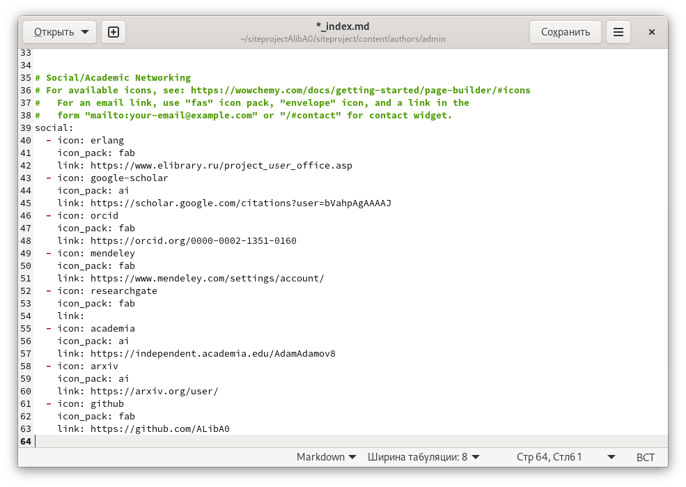
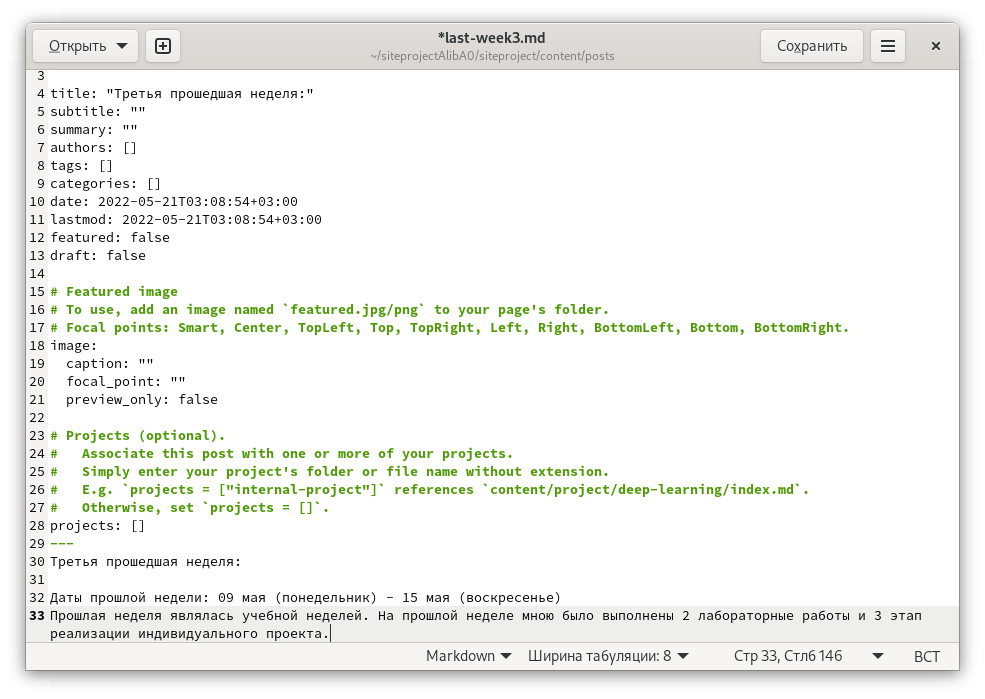
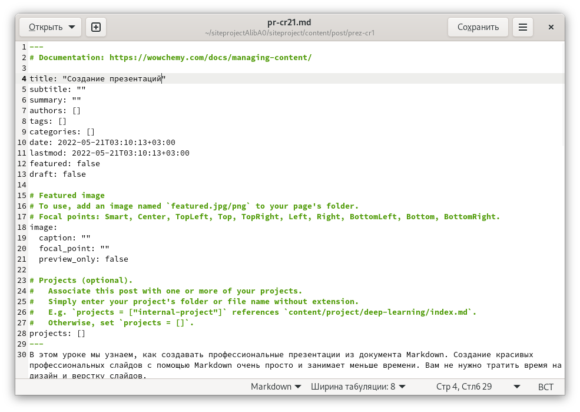
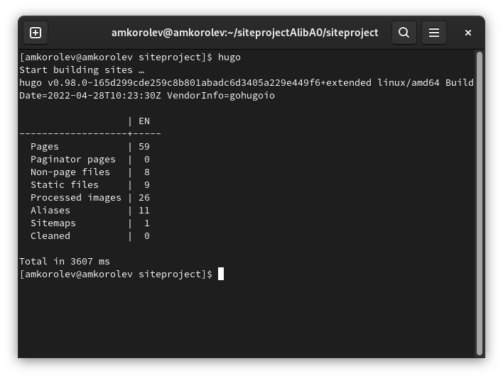
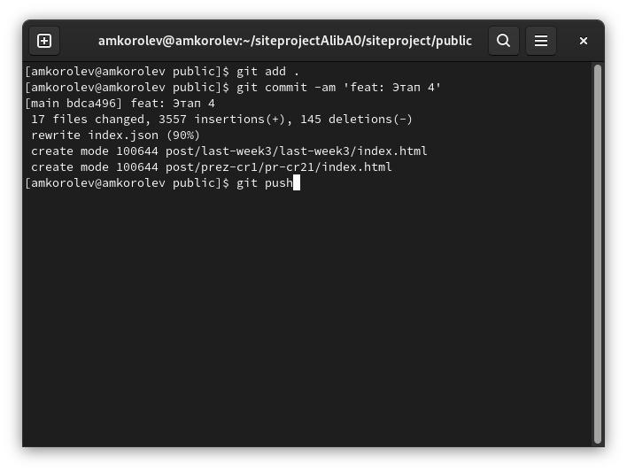
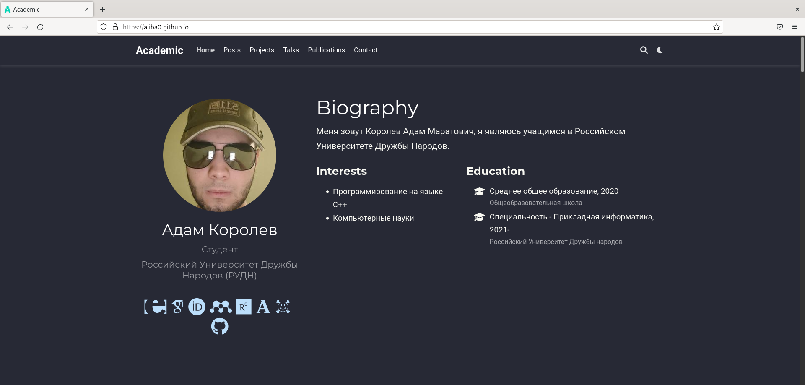
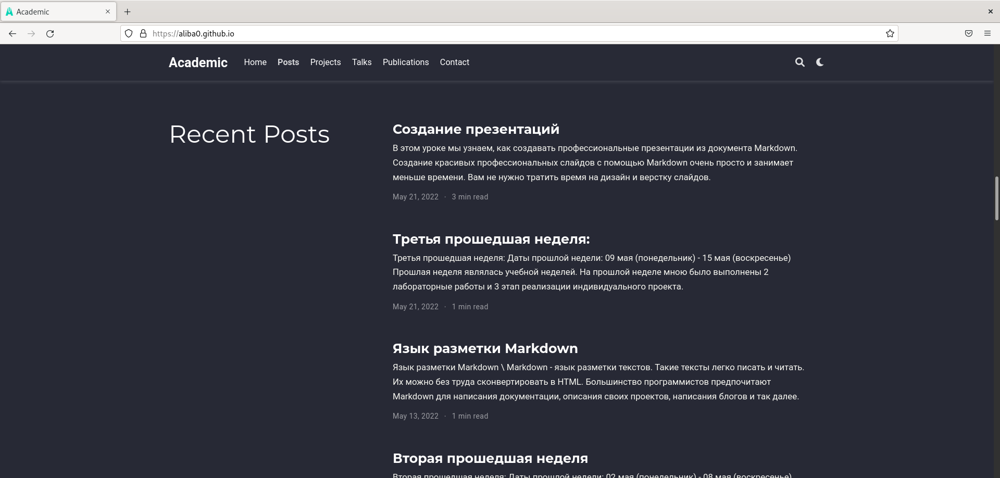

МИНИСТЕРСТВО ОБРАЗОВАНИЯ И НАУКИ\
РОССИЙСКОЙ ФЕДЕРАЦИИ\
\
ФЕДЕРАЛЬНОЕ ГОСУДАРСТВЕННОЕ АВТОНОМНОЕ\
ОБРАЗОВАТЕЛЬНОЕ УЧРЕЖДЕНИЕ ВЫСШЕГО ОБРАЗОВАНИЯ\
"РОССИЙСКИЙ УНИВЕРСИТЕТ ДРУЖБЫ НАРОДОВ"\

Факультет физико-математических и естественных наук\
\
\
\

ОТЧЕТ:\
\
О выполнении индивидуального проекта.\
"Этап 4. Добавление к сайту ссылок на научные и библиометрические ресурсы".\
\
\

Выполнил:\
Студент группы: НПИбд-02-21\
Студенческий билет: №1032217060\
ФИО студента: Королев Адам Маратович\
Дата выполнения: 21.05.2022\

Москва 2022

# Цель работы:

\- Добавление к сайту ссылок на научные и библиометрические ресурсы.\
\- Улучшение навыков по созданию постов при помощи программного обеспечения Hugo.\
\- Улучшение навыков по изменению своего сайта.\

# Задание:

- Зарегистрироваться на соответствующих ресурсах и разместить на них ссылки на сайте.\
- Сделать пост по прошедшей неделе.\
- Добавить пост на тему по выбору.\

# Теоретическое введение: 

GitHub Pages -- это бесплатный хостинг для статических файлов. Данный сервис позволяет размещать свои статические веб-сайты.\
Hugo -- это один из генераторов статических сайтов с открытым исходным кодом, который является как самым популярным, так и совершенно бесплатным.\

# Выполнение лабораторной работы:

1. Размещаем ссылки на соответствующие ресурсы на нашем сайте.\

\
Размещаем ссылки\

2. Делаем пост по прошедшей неделе.\

\
Делаем пост\

3. Добавляем пост на тему: "Создание презентаций".\

\
Добавляем пост\

4. Выполняем команду для создания необходимых файлов\
\
hugo\

5. Выгружаем наш сайт на github.\

\
git add . ; git commit -am; git push\

6. Проверяем изменения на сайте\

\
Переходим на сайт aliba0.github.io и проверяем сайт\

\
Проверяем сайт\

# Выводы:

\- В процессе выполнения работы были добавлены ссылки на соответствующие ресурсы, был создан пост по прошедшей неделе, был добавлен пост на тему: "Создание презентаций". Были улучшены навыки по созданию постов и изменению своего сайта.
