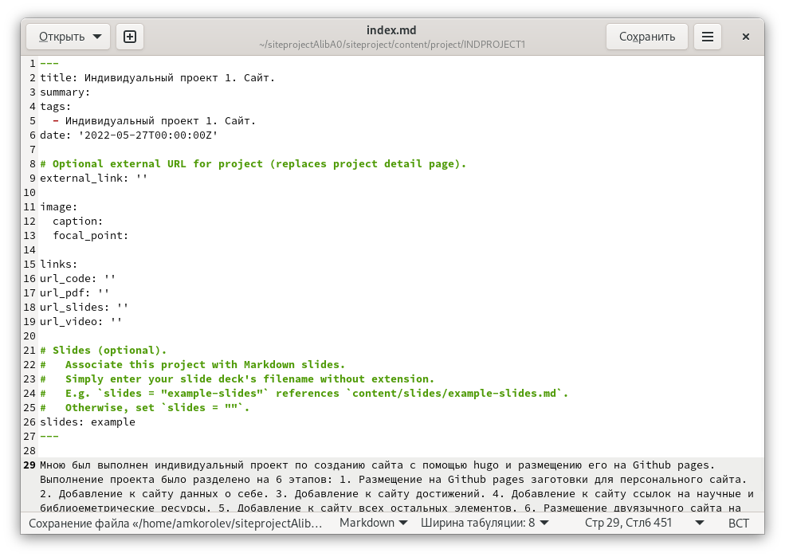
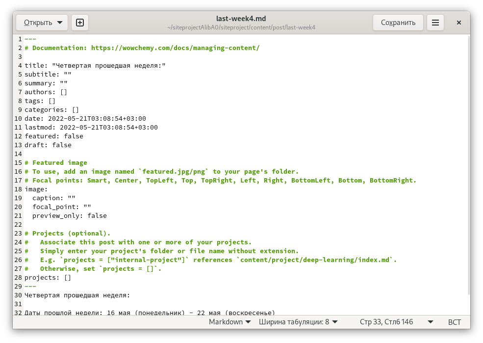
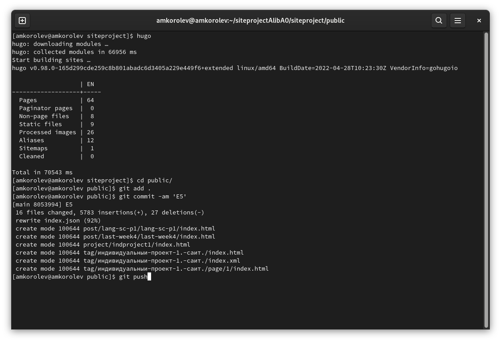
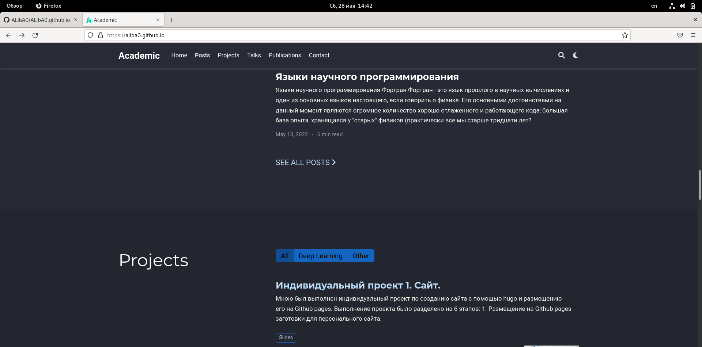

---
## Front matter
lang: ru-RU
title: Реализация индивидуального проекта. Этап 5. Добавление к сайту остальных элементов
author: |
	Подготовил:
	\
	Королев Адам Маратович
	\
	Группа: НПИбд-02-21
	\
	Студенческий билет: № 1032217060

## Formatting
toc: false
slide_level: 2
theme: metropolis
header-includes: 
 - \metroset{progressbar=frametitle,sectionpage=progressbar,numbering=fraction}
 - '\makeatletter'
 - '\beamer@ignorenonframefalse'
 - '\makeatother'
aspectratio: 43
section-titles: true
---
## Цель работы:

\- Добавление к сайту остальных элементов.\
\- Улучшение навыков по созданию постов при помощи программного обеспечения Hugo.\
\- Улучшение навыков по изменению своего сайта.\

## Теоретическое введение:

GitHub Pages -- это бесплатный хостинг для статических файлов. Данный сервис позволяет размещать свои статические веб-сайты.\
Hugo -- это один из генераторов статических сайтов с открытым исходным кодом, который является как самым популярным, так и совершенно бесплатным.\

# Выполнение лабораторной работы:

## 1. Создаем запись для персонального проекта.
{width=250px}

## 2. Создаем пост по прошедшей неделе.
{width=250px}

## 3. Добавляем пост на тему: "Языки научного программирования"
{width=250px}

## 4. Выполняем команду для создания необходимых файлов и выгружаем на Github
{width=250px}

# 5. Проверяем изменения на сайте

## Переходим на сайт aliba0.github.io и проверяем сайт
{width=250px}

## Проверяем сайт
{width=250px}

# Выводы:

\- В процессе выполнения работы была сделана запись для персональных проектов, сделан пост по прошедшей неделе и  добавлен пост на тему: Языки научного программирования. Были улучшены навыки по созданию постов и изменению своего сайта.
