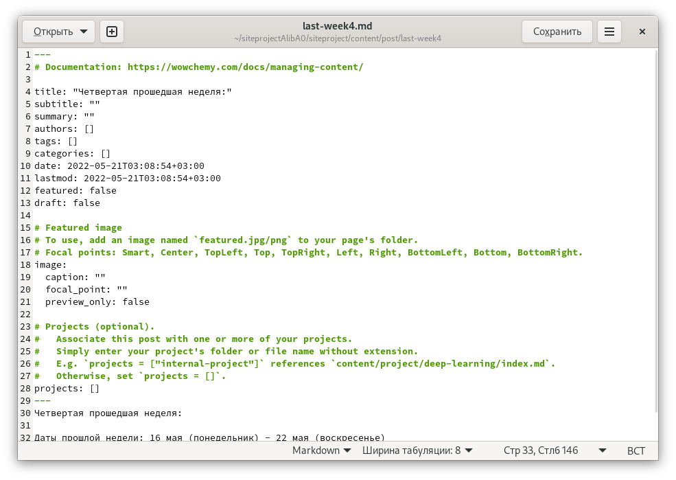
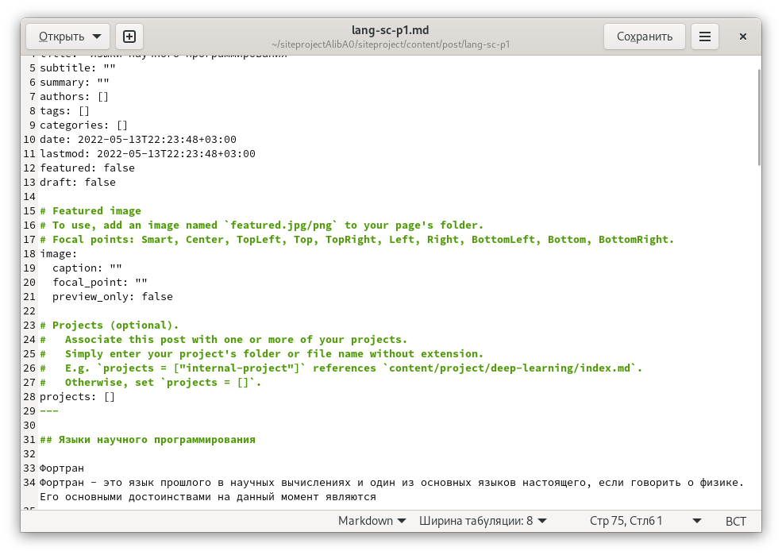
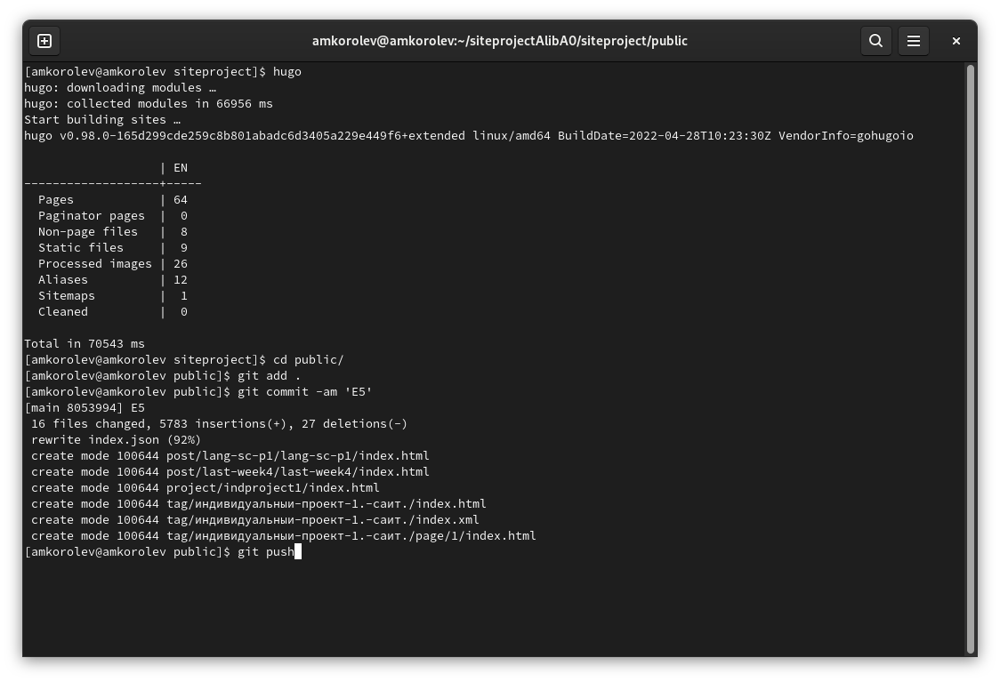
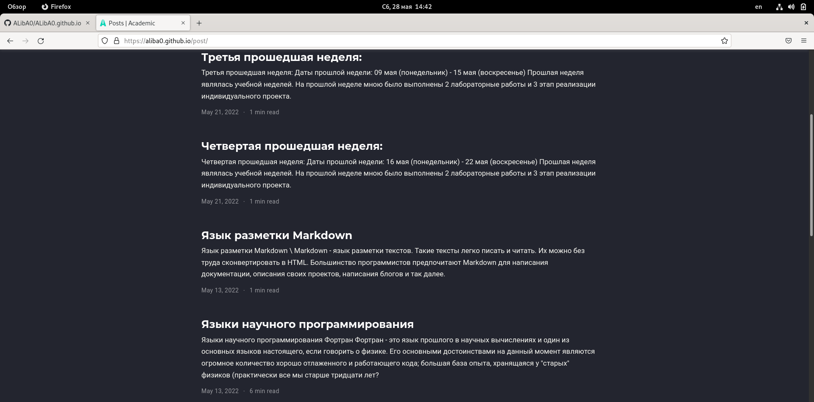
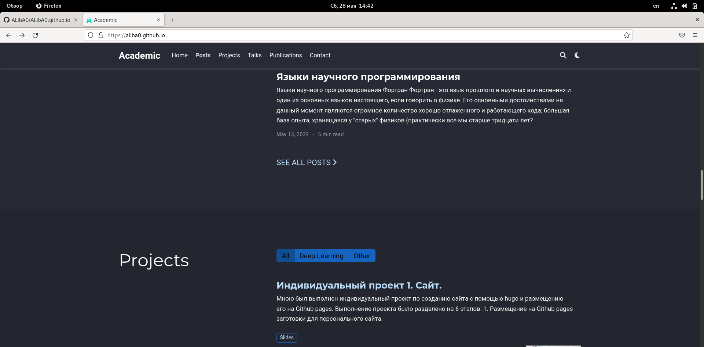

МИНИСТЕРСТВО ОБРАЗОВАНИЯ И НАУКИ\
РОССИЙСКОЙ ФЕДЕРАЦИИ\
\
ФЕДЕРАЛЬНОЕ ГОСУДАРСТВЕННОЕ АВТОНОМНОЕ\
ОБРАЗОВАТЕЛЬНОЕ УЧРЕЖДЕНИЕ ВЫСШЕГО ОБРАЗОВАНИЯ\
"РОССИЙСКИЙ УНИВЕРСИТЕТ ДРУЖБЫ НАРОДОВ"\

Факультет физико-математических и естественных наук\
\
\
\

ОТЧЕТ:\
\
О выполнении индивидуального проекта.\
"Этап 5. Добавление к сайту остальных элементов".\
\
\

Выполнил:\
Студент группы: НПИбд-02-21\
Студенческий билет: №1032217060\
ФИО студента: Королев Адам Маратович\
Дата выполнения: 28.05.2022\

Москва 2022

# Цель работы:

\- Добавление к сайту остальных элементов.\
\- Улучшение навыков по созданию постов при помощи программного обеспечения Hugo.\
\- Улучшение навыков по изменению своего сайта.\

# Задание:
Сделать записи для персональных проектов.\
Сделать пост по прошедшей неделе.\
Добавить пост на тему: Языки научного программирования

# Теоретическое введение: 

GitHub Pages -- это бесплатный хостинг для статических файлов. Данный сервис позволяет размещать свои статические веб-сайты.\
Hugo -- это один из генераторов статических сайтов с открытым исходным кодом, который является как самым популярным, так и совершенно бесплатным.\

# Выполнение лабораторной работы:

1. Создаем запись для персонального проекта.\
\
Создаем запись\

2. Создаем пост по прошедшей неделе.\
\
Создаем пост\

3. Добавляем пост на тему: "Языки научного программирования"\

\
Добавляем пост\

4. Выполняем команду для создания необходимых файлов и выгружаем на Github\
\

5. Проверяем изменения на сайте\

\
Переходим на сайт aliba0.github.io и проверяем сайт\

\
Проверяем сайт\

# Выводы:

\- В процессе выполнения работы была сделана запись для персональных проектов, сделан пост по прошедшей неделе и  добавлен пост на тему: Языки научного программирования. Были улучшены навыки по созданию постов и изменению своего сайта.

